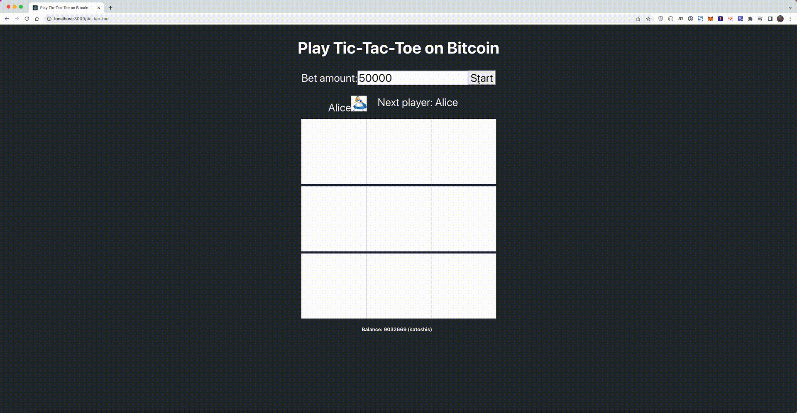
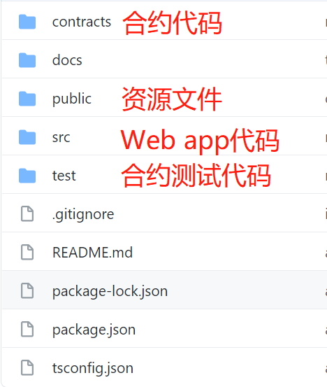
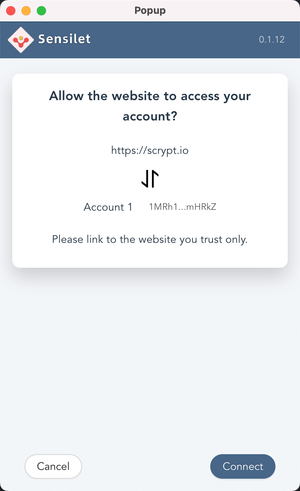
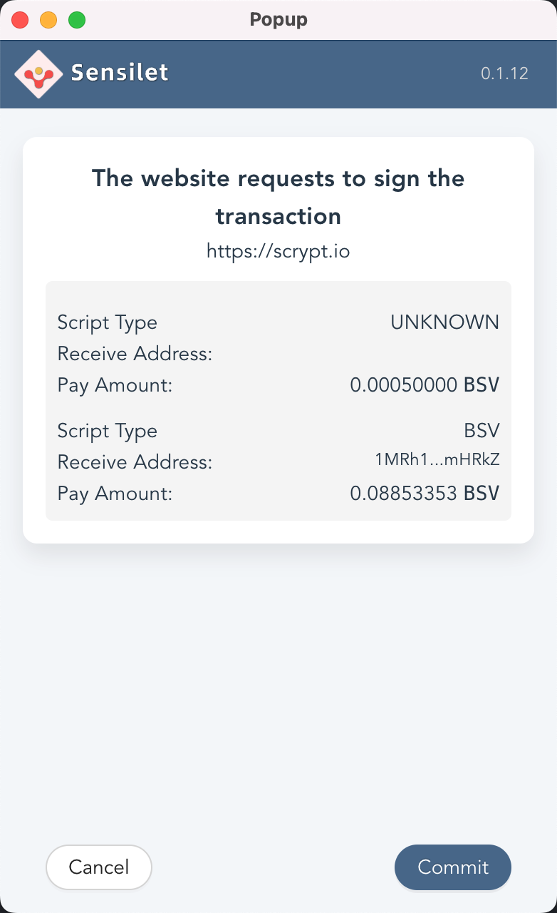
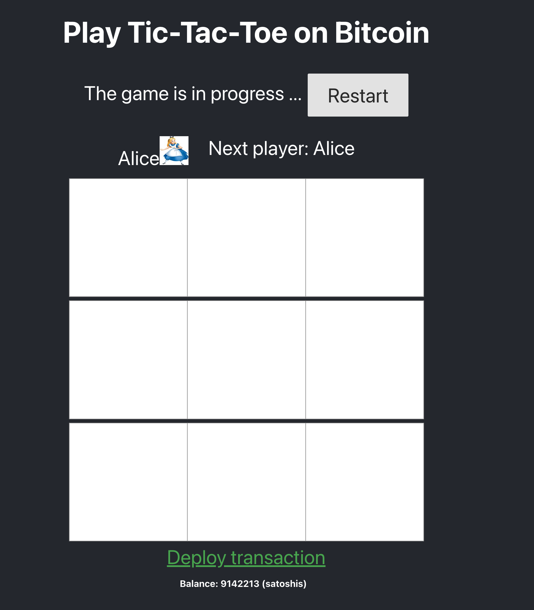

# 基于 sCrypt 合约开发一个完整的 dApp：井字棋游戏

今天，我们将向您展示如何在比特币 SV 区块链上构建去中心化应用程序（又名 dApp）。我们将介绍构建全栈去中心化应用的全过程，包括：

1. 编写合约
2. 测试合约
3. 集成一个简单的 Web 应用程序与合约进行交互

到最后，你将拥有一个运行在比特币上的[井字棋游戏DApp](https://scrypt.io/tic-tac-toe/)。




## 搭建开发环境

1. 安装 sCrypt IDE，见 [sCrypt 开发工具篇 - Visual Studio Code 插件](https://blog.csdn.net/freedomhero/article/details/107127341)
2. 安装 [nodejs](https://nodejs.org/en/), version >= 12
3. 安装 [Typescript](https://www.typescriptlang.org/)
3. 安装 [create-react-app](https://github.com/facebook/create-react-app)

接下来执行 `npx create-react-app tic-tac-toe` 创建 web app。然后在根目录下创建一个 `contracts` 和 `test`目录，分别用来存放合约代码和合约的测试代码。你将看到以下目录结构。



## 使用 sCrypt 编写 tic-tac-toe 合约

`TicTacToe` 合约主要实现原理是通过[有状态合约](https://scryptdoc.readthedocs.io/zh_CN/latest/state.html)将游戏的状态存储在合约中。井字棋游戏状态由以下组成：

1. `turn` : 布尔类型。表示轮到谁下棋, `true` 表示轮到 Alice， `false` 表示轮到 Bob
2. `board` : 整数数组类型。记录棋盘当前的状态，每个元素代表棋盘的一个位置，`0` 表示没有棋子，`1` 表示 ALICE的棋子，`2` 表示BOB的棋子，长度为 9

下面是带有注释的合约代码。

```js

contract TicTacToe {
    PubKey alice;
    PubKey bob;

    // if it is alice's turn to play
    @state
    bool isAliceTurn;

    // state of the board. For example, a chess with Alice in the first row 
    // and first column is expressed as [1,0,0,0,0,0,0,0,0]
    @state
    int[N] board;

    static const int N = 9;
    static const int EMPTY = 0;
    static const int ALICE = 1;
    static const int BOB = 2;

    public function move(int n, Sig sig, int amount, SigHashPreimage txPreimage) {

        require(Tx.checkPreimage(txPreimage));
        require(n >= 0 && n < N);

        // not filled
        require(this.board[n] == EMPTY);

        int play = this.isAliceTurn ? ALICE : BOB;
        PubKey player = this.isAliceTurn ? this.alice : this.bob;

        // ensure it's player's turn
        require(checkSig(sig, player));
        // make the move
        this.board[n] = play;
        this.isAliceTurn = !this.isAliceTurn;

        bytes outputs = b'';
        if (this.won(play)) {
            bytes outputScript = Utils.buildPublicKeyHashScript(hash160(player));
            bytes output = Utils.buildOutput(outputScript, amount);
            outputs = output;
        }
        else if (this.full()) {
            bytes aliceScript = Utils.buildPublicKeyHashScript(hash160(this.alice));
            bytes aliceOutput = Utils.buildOutput(aliceScript, amount);

            bytes bobScript = Utils.buildPublicKeyHashScript(hash160(this.bob));
            bytes bobOutput = Utils.buildOutput(bobScript, amount);

            outputs = aliceOutput + bobOutput;
        }
        else {
            bytes scriptCode_ = this.getStateScript();
            bytes output = Utils.buildOutput(scriptCode_, amount);
            outputs = output;
        }

        require(hash256(outputs) == SigHash.hashOutputs(txPreimage));
    }

    function won(int play) : bool {
        // three in a row, a column, or a diagonal
        int[8][3] lines = [[0, 1, 2], [3, 4, 5], [6, 7, 8], [0, 3, 6], [1, 4, 7], [2, 5, 8], [0, 4, 8], [2, 4, 6]];

        bool anyLine = false;
        loop (8) : i {
            bool line = true;
            loop (3) : j {
                line = line && this.board[lines[i][j]] == play;
            }

            anyLine = anyLine || line;
        }

        return anyLine;
    }

    function full() : bool {
        bool full = true;

        loop (N) : i {
            full = full && this.board[i] != TicTacToe.EMPTY;
        }

        return full;
    }
}
```

<center><a href="https://github.com/sCrypt-Inc/tic-tac-toe/blob/master/contracts/tictactoe.scrypt">TicTacToe 合约源代码</a></center>

### 游戏规则
首先，通过钱包将一定数量的比特币锁定在一个包含上述合约的 UTXO 中。接下来，Alice 和 Bob 通过调用公共函数 `move()` 交替玩游戏：

1. 如果玩家获胜，他/她将拿走合约中锁定的所有资金
2. 如果棋盘已满且无人获胜，则为平局，Alice 和 Bob 各拿一半的资金
3. 否则，游戏仍在进行中，下一个玩家移动棋子

## 测试合约

接下来我们用 Javascript 编写合约的单元测试，以确保合约在上线部署之前能够按预期工作。 通过[sCrypt 测试框架](https://github.com/sCrypt-Inc/boilerplate#how-to-write-test-for-an-scrypt-contract)，我们可以模拟调用 `move()` 并断言游戏状态。

```
it('One full round where Alice wins', () => {

    // Alice places an X at 0-th cell
    testMove(true, 0, moveScript(false, [1,0,0,0,0,0,0,0,0]))

    // Bob places an O at 4-th cell
    testMove(false, 4, moveScript(true, [1,0,0,0,2,0,0,0,0]))

    // Alice places an X at 1-th cell
    testMove(true, 1, moveScript(false, [1,1,0,0,2,0,0,0,0]))

    // Bob places an O at 8-th cell
    testMove(false, 8, moveScript(true, [1,1,0,0,2,0,0,0,2]))

    // Alice places an X at 2-th cell and wins
    testMoveWin(true, 2, bsv.Script.buildPublicKeyHashOut(privateKeyAlice.toAddress()));
});
```
<center><a href="https://github.com/sCrypt-Inc/tic-tac-toe/blob/master/test/tictactoe.scrypttest.js">tictactoe.scrypttest.js</a></center>

## 集成 Web App

我们将复用 [官方 React 教程](https://reactjs.org/tutorial/tutorial.html) 中现有的 [tic-tac-toe](https://github.com/guar47/react-tutorial-tic-tac-toe) 项目。如果您有前端开发的经验，这应该看起来很熟悉。我们将专注于集成智能合约的部分。

### 编译合约

1. 通过 IDE 将 `TicTacToe` 进行[编译](https://scrypt-ide.readthedocs.io/zh_CN/latest/compiling.html)，得到合约描述文件 `tictactoe_release_desc.json`。并将其拷贝到 `public` 目录中，以便我们的能从前端页面加载到该文件。

2. 在前端页面使用 `fetchContract` 函数加载合约描述文件 `tictactoe_release_desc.json`，并实例化合约对象。将合约对象保存在状态中。

```js
async function fetchContract(alicePubKey, bobPubKey) {
  let { contractClass: TictactoeContractClass } = await web3.loadContract(
    "/tic-tac-toe/tictactoe_release_desc.json"
  );

  return new TictactoeContractClass(
    new PubKey(alicePubKey),
    new PubKey(bobPubKey),
    true,
    [0,0,0,0,0,0,0,0,0]
  );
}

...

const instance = await fetchContract(PlayerPublicKey.get(Player.Alice),
    PlayerPublicKey.get(Player.Bob))

updateStates({
    ...
    instance: instance
})

```

### 集成钱包

将合约对象 `instance` 部署到比特币网络需要比特币。为此我们需要先接入钱包用来获取比特币。这里以 [sensilet](https://sensilet.com) 为例，介绍如何接入钱包。

#### 1. 钱包实现

我们在 [wallet.ts](https://github.com/sCrypt-Inc/tic-tac-toe/blob/master/src/web3/wallet.ts) 中定义了一些通用的钱包接口。并使用 sensilet 来实现这些接口。具体实现见: [sensiletwallet.ts](https://github.com/sCrypt-Inc/tic-tac-toe/blob/master/src/web3/sensiletwallet.ts)

#### 2. 钱包初始化

在 `App` 加载时， 使用 `useEffect` 来初始化钱包。首先，为 `web3` 设置一个 `SensiletWallet` 钱包。然后调用 `web3.wallet.isConnected()` 将钱包是否连接的状态保存起来。

```js
// init web3 wallet
  useEffect(async () => {
    const timer = setTimeout(async ()=> {
        //set a SensiletWallet for web3
        web3.setWallet(new SensiletWallet());
        const isConnected = await web3.wallet.isConnected();

        ...

        updateStates({
            ...
            isConnected: isConnected,
        })
  
    }, 100)

    return () => {
      clearTimeout(timer)
    }
  }, []);
```

在 `App` 的渲染代码中，通过判断 `states.isConnected` 状态来决定渲染钱包登入组件 `Auth` 还是钱包余额组件 `Balance`。

```js
return (
    <div className="App">
      <header className="App-header">
        <h2>Play Tic-Tac-Toe on Bitcoin</h2>
        ...
        {states.isConnected ? <Balance></Balance> : <Auth></Auth>}
      </header>
    </div>
  );
```

#### 3. 钱包登入

下面是实现钱包登入的组件 `Auth`。用户点击 **Sensilet** 按钮则调用钱包的 `requestAccount` 接口来登入钱包。钱包插件会出现授权提示框。



```js
import { web3 } from "./web3";

const Auth = (props) => {

  const sensiletLogin = async (e) => {
    try {
      const res = await web3.wallet.requestAccount("tic-tac-toe");
      if (res) {
        window.location.reload();
      }
    } catch (error) {
      console.error("requestAccount error", error);
    }
  };

  return (
    <div className="auth">
      <div>
        <button
          className="pure-button button-large sensilet"
          onClick={sensiletLogin}
        >
          Sensilet
        </button>
      </div>
    </div>
  );
};

export default Auth;
```

#### 4. 钱包余额

`Balance` 组件调用了钱包的 `getbalance` 接口，实现了展示钱包余额的功能。

```js
import { useState, useEffect } from "react";
import { web3 } from "./web3";
const Balance = (props) => {
  const [balance, setBalance] = useState(0);

  useEffect(async () => {
    if (web3.wallet) {
      web3.wallet.getbalance().then((balance) => {
        setBalance(balance);
      });
    }
  }, []);

    return (
      <div className="wallet">
        <div className="walletInfo">
          <div className="balance">
            <label>Balance: {balance} <span> (satoshis)</span></label>
          </div>
        </div>
      </div>
    );
};

export default Balance;
```

接入完钱包后，就可以开始部署合约了。


### 部署合约

点击 **Start** 按钮开始游戏时，会回调 `App` 中的 `startGame` 方法。该函数实现了将合约实例部署到比特币网络上的功能。部署成功后，将包含合约的UTXO到和游戏初始状态保存到 *localStorage*，并更新 `React` 状态。

```js
const startGame = async (amount) => {

    if (web3.wallet && states.instance) {

        web3.deploy(states.instance, amount).then(rawTx => {
            //initial game states
            let gameStates = {
                amount: amount,
                name: "tic-tac-toe",
                date: new Date(),
                history: [
                    {
                    squares: Array(9).fill(null),
                    },
                ],
                currentStepNumber: 0,
                isAliceTurn: true,
            };

            //save utxo
            ContractUtxos.add(rawTx);
            //save Game data
            GameData.set(gameStates);
            //first player is Alice
            CurrentPlayer.set(Player.Alice);
            //update states.started
            updateStates(Object.assign({}, states, {
                started: true
            }))
      })
    }
};
```

其中 [web3.deploy()](https://github.com/sCrypt-Inc/tic-tac-toe/blob/master/src/web3/web3.ts#L48) 函数是对钱包接口的封装。主要包含以下步骤：

1. 调用钱包的 `listUnspent` 接口，查询可用的 UTXO 来支付部署交易的费用。
2. 使用[链式 APIs](https://github.com/sCrypt-Inc/scryptlib/blob/master/docs/chained_api_zh_CN.md) 构建包含合约实例 `contract` 的交易
3. 调用钱包的 `signRawTransaction` 接口对于交易进行签名
4. 最后调用 `web3.sendRawTx` 广播交易

调用钱包的 `signRawTransaction` 接口需要用户授权。



```js
static async deploy(contract: AbstractContract, amountInContract: number): Promise<string> {
    const wallet = web3.wallet

    const changeAddress = await web3.wallet.getRawChangeAddress();

    return wallet.listUnspent(amountInContract, {
      purpose: 'tic-tac-toe'
    }).then((utxos: UTXO[]) => {
      const tx = new bsv.Transaction();
      tx.from([utxos[0]])
        .addOutput(new bsv.Transaction.Output({
          script: contract.lockingScript,
          satoshis: amountInContract,
        }))
        .change(changeAddress);

      return wallet.signRawTransaction(tx.toString(), utxos[0].script, utxos[0].satoshis, 0, SignType.ALL);
    }).then(async (rawTx: string) => {
      await web3.sendRawTx(rawTx);
      return rawTx;
    })
}
```


<center>部署成功</center>

部署成功后，就可以开始游戏了。

## 调用合约

接下来就是开始下棋了，每下一步棋，就是对合约的一次调用，并触发合约状态的改变。Web 应用程序与合约的交互主要发生在这个阶段。主要包含以下步骤：

### 1. Alice 或者 Bob 点击方块

[game.js](https://github.com/sCrypt-Inc/tic-tac-toe/blob/d5c309fce39d8a42202ec5fd056f56c03df7c87a/src/Game.js#L129) 中的 `handleClick()` 函数响应了点击事件。首先调用 `canMove` 方法检查能否移动棋子。

```js
if (!this.canMove(this.state.isAliceTurn, i, squares)) {
    console.error('can not move now!')
    return;
}
```

### 2. 更新游戏状态

可以移动棋子的情况下，首先更新游戏状态，触发 GUI 做出响应。

```js
// update states
this.setState(gameState)
```

### 3. 调用合约

使用 [web3.call()](https://github.com/sCrypt-Inc/tic-tac-toe/blob/master/src/web3/web3.ts#L71) 函数来调用合约。第一个参数是包含合约实例的最新UTXO。第二参数是一个回调函数。我们在这个回调函数中使用[链式 APIs](https://github.com/sCrypt-Inc/scryptlib/blob/master/docs/chained_api_zh_CN.md)来构建调用合约的交易。

```js
const contractUtxo = ContractUtxos.getlast().utxo;

web3.call(contractUtxo, (tx) => {
    let winner = calculateWinner(squares).winner;
    if (winner) { // Current Player won
        let address = PlayerAddress.get(CurrentPlayer.get());
        tx.setOutput(0, (tx) => {
            return new bsv.Transaction.Output({
            script: bsv.Script.buildPublicKeyHashOut(address),
            satoshis: contractUtxo.satoshis - tx.getEstimateFee(),
            })
        })

    } else if (history.length >= 9) { //board is full

        tx.setOutput(0, (tx) => {
            return new bsv.Transaction.Output({
            script: bsv.Script.buildPublicKeyHashOut(PlayerAddress.get(Player.Alice)),
            satoshis: (contractUtxo.satoshis - tx.getEstimateFee()) /2,
            })
        })
        .setOutput(1, (tx) => {
            return new bsv.Transaction.Output({
            script: bsv.Script.buildPublicKeyHashOut(PlayerAddress.get(Player.Bob)),
            satoshis: (contractUtxo.satoshis - tx.getEstimateFee()) /2,
            })
        })

    } else { //continue move

        const newStates = toContractState(gameState);
        const newLockingScript = this.props.contractInstance.getNewStateScript(newStates);
        tx.setOutput(0, (tx) => {
            const amount = contractUtxo.satoshis - tx.getEstimateFee();
            return new bsv.Transaction.Output({
            script: newLockingScript,
            satoshis: amount,
            })
        })
    }

    tx.setInputScript(0, (tx, output) => {
        const preimage = getPreimage(tx, output.script, output.satoshis)
        const privateKey = new bsv.PrivateKey.fromWIF(PlayerPrivkey.get(CurrentPlayer.get()));
        const sig = signTx(tx, privateKey, output.script, output.satoshis)
        const amount = contractUtxo.satoshis - tx.getEstimateFee();

        return this.props.contractInstance.move(i, sig, amount, preimage).toScript();
    })
    .seal()
})
```

构建交易包括： 

1. 从 `ContractUtxos` 中取出包含合约实例的最新的 UTXO。作为交易的输入。
2. 根据游戏的状态和游戏规则来给交易添加输出。添加输出的过程中， 使用 `toContractState()` 函数将游戏状态转换成合约状态。
3. 设置合约解锁脚本。

### 4. 更新状态合约状态

`web3.call` 的内部实现同样会调用广播交易。广播成功后，需要保存调用的交易和包含合约实例的UTXO, 作为下一次调用的输入。
同时还需要更新游戏状态和合约实例的状态。

```js
squares[i].tx = utxo.utxo.txId; //bind transaction to square
squares[i].n = history.length; 

const utxo = ContractUtxos.add(rawTx); // save latest utxo
GameData.update(gameState); //update game's states
this.attachState(); //update stateful contract's states
```

至此，我们完成了 TicTacToe 小游戏下棋动作和合约调用的绑定，玩家的每个下棋动作，都产生一个区块链上的交易与之对应。

# 总结

恭喜你！ 您刚刚在比特币上构建了第一个全栈 dApp。 现在，您可以玩井字游戏或在比特币上构建您自己喜欢的游戏。现在是时候喝些香槟了，或者打开下方连接和小伙伴来一场比赛！

------------------------------

[1]: 本文演示的游戏可以在 [这里](https://scrypt.io/tic-tac-toe/) 试玩

[2]: 本文使用的所有代码均源自这个 [Github Repo](https://github.com/sCrypt-Inc/tic-tac-toe) ，欢迎大家加星收藏。


