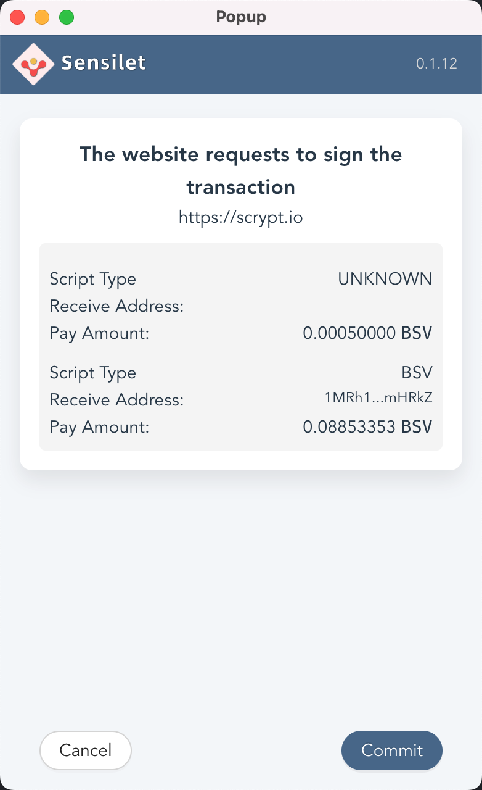

# Full Stack Bitcoin Dapp Tutorial

In our previous blog, we covered how to use sCrypt to write Bitcoin smart contracts. But as a beginning developer, you may be more interested in how to use sCrypt to build dApps. Next we will teach you how to build a tic-tac-toe dApp using sCrypt step by step.

The application is very simple, all it does is use the public keys of two players (Alice and Bob) to initialize a contract, and only the winning player can withdraw the money in the contract. If no one wins at the end, both players can each take half of the money. We'll show you how to build decentralized applications (aka dApps) on the Bitcoin SV blockchain, including:


- Write a contract
- Test the contract
- Interact with the contract through a simple web app

By the end, you will have a fully functional [tic-tac-toe](https://scrypt.io/tic-tac-toe) app running on Bitcoin.


## Development Environment

Before we dive into the app, make sure you have the following dependencies installed.

1. [sCrypt IDE](https://marketplace.visualstudio.com/items?itemName=bsv-scrypt.sCrypt)
2. [nodejs](https://nodejs.org/en/), version >= 12
3. [Typescript](https://www.typescriptlang.org/)

Use Git to clone the React App project [tic-tac-toe](https://github.com/sCrypt-Inc/tic-tac-toe), and switch to the `webapp` branch. This branch contains a tic-tac-toe game with only front-end code. Then create a `contracts` and `test` directories in the root directory to store the contract code and the test code of the contract respectively. You will see the following directory structure.


## Tic-tac-toe Contract

The basic idea is to store the state of the game in a contract via [Stateful Contracts](https://scryptdoc.readthedocs.io/en/latest/state.html), using the [general approach](https://xiaohuiliu.medium.com/tic-tac-toe-on-bitcoin-sv-5acdf5bd676d) detailed before. In tic-tac-toe, the state consists of:

1. `isAliceTurn` : Boolean type. Indicates whose turn it is to play, `true` for Alice's turn, `false` for Bob's turn
2. `board` : Integer array type. Record the current state of the board, each element represents a position on the board, `0` means no piece, `1` means ALICE's piece, `2` means BOB's piece. The length is `9`.

Below is the contract code with comments:

```js

contract TicTacToe {
    PubKey alice;
    PubKey bob;
    // if it is alice's turn to play
    @state
    bool isAliceTurn;
    // state of the board. For example, a board with Alice in the first row 
    // and first column is expressed as [1,0,0,0,0,0,0,0,0]
    @state
    int[N] board;
    static const int N = 9;
    static const int EMPTY = 0;
    static const int ALICE = 1;
    static const int BOB = 2;
    public function move(int n, Sig sig, int amount, SigHashPreimage txPreimage) {

        require(Tx.checkPreimage(txPreimage));
        require(n >= 0 && n < N);

        // not filled
        require(this.board[n] == EMPTY);

        int play = this.isAliceTurn ? ALICE : BOB;
        PubKey player = this.isAliceTurn ? this.alice : this.bob;

        // ensure it's player's turn
        require(checkSig(sig, player));
        // make the move
        this.board[n] = play;
        this.isAliceTurn = !this.isAliceTurn;

        bytes outputs = b'';
        if (this.won(play)) {
            bytes outputScript = Utils.buildPublicKeyHashScript(hash160(player));
            bytes output = Utils.buildOutput(outputScript, amount);
            outputs = output;
        }
        else if (this.full()) {
            bytes aliceScript = Utils.buildPublicKeyHashScript(hash160(this.alice));
            bytes aliceOutput = Utils.buildOutput(aliceScript, amount);

            bytes bobScript = Utils.buildPublicKeyHashScript(hash160(this.bob));
            bytes bobOutput = Utils.buildOutput(bobScript, amount);

            outputs = aliceOutput + bobOutput;
        }
        else {
            bytes scriptCode_ = this.getStateScript();
            bytes output = Utils.buildOutput(scriptCode_, amount);
            outputs = output;
        }

        require(hash256(outputs) == SigHash.hashOutputs(txPreimage));
    }

    function won(int play) : bool {
        // three in a row, a column, or a diagonal
        int[8][3] lines = [[0, 1, 2], [3, 4, 5], [6, 7, 8], [0, 3, 6], [1, 4, 7], [2, 5, 8], [0, 4, 8], [2, 4, 6]];

        bool anyLine = false;
        loop (8) : i {
            bool line = true;
            loop (3) : j {
                line = line && this.board[lines[i][j]] == play;
            }

            anyLine = anyLine || line;
        }

        return anyLine;
    }

    function full() : bool {
        bool full = true;

        loop (N) : i {
            full = full && this.board[i] != TicTacToe.EMPTY;
        }

        return full;
    }
}
```

<center><a href="https://github.com/sCrypt-Inc/tic-tac-toe/blob/master/contracts/tictactoe.scrypt">TicTacToe Contract</a></center>

### Game Rules

First, a certain amount of Bitcoin is locked in a UTXO containing the above contract through the wallet. Next, Alice and Bob alternately play the game by calling the public function `move()`:


1. If the player wins, he/she takes all funds locked in the contract
2. If the board is full and no one wins, it is a tie, Alice and Bob each get half of the money
3. Otherwise, the game is still in progress and the next player moves the piece

## scryptlib

The dApp needs to interact with the contract on the front-end page. To do this, we will use sCrypt's official JavaScript library - [scryptlib](https://github.com/sCrypt-Inc/scryptlib).

> scryptlib is a Javascript/TypeScript SDK for integrating Bitcoin SV smart contracts written in the sCrypt language.

With `scryptlib`, you can easily compile, test, deploy, and call contracts.

### Install scryptlib

`scryptlib` can be installed via `npm`.


```javascript
// use NPM
npm install scryptlib

// use Yarn
yarn add scryptlib
```

The code to instantiate and call the contract's public methods using `scryptlib` looks like:

```javascript
const Demo = buildContractClass(compileContract('demo.scrypt'));
const demo = new Demo(7, 4);

const result = demo.add(11).verify()
assert(result.success);
```

## Test the Contract

Let’s write some tests in Javascript to make sure our contract is working as expected. We will use the [sCrypt testing framework](https://github.com/sCrypt-Inc/boilerplate#how-to-write-test-for-an-scrypt-contract), by simulating calling `move()` and expecting the game state.


```
it('One full round where Alice wins', () => {

    // Alice places an X at 0-th cell
    testMove(true, 0, moveScript(false, [1,0,0,0,0,0,0,0,0]))

    // Bob places an O at 4-th cell
    testMove(false, 4, moveScript(true, [1,0,0,0,2,0,0,0,0]))

    // Alice places an X at 1-th cell
    testMove(true, 1, moveScript(false, [1,1,0,0,2,0,0,0,0]))

    // Bob places an O at 8-th cell
    testMove(false, 8, moveScript(true, [1,1,0,0,2,0,0,0,2]))

    // Alice places an X at 2-th cell and wins
    testMoveWin(true, 2, bsv.Script.buildPublicKeyHashOut(privateKeyAlice.toAddress()));
});
```
<center><a href="https://github.com/sCrypt-Inc/tic-tac-toe/blob/master/test/tictactoe.scrypttest.js">tictactoe.scrypttest.js</a></center>

## Simple Webpage to Interact with the Contract

We assume you already have the basics of front-end development, so we won't take the time to cover the basics of these techniques. We will focus on the part of integrating smart contracts.


### Compile the contract

1. Compile `TicTacToe` through IDE (https://scrypt-ide.readthedocs.io/en/latest/compiling.html) to get the contract description file `tictactoe_release_desc.json`. and copy it into the `public` directory so that our frontend page can load this file into it.

2. Use the `fetchContract` function on the front-end page to load the contract description file `tictactoe_release_desc.json`, and instantiate the contract object. Save the contract object in state.

```js
async function fetchContract(alicePubKey, bobPubKey) {
  let { contractClass: TictactoeContractClass } = await web3.loadContract(
    "/tic-tac-toe/tictactoe_release_desc.json"
  );

  return new TictactoeContractClass(
    new PubKey(alicePubKey),
    new PubKey(bobPubKey),
    true,
    [0,0,0,0,0,0,0,0,0]
  );
}

...

// save the contract object in state.
const instance = await fetchContract(PlayerPublicKey.get(Player.Alice),
    PlayerPublicKey.get(Player.Bob))

updateStates({
    ...
    instance: instance
})

```

### Integrate wallet

Deploying the contract object `instance` to the Bitcoin network requires bitcoins. To do this, we need to access a wallet first to get bitcoins. Here we take [sensilet](https://sensilet.com) as an example to introduce how to access the wallet.

#### 1. Wallet implementation

We define some common wallet interfaces in [wallet.ts](https://github.com/sCrypt-Inc/tic-tac-toe/blob/master/src/web3/wallet.ts) and use sensilet to implement these interfaces. See the specific implementation at [sensiletwallet.ts](https://github.com/sCrypt-Inc/tic-tac-toe/blob/master/src/web3/sensiletwallet.ts)

#### 2. Wallet initialization

When `App` loads, we use `useEffect` to initialize the wallet. First, we set up a `SensiletWallet` wallet for `web3`. Then we call `web3.wallet.isConnected()` to save the status of whether the wallet is connected.

```js
// init web3 wallet
  useEffect(async () => {
    const timer = setTimeout(async ()=> {
        //set a SensiletWallet for web3
        web3.setWallet(new SensiletWallet());
        const isConnected = await web3.wallet.isConnected();

        ...

        updateStates({
            ...
            isConnected: isConnected,
        })
  
    }, 100)

    return () => {
      clearTimeout(timer)
    }
  }, []);
```

In the rendering code of `App`, it is determined whether to render the wallet login component `Auth` or the wallet balance component `Balance` by checking the state of `states.isConnected`.

```js
return (
    <div className="App">
      <header className="App-header">
        <h2>Play Tic-Tac-Toe on Bitcoin</h2>
        ...
        {states.isConnected ? <Balance></Balance> : <Auth></Auth>}
      </header>
    </div>
  );
```

#### 3. Wallet login

Below is the component `Auth` that implements wallet login. The user clicks the **Sensilet** button to call the wallet's `requestAccount` interface to log into the wallet. An authorization prompt box will appear in the wallet plugin.


```js
import { web3 } from "./web3";

const Auth = (props) => {

  const sensiletLogin = async (e) => {
    try {
      const res = await web3.wallet.requestAccount("tic-tac-toe");
      if (res) {
        window.location.reload();
      }
    } catch (error) {
      console.error("requestAccount error", error);
    }
  };

  return (
    <div className="auth">
      <div>
        <button
          className="pure-button button-large sensilet"
          onClick={sensiletLogin}
        >
          Sensilet
        </button>
      </div>
    </div>
  );
};

export default Auth;
```

#### 4. Wallet balance

The `Balance` component calls the `getbalance` interface of the wallet to display the balance.

```js
import { useState, useEffect } from "react";
import { web3 } from "./web3";
const Balance = (props) => {
  const [balance, setBalance] = useState(0);

  useEffect(async () => {
    if (web3.wallet) {
      web3.wallet.getbalance().then((balance) => {
        setBalance(balance);
      });
    }
  }, []);

    return (
      <div className="wallet">
        <div className="walletInfo">
          <div className="balance">
            <label>Balance: {balance} <span> (satoshis)</span></label>
          </div>
        </div>
      </div>
    );
};

export default Balance;
```

After accessing the wallet, you can start deploying the contract.


### Deploying the contract

When the **Start** button is clicked to start the game, the `startGame` method in `App` will be called back. This function implements the function of deploying a contract instance to the Bitcoin network. After successful deployment, we save the UTXO containing the contract and the initial game state to *localStorage* and update the `React` state.

```js
const startGame = async (amount) => {

    if (web3.wallet && states.instance) {

        web3.deploy(states.instance, amount).then(rawTx => {
            //initial game states
            let gameStates = {
                amount: amount,
                name: "tic-tac-toe",
                date: new Date(),
                history: [
                    {
                    squares: Array(9).fill(null),
                    },
                ],
                currentStepNumber: 0,
                isAliceTurn: true,
            };

            //save utxo
            ContractUtxos.add(rawTx);
            //save Game data
            GameData.set(gameStates);
            //first player is Alice
            CurrentPlayer.set(Player.Alice);
            //update states.started
            updateStates(Object.assign({}, states, {
                started: true
            }))
      })
    }
};
```

The [web3.deploy()](https://github.com/sCrypt-Inc/tic-tac-toe/blob/master/src/web3/web3.ts#L48) function is the encapsulation of the wallet interface. It mainly includes the following steps:

1. Call the wallet's `listUnspent` interface to query the available UTXOs to pay for the deployment transaction fee
2. Use [chained APIs](https://github.com/sCrypt-Inc/scryptlib/blob/master/docs/chained_api_zh_CN.md) to build a transaction containing a contract instance `contract`
3. Call the wallet's `signRawTransaction` to sign the transaction
4. Finally call `web3.sendRawTx` to broadcast the transaction.

Calling the wallet's `signRawTransaction` interface requires user authorization.



```js
static async deploy(contract: AbstractContract, amountInContract: number): Promise<string> {
    const wallet = web3.wallet

    const changeAddress = await web3.wallet.getRawChangeAddress();

    return wallet.listUnspent(amountInContract, {
      purpose: 'tic-tac-toe'
    }).then((utxos: UTXO[]) => {
      const tx = new bsv.Transaction();
      tx.from([utxos[0]])
        .addOutput(new bsv.Transaction.Output({
          script: contract.lockingScript,
          satoshis: amountInContract,
        }))
        .change(changeAddress);

      return wallet.signRawTransaction(tx.toString(), utxos[0].script, utxos[0].satoshis, 0, SignType.ALL);
    }).then(async (rawTx: string) => {
      await web3.sendRawTx(rawTx);
      return rawTx;
    })
}
```


<center>Deployment successfully</center>

After the deployment is successful, you can start the game.

## Call Contract

The next step is to start playing chess. Each chess move is a call to the contract and triggers a change in the contract state. The interaction of the web application with the contract mainly occurs in this phase.

As with the deployment contract, we use the `web3.call()`, which provided by the [web3](https://github.com/sCrypt-Inc/tic-tac-toe/blob/7ae1eb8cb46bd8315d9c7d858b6a190ba3c4c306/src/web3/web3.ts#L71) tool class, to call the contract.

The first argument of function `web3.call()` is a **UTXO** containing the contract instance as the first input to construct the transaction that calls the contract. The second parameter is a callback function. we are at
[Chained APIs](https://github.com/sCrypt-Inc/scryptlib/blob/master/docs/chained_api_en.md) is used in the callback function to construct a complete transaction calling the contract.

Calling a contract requires the following work:

1. Fetch the latest UTXO containing the contract instance from storage. as an input to the transaction.
2. Add output to the transaction according to the game state and game rules. During the process of adding outputs, use the `toContractState()` function to convert the game state to the contract state.

```js

let winner = calculateWinner(squares).winner;

if (winner) { // Current Player won
  let address = PlayerAddress.get(CurrentPlayer.get());

  tx.setOutput(0, (tx) => {
    return new bsv.Transaction.Output({
      script: bsv.Script.buildPublicKeyHashOut(address),
      satoshis: contractUtxo.satoshis - tx.getEstimateFee(),
    })
  })

} else if (history.length >= 9) { //board is full

  tx.setOutput(0, (tx) => {
    return new bsv.Transaction.Output({
      script: bsv.Script.buildPublicKeyHashOut(PlayerAddress.get(Player.Alice)),
      satoshis: (contractUtxo.satoshis - tx.getEstimateFee()) /2,
    })
  })
  .setOutput(1, (tx) => {
    return new bsv.Transaction.Output({
      script: bsv.Script.buildPublicKeyHashOut(PlayerAddress.get(Player.Bob)),
      satoshis: (contractUtxo.satoshis - tx.getEstimateFee()) /2,
    })
  })

} else { //continue move

  const newStates = toContractState(gameState);
  const newLockingScript = this.props.contractInstance.getNewStateScript(newStates);
  tx.setOutput(0, (tx) => {
    const amount = contractUtxo.satoshis - tx.getEstimateFee();
    return new bsv.Transaction.Output({
      script: newLockingScript,
      satoshis: amount,
    })
  })
}
```

3. Set up the contract unlocking script.

```js
tx.setInputScript(0, (tx, output) => {

  const preimage = getPreimage(tx, output.script, output.satoshis)
  const privateKey = new bsv.PrivateKey.fromWIF(PlayerPrivkey.get(CurrentPlayer.get()));
  const sig = signTx(tx, privateKey, output.script, output.satoshis)
  const amount = contractUtxo.satoshis - tx.getEstimateFee();

  return this.props.contractInstance.move(i, sig, amount, preimage).toScript();
})
.seal()
```

4. Broadcast transactions using the `sendRawTransaction` interface provided by the wallet. This is wrapped in `web3.call()`.

5. After the broadcast is successful, the called transaction and the UTXO containing the contract instance need to be saved as the input for the next calling. It also needs to update the game state and the state of the contract instance.

```js
const utxo = ContractUtxos.add(rawTx); // save latest utxo
GameData.update(gameState); //update game's states
this.attachState(); //update stateful contract's states
```


So far, we have completed the binding of the TicTacToe action and the contract call. Each action of the player generates a corresponding transaction on the blockchain.


# Summarize

Congratulations! You've just built your first full-stack dApp on Bitcoin. How cool is that? Now you can play tic-tac-toe or build your own favorite game on Bitcoin. It's time to drink some champagne, or open the link below and play a game with your friends! Happy coding on Bitcoin.

---------------


[1]: [Go Play tic-tac-toe](https://scrypt.io/tic-tac-toe/)

[2]: [tic-tac-toe Github Repo](https://github.com/sCrypt-Inc/tic-tac-toe)


