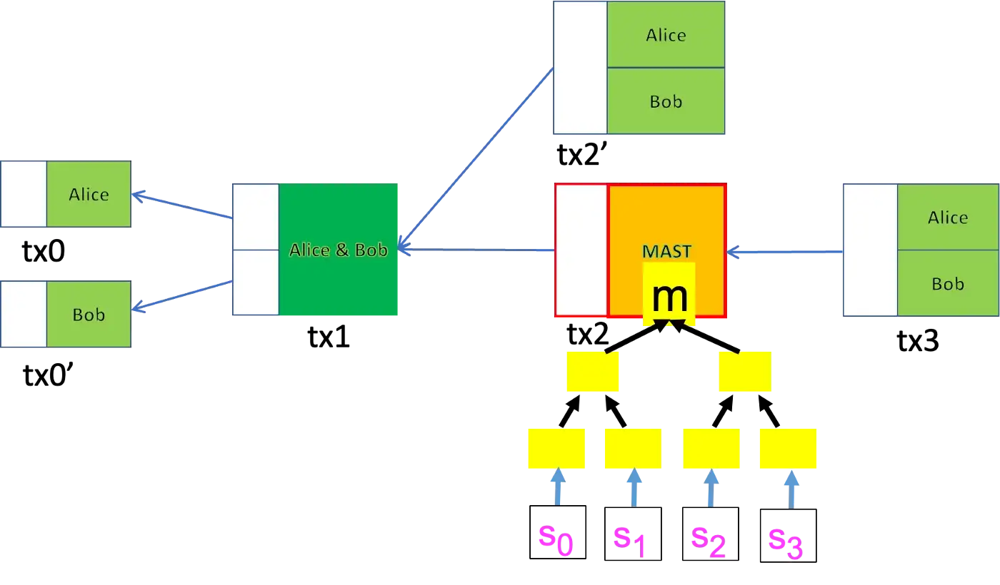
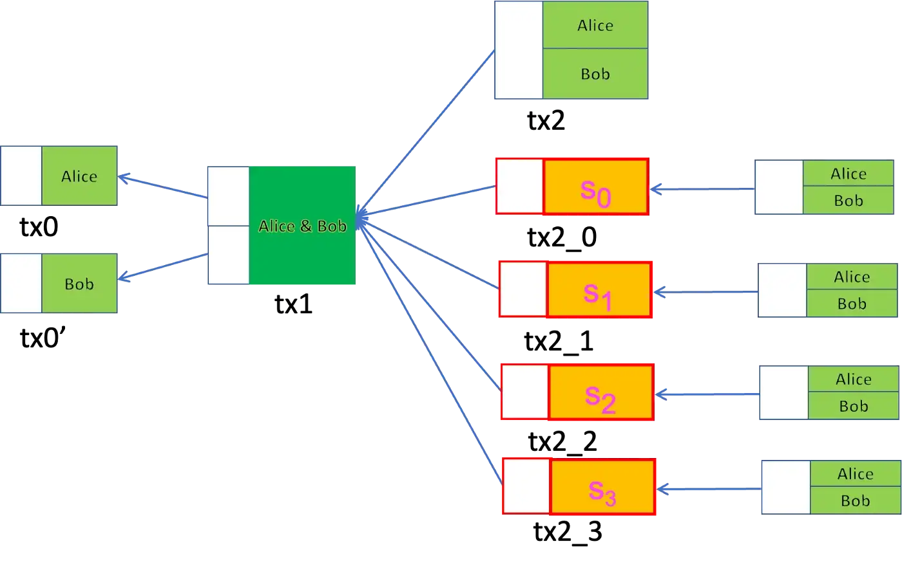

# BSV 上的 Graftroot
> 无需分叉

我们已经演示了如何使用[无合约的合约](https://blog.csdn.net/freedomhero/article/details/124047689)在原始比特币上[实现 Taproot](https://blog.csdn.net/freedomhero/article/details/124352134)。我们将展示了其后续提案 [Graftroot](https://lists.linuxfoundation.org/pipermail/bitcoin-dev/2018-February/015700.html) 可以以类似的方式实施。

## BTC 中的 Grabroot

与 Taproot 类似，有两种方式可以使用锁定在由多方创建的聚合公钥 *P* 中的资金：

1. **合作案例**：又名默认密钥花费路径

各方同意并签署在定期支付交易中释放资金，与 Taproot 相同。

2. **不合作的案例**：又名替代脚本支出路径

如果任何一方未能签署，将选择一个替代脚本来运行以解锁资金。在 Taproot 中，脚本是 [Merklized Alternative Script Tree](https://xiaohuiliu.medium.com/merkelized-abstract-syntax-tree-6a49b2008435) (MAST) 中的叶节点。它通过在 *P* 中链接 MAST *m* 的根并通过 Merkle 证明验证脚本确实是 MAST 的叶子来授权。*然而，在 Graftroot 中，称为代理脚本的替代脚本仅由各方共同签署脚本本身授权。* 这和我们之前介绍的[密钥委托](https://blog.csdn.net/freedomhero/article/details/125332067)类似，只是委托的是脚本，而不是公钥。

## 与 Taproot 相比

在设置过程中，各方共同签署所有可能的代理脚本。花费时，一方可能不愿意或无法签字。在这种情况下，Graftroot 比 Taproot 具有一些显着优势：

1. 它按 `O(1)` 而不是 `O(log n)` 进行缩放，其中 `n` 是备选脚本的总数，每个脚本代表一种花费方式。无论 `n` 是多少，都需要一个签名。在 Taproot 中，花费时需要大小为 `O(log n)` 的 Merkle 证明。

2. 在 Graftroot 中，可以在设置和支出之间的任何时间委托新的替代脚本。这在 Taproot 中是不可能的，因为 MAST 根已提交并且在安装后无法修改。

## BSV 中的 Graftroot

事实证明，Graftroot 可以在BSV上实现，而无需对原始协议进行任何更改。下图显示了 Alice 和 Bob 在[BSV上的 Taproot](https://blog.csdn.net/freedomhero/article/details/124352134)。有四种替代支出脚本（S₀、S₁、S₂ 和 S₃），它们位于根为 `m` 的 MAST 的叶节点上。

图 1：具有 4 个替代支出脚本的 Taproot

不是在单个事务 `tx2` 中的 MAST 中提交四个脚本，而是可以将每个脚本制作成一个单独的事务。所有交易（即 `tx2_0`、`tx2_1`、`tx2_2` 和 `tx2_3`）在运行 [Nakamoto 签名协议](https://blog.csdn.net/freedomhero/article/details/124047689)后由双方签署并在链下持有。双方通过共同签署包含脚本的交易来委托脚本。例如，两个签名 `tx2_0` 都使 S₀ 成为代理。在不合作的情况下，可以广播这四个包含所选脚本的交易之一。最多可以赎回其中一个，因为它们都是花费`tx1` 中的同一个 UTXO。

图 2：带有 4 个替代支出脚本的 Graftroot

比较图 1 和图 2，很明显，从替代脚本（例如 `tx2_0` 中的 S₀）中支出成本更低，并且没有 Merkle 证明的开销。

更多的脚本可以委托，只要双方同意。例如，通过双方签署包含它的 `tx2_4` 交易，新脚本 S₄ 可以被添加为代理人。

## 总结

由于 BSV 上的 Graftroot 不需要任何共识更改，这与 BTC 不同，因此今天可以利用它来提高隐私和效率。例如，可以使用现有的操作码 `OP_CHECKSIG` 检查用于委托的签名，而 BTC 需要新的操作码，例如 [OP_CHECKSIGFROMSTACK](https://elementsproject.org/features/opcodes)，因为签名的消息是脚本本身，而不是交易数据。