# PLONK 的工作原理：第 1 部分

[PLONK](https://eprint.iacr.org/2019/953.pdf) 是最先进的 zk-SNARK 证明系统。以前的 zk-SNARK（例如 [Groth16](https://eprint.iacr.org/2016/260.pdf)）具有特定于电路的设置，这需要对任何新电路进行新的可信设置。**PLONK** 的可信设置是通用的，这意味着它可以启动一次并被所有电路重复使用¹。它也是可更新的：人们总是可以添加新的随机性，直到确信设置没有受到损害。

本文将解释 **PLONK** 如何证明计算的核心思想。下图说明了使用 **PLONK** 证明计算所要采取的步骤。

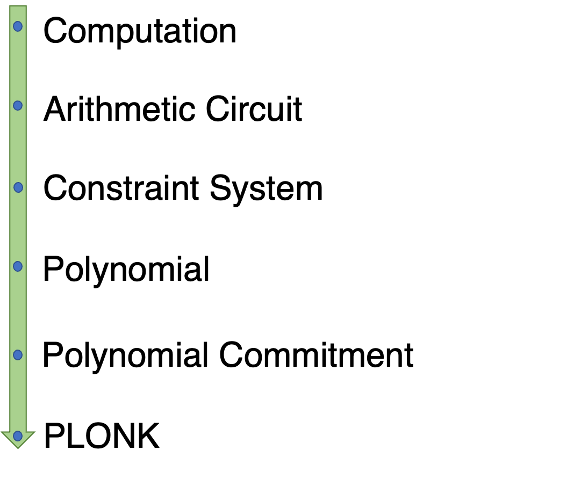


我们将详细解释每个步骤。

## 算术电路

PLONK 不理解想要证明的程序。它首先必须转换为一种称为算术电路的格式。算术电路是由两种门组成的电路：加法和乘法。

假设我们想证明我们知道方程 `P(x) = x³ + x + 5 = 35` 的解（解为 `3`）。我们可以将其转换为以下电路。


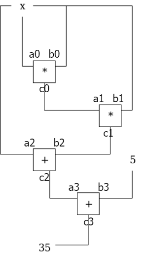

<center>图 1 : 电路</center>

## 约束系统

接下来，我们将算术电路转换为约束系统。电路导线有两类约束。

### 1. 门限约束

这些是电路每个门内的约束。上述电路有四个门和以下约束，即具有一定格式的方程。

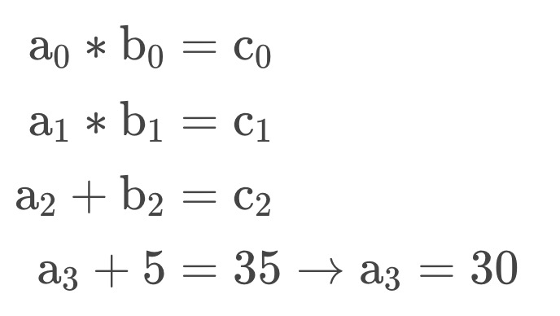

<center>图 2 : 约束</center>

在 PLONK 中，所有约束都被标准化/标准化为以下形式²：


<center>图 3 </center>

`a`、`b`、`c` 是门的左、右和输出线。所有的 `Q`都是常数。

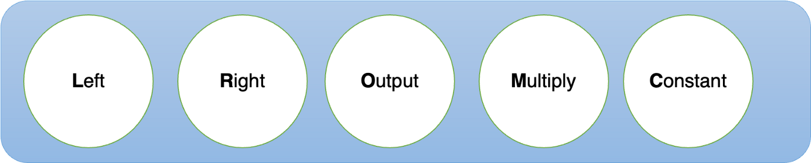

<center>图 4: PLONK 通用门，每个圆圈是一个 Q</center>


它可以看作是一个广义门，可以通过调整所有的 `Q` 来配置。例如，如下设置所有的 `Q` 会将通用门变成加法门。

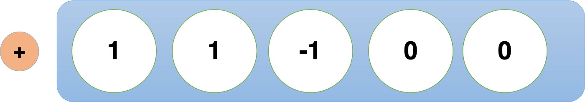

<center>图 5：加法门</center>


为了看看如何，我们设置 `QL = 1`，`QR = 1`，`QO = -1`，`QM = 0`，`QC=0`，则 图 3变成

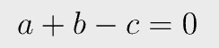

同样，以下配置表示乘法门。

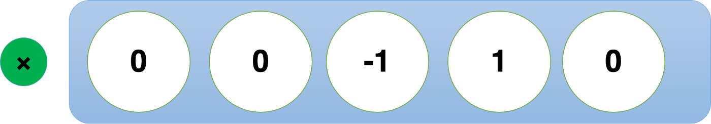

<center>图 6：乘法门</center>

图 2 转化为：

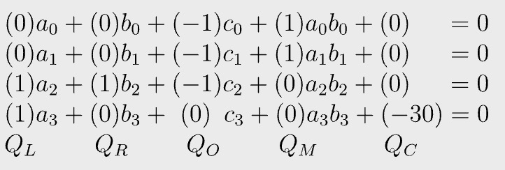

<center>图 7：Plonk 约束</center>

我们可以用向量形式重写 `Q`：

```
QL​=(0,0,1,1), QR​=(0,0,1,0), QO​=(−1,−1,−1,0), QM​=(1,1,0,0), QC​=(0,0,0,−30).
```

`Q` 向量称为选择器，它编码电路结构，即程序。

类似地，我们可以将所有 a、b 和 c 收集到向量中：

```
a = (a0, a1, a2, a3), b = (b0, b1, b2, b3), c = (c0, c1, c2, c3).
```

这些向量称为见证人分配 （witness assignments），表示从用户输入派生的所有线路值，其中一些可能是私有的，只有证明者知道。

### 2.复制约束

这些是跨不同门的约束，例如，`c0=a1`。我们将推迟到第 `2` 部分来解释它。

## 多项式

我们可以通过使用它的索引作为 `x` 坐标将向量转换为点列表。例如，QL 可以转换为 `(0, 0)、(1, 0)、(2, 1)` 和 `(3, 1)`。有一个唯一的 `3` 次多项式通过这些点。`{0, 1, 2, 3}` 称为评估域。QL 是“评估形式”，而它的“系数形式”可以通过插值获得³。

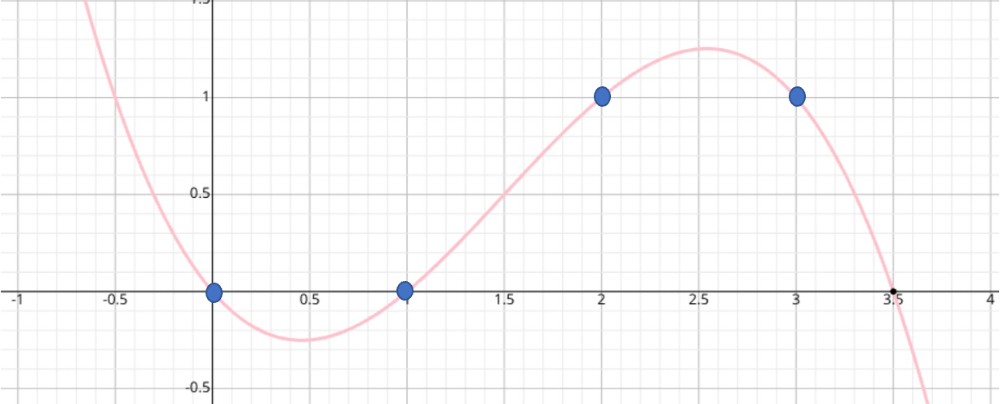

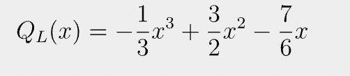


同样，我们可以将其他向量转换为多项式，在同一域进行评估。让我们将 `f(x)` 定义为：

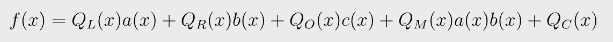


<center>图 8</center>

`f(0)` 计算结果为 `0`，因为

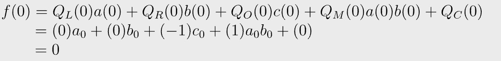

类似地，您可以在 1、2、3 处评估 `f`，这些结果都为 `0`。


当且仅当满足以下条件时，将满足图 7 中的所有约束：

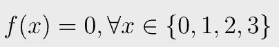

<center>图 9</center>

我们已将所有约束压缩为单个多项式 `f(x)`，可以表示如下。

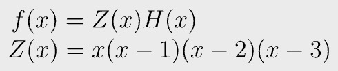

<center>图 10</center>

这是因为 0、1、2 和 3 是 `f(x)` 的根。只要存在使 `f(x)` 除 `Z(x)` 没有任何余数的多项式 `H(x)`，图 9 就成立。`Z(x)` 称为消失/零多项式，`H(x)` 称为商多项式。我们可以定义另一个多项式 `g(x)`：

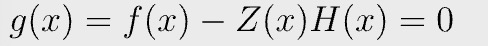

<center>图 11</center>

我们只需要证明 `g(x)` 在任何地方都是 `0`，即它是一个零多项式。

## Schwartz-Zippel 引理

[Schwartz-Zippel 引理](https://en.wikipedia.org/wiki/Schwartz%E2%80%93Zippel_lemma) 指出：设 `f(x)` 是大小为 `n` 的域 `F` 上的 `d` 次非零多项式，则对于随机选择的 `s`，`f(s) = 0` 的概率至多为 `d/n`​. 直观地说，这是因为 `f(x)` 最多有 `d` 个根。在实践中，d通常不大于1亿，而 `n` 接近2²⁵⁶，即 `d/n = 1/10⁶⁹`。

这意味着如果我们在某个随机点评估多项式并且评估为 0，则表明多项式实际上在任何地方都为零，并且具有压倒性的概率。

一个推论是，如果我们在某个随机点评估两个多项式并且它们相等，那么它们几乎肯定在任何地方都相等。

## 多项式承诺方案

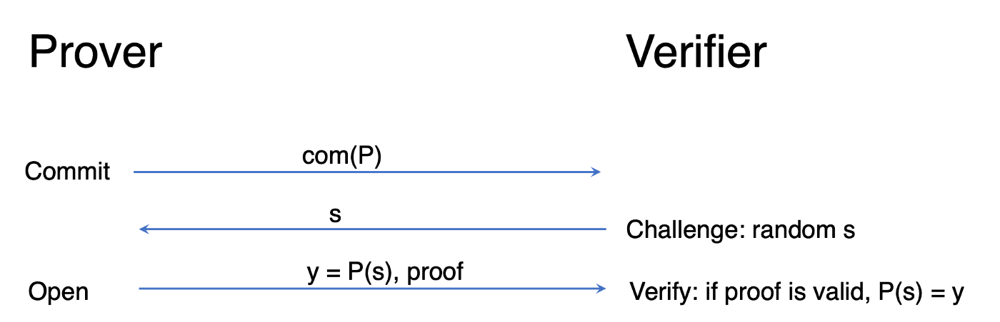

<center>多项式承诺</center>


为了证明多项式 `P(x)` 为 `0`，我们使用多项式承诺方案(**PCS**)。**PCS** 可以看作是某个多项式 `P(x)` 的某种“散列”，提交者可以通过证明证明 `P` 在某个点上的计算结果为某个值，而不会泄露多项式 `P`。

**PCS** 由证明者和验证者之间的三轮组成：

1. 提交：证明者提交某个多项式 `P` 并将其发送给验证者
2. 挑战：验证者想要在随机点 `s` 评估 `P` 并将其发送给证明者
3. 揭示：证明者在 `s` 处评估 `P` 并将结果 `y` 连同评估证明一起发回。验证者检查证明，如果证明有效，则得出 `P(s) = y` 的结论。多项式方程本身可以通过在随机值处进行评估来有效地验证。

我们可以使用 **PCS** 来证明图 11 中的 `g(x)` 为零。PLONK 论文使用基于配对的 [Kate 承诺](https://dankradfeist.de/ethereum/2020/06/16/kate-polynomial-commitments.html)。也可以使用其他 **PCS**。

我们将在下一篇文章中介绍剩余的复制约束部分。敬请关注。如果有任何错误，请告诉我们。

## 参考

https://github.com/sCrypt-Inc/awesome-zero-knowledge-proofs#plonk

------------------------------------------------------

[1] 只要新电路不大于原电路。

[2] PLONK 约束系统类似于 rank-one 约束系统 (R1CS)，因为它们在每个门中都只能有一个乘法。不同之处在于 R1CS 允许在门中无限加法，而 PLONK 只能做一个，不包括常数的加法。

[3] 在实践中，系数都是整数，因为所有操作都不是在整数上完成的，而是在素数域上完成的。