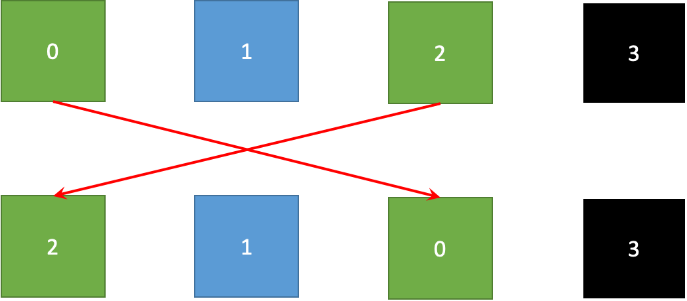

# PLONK 的工作原理：第 2 部分

> 复制约束

在[第 1 部分](https://blog.csdn.net/freedomhero/article/details/127675853)中，我们解释了如何将想要使用 PLONK 证明的计算转换为中间约束系统，最终使用多项式承诺方案 (PCS) 来证明。我们只介绍了一种类型的约束：门约束。在本文中，我们将介绍另一种类型：复制约束。

## 复制约束

图 1

在第 1 部分中，我们在每个门中实施了约束，例如 `a0 * b0 = c0`。但是，不同的门也存在约束，例如，门 0 的输出是门 1 的左输入，因此 `c0 = a1`。此外，可以拆分，例如，`a0 = b0 = b1 = a2`。这些约束称为*复制约束*，以确保连线包含相同的值。

## 排列检查

让我们首先考虑单个向量（即单个多项式）内的复制约束，例如 `a0 = a2`。我们定义一个置换函数 `σ`。 `σ(i)` 是置换向量中第 `i` 个元素的新索引。在我们的例子中，`σ = (2, 1, 0, 3)` 如图 2 所示，表示 `a0` 和 `a2` 交换位置。

图 2

颜色代表图中的线值。如果置换的块与顶部的原始块具有相同的颜色，则满足复制约束。

## 大乘积

让我们选择两个随机数 `β` 和 `γ`。将 `f` 和 `g` 定义为：

图 3

当且仅当以下等式成立时，置换检查通过：

图 4

左手边称为 **大乘积**。在我们的具体示例中，当 `a0 = a2` 时，很容易看到等式成立，因为在大乘积的分子和分母中的所有项都抵消了。

图 5

因为 β 和 γ 是随机的，所以在置换检查失败的情况下，大乘积 是 1 实际上是不可能的。也就是说，如果 `a0 != a2`，图 4 中的等式将不成立。

## 证明

我们提供了一个非正式的证明，如果大乘积为 1，则 `σ(i) = j` 意味着 `ai = aj`。

回想一下，Schwartz-Zippel 引理说如果两个多项式在随机评估点相等，那么这两个多项式在任何地方都是相同的，并且具有压倒性的概率。让我们考虑两个多项式。

由于它们在随机 `γ` 上相等，我们可以认为它们是相同的，这意味着它们具有相同的根。

考虑两个匹配的根：来自 **P1** 的第 `j` 个和来自 **P2** 的第 `i` 个。

我们可以通过定义两个多项式再次应用上述技巧：

由于它们在随机 `β` 处相等，我们可以认为它们是相等的。也就是说，当 `σ(i)=j` 时，`ai=aj`。 QED¹。

## 多项式

### 单位根

在将向量转换为目标多项式时，我们使用向量索引 `{0, 1, 2, ..., n-1}` 作为评估 `H` 的域，但可以使用任何域。在 PLONK 中，由于其性能提升，用于多项式插值的域由单位根组成。域的第 `n` 个单位根是满足 `ω^n = 1` 的域元素 `ω`。`n` 是向量的大小，在这种情况下为 `4`。 `H` 是 `{ω⁰, ω¹, ω², ω³ }`。

### 累加器

让我们定义一个向量 P 评估如下：

图 6

它累积了大乘积，因为 P 可以递归地重写：

图 7

如果存在诸如 `P(x)`，我们知道图 4 中的大乘积方程成立，因为

图 8

图 7 等价于：

图 9

`P(x)`、`f(x)` 和 `g(x)` 可以像以前一样在域 H `{ω⁰, ω¹, ω², ω³}`上使用插值来找到。以下多项式方程在域 H 上成立

其中

再次等价证明下面的多项式方程

其中

我们可以使用[第 1 部分](https://blog.csdn.net/freedomhero/article/details/127675853)中的多项式承诺方案来证明它。

## 跨向量复制约束

不同向量/多项式之间也存在复制约束，例如 `a2 = b0` 和 `a1 = c0`。我们可以扩展之前的方法，将向量 `a`、`b` 和 `c` 合并为一个大小为 `12` 的大向量。例如，`b0` 的索引为 `4`，`c0` 为 `8`。我们玩具示例的置换函数 `σ(i)` 变为：

图 3 变为：

其余步骤类似于在单个向量中执行复制约束的步骤。

## PLONK

回顾一下，给定一个要证明的程序 P，我们首先将其转换为算术电路，然后转换为一系列约束，包括门和复制约束，这些约束被转换为多项式。最后，我们使用 PCS 简洁地验证多项式恒等式。这些都是使用 PLONK 来证明计算的高级思想。为了便于说明，我们省略了无数重要的优化，这些优化使 PLONK 在实践中高效。例如，可以使用标准的 [Fiat-Shamir 启发式](https://en.wikipedia.org/wiki/Fiat%E2%80%93Shamir_heuristic)使 PCS 成为非交互式的。对多个多项式身份的测试也可以合并为一个。有关更多详细信息，您可以阅读[原始论文](https://eprint.iacr.org/2019/953.pdf)或下面的参考资料。

## 参考

https://github.com/sCrypt-Inc/awesome-zero-knowledge-proofs#plonk

---------------------------------------------

[1] 证明的思想来自[这里](https://youtu.be/NqrVcDuQ8hM?t=1669)。