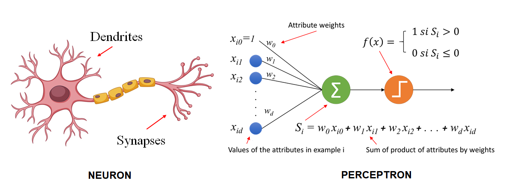

# 如何使用比特币训练人工智能
> 将训练外包给他人

[之前](https://github.com/sCrypt-Inc/article/blob/b44946d2a73b5cdec5136a4297d8696de3f12fd6/AI%20on%20Bitcoin/AI%20on%20Bitcoin.md#L124)，我们已经实现了一个单层感知器，可以在比特币上持续训练。当数据集很大并且需要多次迭代才能找到所需的权重时，这很快就会变得非常昂贵。



<center><a href="https://inteligenciafutura.mx/english-version-blog/blog-06-english-version">感知器</a></center>

我们制定了外包训练的合约。这是一项公共赏金，任何提供正确权重的人都可以获得奖赏，这些权重可以使预测与所有训练数据集输入的输出相匹配。计算密集型的训练是在链下完成的，合约只验证训练是有效的，因此在比特币上训练感知器的成本效益显着提高。

```js
contract Perceptron {
	// sample size
	static const int N = 100000;

	// training dataset
	// inputs
	Input[N] inputs;
	// outputs
	Output[N] outputs;

	// prediction for the i-th input
	function predict(int heightWeight, int weightWeight, int bias, int i) : int {
		int sum = bias;
		sum += this.inputs[i].height * heightWeight + this.inputs[i].weight * weightWeight;
		return stepActivate(sum);
	}

	// whoever can find the correct weights and bias for the training dataset can take the bounty
	public function main(int heightWeight, int weightWeight, int bias) {
		// every dataset must match
		loop (N) : i {
			int prediction = this.predict(heightWeight, weightWeight, bias, i);
			// prediction must match actual
			require(this.outputs[i] == prediction);
		}

        require(true);
    }

	// binary step function
	static function stepActivate(int sum): int {
		return (sum >= 0 ? 1 : 0);
	}
}
```

<center><a href="https://github.com/sCrypt-Inc/boilerplate/blob/master/contracts/perceptron2.scrypt">感知器外包合约</a></center>