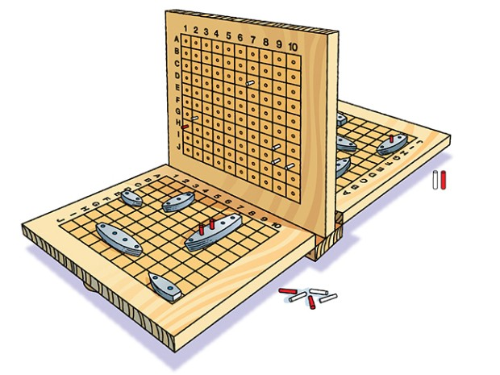
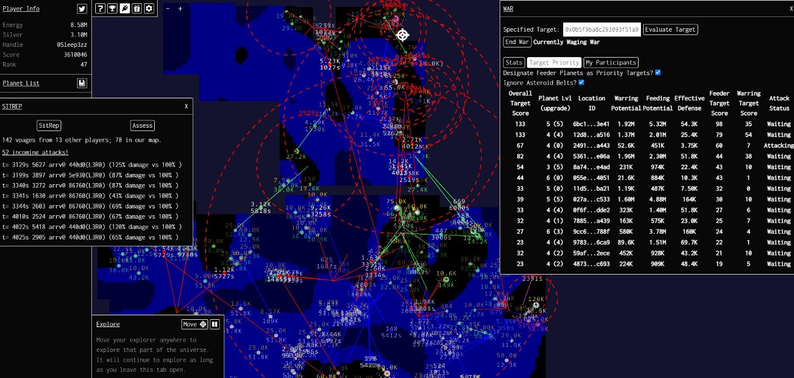

# 比特币上的信息不完整游戏

> 使用零知识解决区块链隐私困境

我们展示了如何使用零知识证明（ZKP）开发比特币上的信息不完整游戏，这通常被认为无法在透明的区块链上实现。我们使用两个游戏来举例说明关键过程。

## 悖论

游戏分为两类：

**信息完整游戏** : 所有玩家都知道有关游戏状态的一切。例如，在国际象棋中，两个玩家都知道所有棋子在哪里。
**信息不完整游戏** : 扑克就是这样一种游戏，因为你不知道对手有什么牌。

大多数大型多人在线 (MMO) 游戏都属于后者，例如《星际争霸》、《我的世界》和《魔兽世界》。[“战争迷雾”](https://en.wikipedia.org/wiki/Fog_of_war#In_video_games)隐藏了信息，游戏地图的区域在玩家探索之前一直被隐藏起来。它使游戏更加有趣和有吸引力，因为它支持社交动态和博弈论策略，例如基于信息不完整的虚张声势、欺骗、协调和决策。

在像比特币这样的区块链上构建信息不完整的游戏似乎是自相矛盾的：

* 一方面，我们希望游戏状态转换遵循游戏规则，没有玩家可以作弊。例如，扑克玩家不能使用他不拥有的牌或使用两次牌。区块链是理想的选择，因为其上的数据和计算都是可公开验证和审计的。
* 另一方面，我们需要对每个用户保密部分状态。但是区块链本质上是开放和透明的。

## ZKP 来救援

ZKP 为这个明显的悖论提供了解决方案。游戏状态转换是一种计算。ZKP 允许区块链验证私有状态的计算结果，同时在链下对其保密。更具体地说，由于比特币支持 zk-SNARKs 等 ZKP，它为各种信息不完整的游戏打开了大门，这在以前被认为是不可能的。

## 为什么不只是承诺和揭示？

在 commit-reveal 方案中，游戏信息被散列并暂时隐藏，并最终在游戏结束时公开。它不适用于许多游戏，因为：

1. 在 战舰 (Battleship) 或 Mastermind 等游戏中，一名玩家在一轮中进行多个动作，每个动作取决于游戏中的状态。仅知道游戏结束时的最终状态是不够的。

2. 在其他游戏中，信息可以无限期地隐藏。例如，扑克玩家可以选择弃牌而不亮牌。

## 战舰 (Battleship)

[战舰](https://en.wikipedia.org/wiki/Battleship_(game))是两个玩家的经典猜谜游戏。它是在一个网格上进行游戏的，每个玩家的战舰都锚定在这个网格上。有两个步骤：

1. 放置：每个玩家将 `5` 艘船放置在 `10x10` 的网格上。每艘船都是一个宽度为 `1` 且长度可变的矩形。舰队的位置必须对对手隐瞒。

2. 射击：玩家轮流猜测网格上的坐标。然后他们的对手会告诉他们该坐标是否包含一艘船。如果是，则为“命中”，否则为“未命中”。

如果所有方格都被击中，则一艘船沉没。如果玩家击沉对手的所有船只，则该玩家获胜。

在离线环境中，两名玩家面对面坐着，他们看不到对方的舰队。比特币上，为了模拟的隐藏，每个玩家都会散列他的舰队位置并将其提交给智能合约。

使用 zk-SNARKs，每个玩家都可以向智能合约提交一个证明，证明另一个玩家的猜测坐标是命中还是未命中，而不用披露他的舰队。只有当证明有效时，智能合约才会验证证明并更新全局游戏状态。

## 黑暗森林

[《黑暗森林》](https://blog.zkga.me/) 是第一款链上MMO即时战略游戏，改编自[三体](https://en.wikipedia.org/wiki/The_Three-Body_Problem_(novel))三部曲的第二部同名小说。在这款太空征服游戏中，玩家可以开发星球，建造舰队，征服宇宙中的其他星球。

它比 CryptoKitties 等传统区块链游戏更有趣的是，每个玩家都知道自己的游戏状态，但不知道其他玩家的游戏状态，因为他们被战争迷雾所掩盖。

为了实现这一点，每个玩家都将其位置的哈希提交到区块链，就像在战舰中一样。它使用 zk-SNARK 来强制玩家的动作遵循游戏规则，而不会将有关动作的信息分享给其他玩家。例如，当玩家选择一个母星时，它必须在已知宇宙的边界内。

## 总结

今天可以在比特币上开发信息不完整的游戏，因为我们已经在其上[实现了 zk-SNARKs](https://blog.csdn.net/freedomhero/article/details/125599764)。由于比特币上的智能合约交易便宜且即时，因此它是构建此类游戏的理想平台。我们将发布更多示例和工具，以促进比特币的零知识应用程序开发。