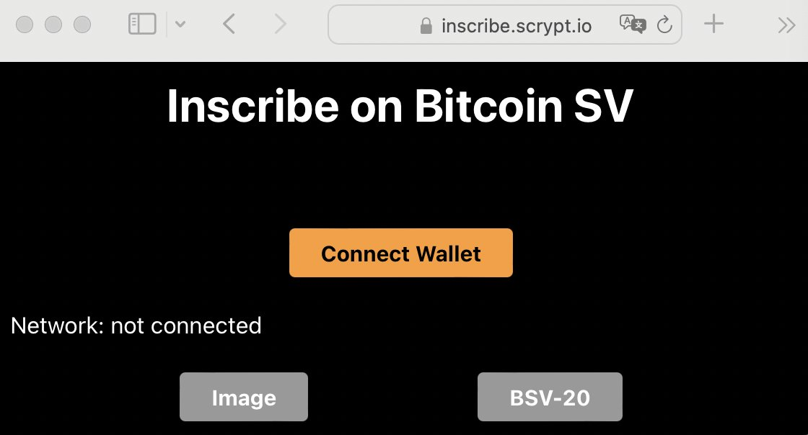
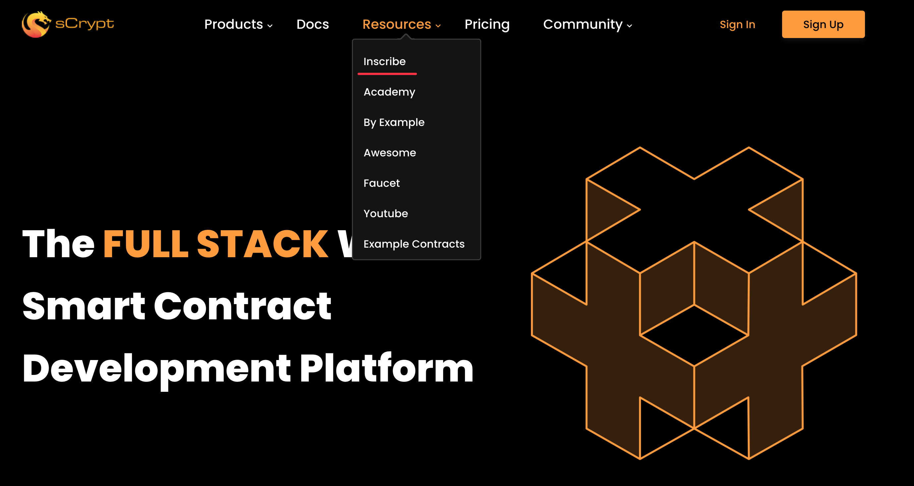

# 在sCrypt网站上铭刻Ordinals

sCrypt发布了一个新的[Ordinals](https://docs.1satordinals.com/)铭刻工具，连接[Panda Wallet](https://github.com/Panda-Wallet/panda-wallet)后即可使用。你可以观看我们录制的[视频教程](https://youtu.be/IsNINX3pqKI?si=x9ORS3uV8Mau6d_p)，获得更多细节。

铭刻工具同时支持BSV主网（mainnet）和测试网（testnet），你可以在我们的[官方网站](https://scrypt.io/)上找到它，或直接访问[https://inscribe.scrypt.io](https://inscribe.scrypt.io)。

