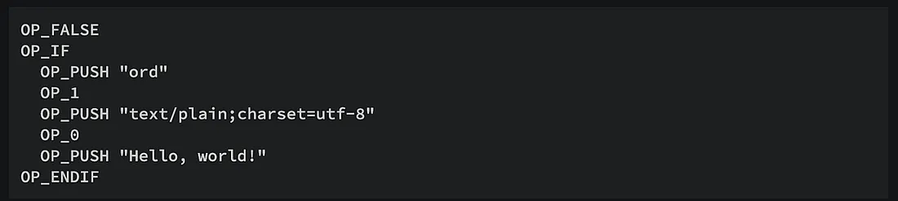

# 将序数与比特币智能合约集成：第 1 部分

最近，比特币序数在区块链领域引起了广泛关注。 据称，与以太坊 ERC-721 等其他代币标准相比，Ordinals 的一个主要缺点是缺乏对智能合约的支持。

我们展示了如何向 Ordinals 添加智能合约功能，从而扩大其用例范围。 与普遍看法相反，序数不仅与智能合约兼容，而且实际上非常适合智能合约。


作为展示，我们开发了一个支持许可序数的智能合约。 与常规/无需许可的序数相比，每次转让都需要由发行人批准和共同签署。

## 基本思想

比特币采用UTXO（Unspent Transaction Output）模型。每个UTXO由两个字段组成：

- value：此输出中的聪数量
- script：锁定输出的比特币脚本。


如果使用 1Sat Ordinals 将 UTXO 记录为不可替代代币 (NFT)，则该`value` 为 1，并且 `script` 控制如何铸造或转移代币。 由于聪和脚本位于两个正交字段中，因此序数代币可以锁定到任何脚本中。 这意味着代币可以由任何智能合约控制。

### 铸造(Mint)

正如我们之前介绍的，序数被刻在操作码 `OP_FALSE OP_IF` 和 `OP_ENDIF` 之间的“信封”中。



<center>文本铭文“Hello, world!”</center>

`OP_FALSE` 确保铭文脚本永远不会进入 `OP_IF` 分支并且永远不会被执行。 整个铭文脚本可以被视为一个 [`NOP`](https://en.wikipedia.org/wiki/NOP_(code))，并与其他脚本结合在一起，而不改变后者的执行。

对于 sCrypt，它被添加到从 sCrypt 智能合约编译的锁定脚本之前。 它不会改变合约的行为，因此可以安全地与任何合约结合。


```
<Inscription Script> <Locking Script>
```

### 转移(Transfer)

代币铸造后，其转移由智能合约决定，就像原生比特币一样。 每次转账都可以将代币/聪转移到新的智能合约中。 注意，确保转移时没有前面的铭文，只有在第一次铭文时才会有。

```
<Locking Script>
```

## 许可序数

如今，大多数序数都使用 [Pay To Pubkey Hash (P2PKH)](https://learnmeabitcoin.com/technical/p2pkh) 作为锁定脚本。 当 Alice 想要将序数转移给 Bob 时，她不需要任何第三方的许可。

在某些情况下，每次转让都必须得到发行人的批准，例如为了遵守法律。 当铸造这样的序数时，我们可以使用以下智能合约。


```ts
export class PermissionedOrdinal extends SmartContract {
    @prop()
    readonly issuer: PubKey

    // length of inscription script
    @prop()
    readonly inscriptLen: bigint

    @prop(true)
    owner: PubKey

    // is being minted
    @prop(true)
    isMint: boolean

    constructor(issuer: PubKey, inscriptLen: bigint) {
        super(...arguments)
        this.issuer = issuer
        this.inscriptLen = inscriptLen
        this.owner = issuer
        this.isMint = true
    }

    @method()
    public transfer(recipient: PubKey, ownerSig: Sig, issuerSig: Sig) {
        assert(this.checkSig(ownerSig, this.owner), 'owner signature check failed')
        // issuer co-sign
        assert(this.checkSig(issuerSig, this.issuer), 'issuer signature check failed')
        
        // save a local copy
        const isMint = this.isMint

        this.owner = recipient
        this.isMint = false
        let stateScript = this.getStateScript()
        if (isMint) {
            // Cut leading inscription script.
            stateScript = slice(stateScript, this.inscriptLen)
        }

        // Propagate contract to next output and ensure the value stays 1 sat.
        let outputs = Utils.buildOutput(stateScript, 1n)
        outputs += this.buildChangeOutput()
        assert(this.ctx.hashOutputs == hash256(outputs), 'hashOutputs mismatch')
    }
}
```

[PermissionedOrdinal 合约](https://github.com/sCrypt-Inc/boilerplate/blob/master/src/contracts/permissionedOrdinal.ts)

除了第 `26` 行当前所有者的签名（第 `10` 行是合同状态）之外，第 `28` 行还需要发行人的签名。


由于合约是有状态的，因此每次转让都必须确保聪被转移到同一个合约中，确保所有后续转让都需要发行人签名，而不仅仅是铸币后的第一次转让。 请注意，主要铭文脚本在第 `38` 行的第一次传输时被剪切。

## 其他潜在用例

Ordinal 代币和智能合约的正交性意味着它们是无限可组合的。 有多种方法可以将它们结合起来。 下面我们只列出几个例子：

1. [序数锁](https://docs.1satordinals.com/ordinal-lock)：锁定一个序数 utxo，任何人都可以通过购买来解锁该序数 utxo，或者由列出者取消。
2. [OP-NS](https://op0-2.gitbook.io/op-standard/protocols/op-ns)：使用迷你工作量证明支持的 Ordinals Inscriptions 为比特币数据空间创建一个 fair-mint 分层命名系统
3. 序数和比特币之间的原子交换：将序数锁定在 HLTC 中以允许无需信任的序数销售
4. 供应上限：目前，BSV-20² 允许铸造的代币数量超过部署中的最大供应量。 使用合约，我们可以禁止链上的此类铸造交易，而不是事后在索引器上使它们在链下无效
5. 黑名单/白名单
6. 冻结与恢复

------------------------------

[1] 事实上，当 sCrypt 智能合约是无状态时，铭文脚本可以插入到任何地方。 例如，它可以附加到合同脚本中。 但追加不适用于有状态合约。 为了使其能够与任何 sCrypt 合约一起使用，我们在一开始就将其作为约定。

[2] 基于 1Sat Ordinals 的可替代代币标准。