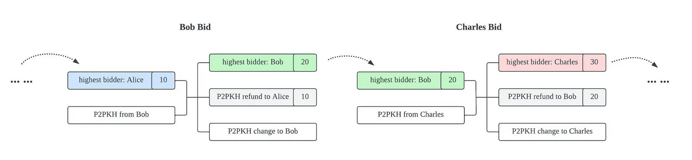
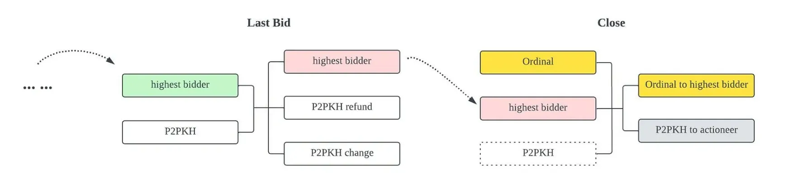
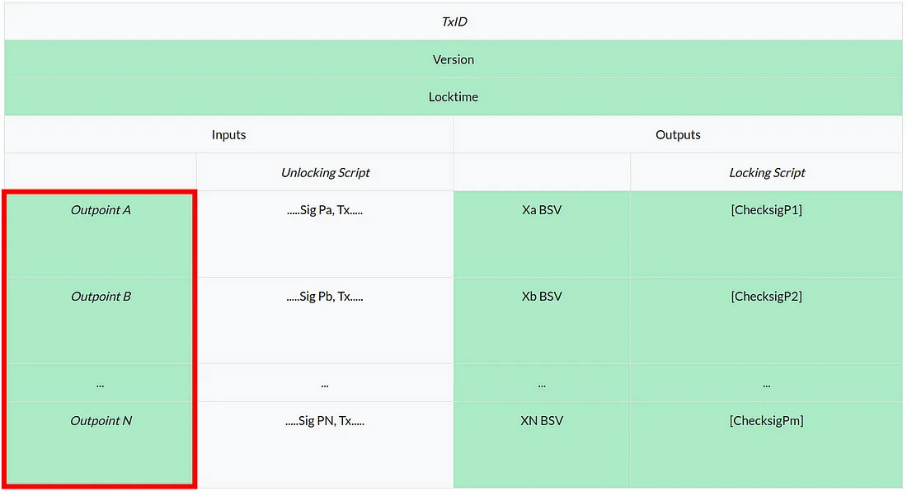

# 将 Ordinal 与比特币智能合约集成：第 2 部分

在上一篇文章中，我们展示了一种将 Ordinal 与智能合约集成的方法，即将Ordinal和合约放在同一个 UTXO 中。 今天，我们介绍了一种集成它们的替代方案，即它们位于单独的 UTXO 中。

作为展示，我们开发了一个智能合约，可以实现序号的链上拍卖。 智能合约保证拍卖师将获得最高出价，而投标人将获得 Ordinal。

## 基本思想

在 UTXO 模型中，一笔交易可以包含多个输入，每个输入消耗一个单独的 UTXO。 其中一个 UTXO 是我们的智能合约，另一个是锁定在非合约（即 P2PKH）UTXO 中的 Ordinal。 比特币智能合约能够访问相邻的输入，在 sCrypt 中称为 `ScriptContext`。*由于 Ordinal 也基于 UTXO，因此智能合约可以访问相邻输入中花费的 Ordinal，从而决定其传输。*

## Ordinal 拍卖

为了演示这个想法是如何体现的，我们构建了一个拍卖 Ordinal 的合约。 它是公开透明的，每个人都可以参与，在规定的截止日期后投标结束，出价最高者获胜。

有两种与合约交互的方式。 让我们看看它们是如何实现的。

### 1. 投标

当出现更高出价时，更新当前最高出价者，并退还之前最高出价者。



上图显示了两笔此类竞价交易，其中 Bob 和 Charles 成功竞价。 它们都有 3 个输入和 2 个输出。


```ts
@method()
public bid(bidder: PubKey, bid: bigint) {
    const highestBid: bigint = this.ctx.utxo.value
    assert(
        bid > highestBid,
        'the auction bid is lower than the current highest bid'
    )

    // Change the public key of the highest bidder.
    const highestBidder: PubKey = this.bidder
    this.bidder = bidder

    // Auction continues with a higher bidder.
    const auctionOutput: ByteString = this.buildStateOutput(bid)

    // Refund previous highest bidder.
    const refundOutput: ByteString = Utils.buildPublicKeyHashOutput(
        hash160(highestBidder),
        highestBid
    )
    let outputs: ByteString = auctionOutput + refundOutput

    // Add change output.
    outputs += this.buildChangeOutput()

    assert(
        hash256(outputs) == this.ctx.hashOutputs,
        'hashOutputs check failed'
    )
}
```


出价方法非常简单。 它首先检查出价是否足够大。 如果是，它会更新最高出价者。 其余的，它检查新交易的输出。 第一个输出只是具有更新状态的下一个拍卖实例。 此输出中锁定的值将等于新的出价。 第二个输出将按照最后最高出价者的出价金额偿还。 最后它添加了找零输出。

### 2. 关闭拍卖

当拍卖到期时，拍卖师可以关闭拍卖并接受报价。 拍卖师还必须将 ordinal 转让给最高出价者。 这是关闭合约的条件。



上图右侧显示了一笔平仓交易。 它与竞价交易的不同之处在于输入和输出。

- 有一个附加输入（第一个输入）包含我们正在拍卖的 Ordinal
- 有一个输入（第一个输出）将 Ordinal 传输给中标者。

合约在第二个输入中被调用，而 Ordinal 在第一个输入中被引用。 它们位于单独的 UTXO 中，但合约可以控制 Ordinal 的传输。

```ts
// Output of auctioned ordinal (txid + vout).
@prop()
readonly ordnialPrevout: ByteString
    
@method()
public close(sigAuctioneer: Sig) {
    // Check if using block height.
    assert(
        this.ctx.locktime >= this.auctionDeadline,
        'auction is not over yet'
    )

    // Check signature of the auctioneer.
    assert(
        this.checkSig(sigAuctioneer, this.auctioneer),
        'signature check failed'
    )

    // Ensure the first input in spending the auctioned ordinal UTXO.
    assert(
        slice(this.prevouts, 0n, 36n) == this.ordnialPrevout,
        'first input is not spending specified ordinal UTXO'
    )

    // Ensure the 1sat ordinal is being payed out to the winning bidder.
    let outputs = Utils.buildPublicKeyHashOutput(hash160(this.bidder), 1n)

    // Ensure the second output is paying the bid to the auctioneer.
    outputs += Utils.buildPublicKeyHashOutput(
        hash160(this.auctioneer),
        this.ctx.utxo.value
    )

    // Add change output.
    outputs += this.buildChangeOutput()

    // Check outputs.
    assert(hash256(outputs) == this.ctx.hashOutputs, 'hashOutputs mismatch')
}
```

`close` 方法稍微复杂一些。 首先，它在第 `8` 行使用典型的[时间锁定](https://docs.scrypt.io/tutorials/timeLock)模式检查调用是否是在截止日期之后发出的。然后，它在第 `14` 行验证拍卖师的签名，这是唯一允许结束拍卖的签名。



ScriptContext 中的 [this.prevouts](https://docs.scrypt.io/how-to-write-a-contract/scriptcontext/#prevouts) 包含指向输入中引用的 UTXO 的所有指针，称为 outpoints。 出点包含两部分：

1. 交易ID: 32 字节
2. 输出索引: 4 字节

UTXO 位于由此类出点唯一标识的交易的输出中。

在第 21 行，我们提取第一个输入的出点（前 36 个字节），并将其与实际 Ordinal 的 UTXO 进行比较，在拍卖开始和部署合约时进行硬编码。 这保证了 Ordinal 的真实性并且它不能被伪造。

然后我们像以前一样构造并确认输出。 第一个输出是定期 P2PKH 转账给最高出价者。 第二个输出支付给拍卖师。 最后，如有必要，我们添加找零输出。

请注意，合约确保 Ordinal 出现在第一个输入中，因此它最终出现在第一个输出中并转移给获胜者。

### 一个例子
以下是执行比特币 Ordinal 拍卖结束的交易示例：

[69335ac678c19704c1564877f5d100f1b99212273f83a5536bb2c6deca40d0c8](https://whatsonchain.com/tx/69335ac678c19704c1564877f5d100f1b99212273f83a5536bb2c6deca40d0c8)

这个 Ordinal 刻有“Hello, sCrypt!”文字，拍卖价格高达 `8` 聪！  Ordinal 被转移给地址为 `1NHJoK2ANVb8MtK7Er1uEqBckgbpZK7QUz` 的最高出价者。

完整的[代码](https://github.com/sCrypt-Inc/boilerplate/blob/master/src/contracts/ordinalAuction.ts)和[测试](https://github.com/sCrypt-Inc/boilerplate/blob/master/tests/ordinalAuction.test.ts)可以在 GitHub 上找到。