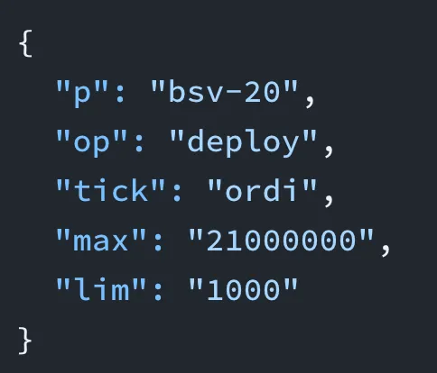
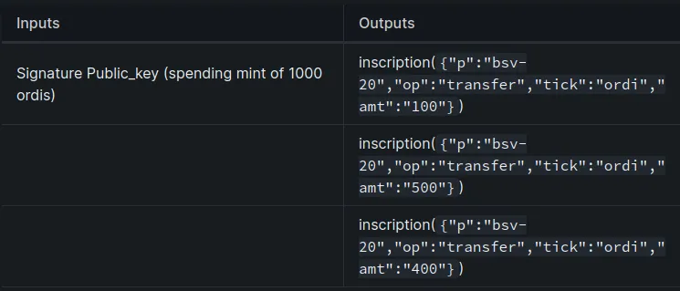

# 将 Ordinals 与比特币智能合约集成：第 3 部分

> 基于 Ordinals 的 BSV-20 同质化代币

[之前](https://github.com/sCrypt-Inc/article/blob/master/Integrate%20Ordinals%20with%20Smart%20Contracts%20on%20Bitcoin%20-%20Part%201/Integrate%20Ordinals%20with%20Smart%20Contracts%20on%20Bitcoin.md)，我们展示了如何将比特币智能合约与 Ordinals 集成，Ordinals 可以被视为链上的 NFT。 在本文中，我们将展示如何将它们与同质化代币（即 [BSV-20 代币](https://docs.1satordinals.com/bsv20)）集成。 我们仍然以拍卖为例，它的工作原理与 NFT 版本相同，只有很少的变化。



## BSV-20 同质化代币如何运作

BSV-20<sup>1</sup> 是 BSV 网络上的同质化代币标准，受到 BTC 上的 [BRC-20 标准](https://domo-2.gitbook.io/brc-20-experiment/)的启发。

Ordinals 铭文由内容类型（也称为 MIME 类型）和内容（任意字节字符串）组成。

```
OP_FALSE
OP_IF
  OP_PUSH "ord"
  OP_PUSH 1
  OP_PUSH content-type
  OP_PUSH 0
  OP_PUSH content
OP_ENDIF
```

在 BSV-20 中，您可以创建内容类型为 `application/bsv-20` 且内容为 JSON 的 Ordinals 铭文输出。

### 部署 (Deploy)

例如，要部署最大供应量为 `21000000` 的 `ordi` 代币，您可以使用以下 JSON 创建一个铭文。

```json
{ 
  "p": "bsv-20",
  "op": "deploy",
  "tick": "ordi",
  "max": "21000000",
  "lim": "1000"
}
```

### 铸造 (Mint)

要铸造 `1000` 个 `ordi` 代币，请写入以下 JSON。

```json

{ 
  "p": "bsv-20",
  "op": "mint",
  "tick": "ordi",
  "amt": "1000"
}
```

### 转移 (Transfer)

代币存储在未花费的交易输出（UTXO）中，就像原生比特币的持有方式一样。 要启动代币转账，您需要花费指定的 UTXO 并使用与花费常规聪相同的过程生成新输出。*只不过这些新输出需要包含转账铭文。 这与 Ordinal NFT 不同，Ordinal NFT 仅在铸造时需要铭文，而在转移时会被丢弃。*

例如，要转移上面铸造的代币，您将创建一个交易，其输入花费铸造 UTXO（通常提供签名和公钥以花费 P2PKH 脚本），输出包含以下铭文。 它将 `1000` 个代币分成三个输出，每个输出分别包含 `100`、`500` 和 `400` 个代币。



有关 BSV-20 代币如何工作的更多详细信息，请阅读[官方文档](https://docs.1satordinals.com/bsv20)。

## 拍卖 BSV-20 代币

拍卖 BSV-20 代币的智能合约与我们上一篇文章中用于拍卖 NFT 的智能合约几乎相同。


唯一的区别在于 `close` 公共方法。 除了检查第一个输出是否发送给中标者之外，我们还检查它在一开始就包含预期的转移铭文。 如果我们忽略此检查，则解锁的 UTXO 携带的 BSV-20 代币将被视为烧毁。

```ts
// Close the auction if deadline is reached.
@method()
public close(sigAuctioneer: Sig) {
  ...
  
  // Ensure the ordinal is being payed out to the winning bidder.
  let outScript = Utils.buildPublicKeyHashScript(hash160(this.bidder))
  outScript = this.transferInscription + outScript
  let outputs = Utils.buildOutput(outScript, 1n)
  
  ...
}
```


假设我们要拍卖上面铸造的 1000 个 ordi 代币，`this.transferInscription` 将如下所示：

```
OP_FALSE
OP_IF
  OP_PUSH "ord"
  OP_PUSH 1
  OP_PUSH "application/bsv-20"
  OP_PUSH 0
  OP_PUSH 
    { 
      "p": "bsv-20",
      "op": "transfer",
      "tick": "ordi",
      "amt": "1000"
    }
OP_ENDIF
```

----------------------

[1] 这里我们使用 BSV-20 的 V1，First 是第一模式。 V2，[无 tick 模式](https://docs.1satordinals.com/bsv20#new-in-v2-tickerless-mode)，稍作修改即可支持。
