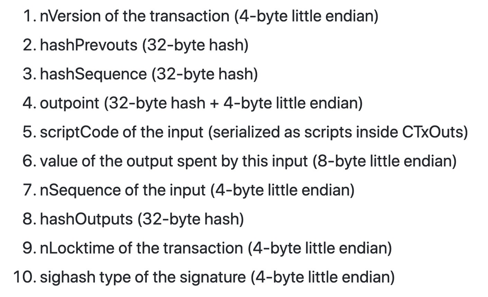
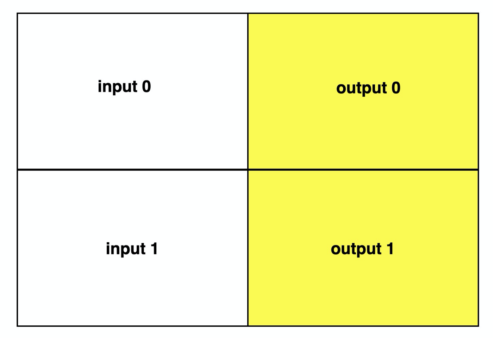
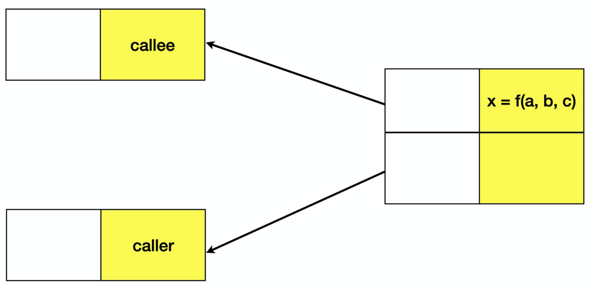

# 比特币合约间调用

我们将介绍一种新颖的方法来调用另一个智能合约。方法建立在 [OP_PUSH_TX](https://blog.csdn.net/freedomhero/article/details/107306604) 的技术之上。我们通过让一个合约调用另一个合约来求解二次方程来说明该方法。它已在 [Sensible Contract](https://sensiblecontract.org) 等项目中得到推广和广泛使用。

## 背景


<center> <a href="https://github.com/bitcoin-sv/bitcoin-sv/blob/master/doc/abc/replay-protected-sighash.md#digest-algorithm"> sighash 原像格式规范</a> </center>

从 sighash 原像的规范中，我们可以看到交易中的每个输入都有不同的 sighash 原像。我们还看到它们的原像有重叠的部分。最值得注意的是，它们共享相同的输出（彩色）。input0 和 input1 的原像都包括 output0 和 output1，如下面的示例交易<sub>1</sub>中突出显示的部分。我们利用这一特性来让两个合约相互通信。



<center>在 2 个输入的 sighash 原像中都包含相同的输出</center>

## 合约间调用

为了演示如何调用另一个合约，我们考虑求解一个二次方程的示例：`a * x² + b * x + c = 0`。



下面列出了求解方程的合约。它将解 `x` 写入 output0。

```javascript
struct Coeff {
    int a;
    int b;
    int c;
}

contract Callee {
    static const int N = 2;

    public function solve(Coeff co, int x, SigHashPreimage txPreimage) {
        // Note: SigHash_SINGLE is used
        require(Tx.checkPreimageSigHashType(txPreimage, SigHash.SINGLE | SigHash.FORKID));

        // check x is a root
        require(co.a * x * x + co.b * x + co.c == 0);

        bytes data = num2bin(co.a, N) + num2bin(co.b, N) + num2bin(co.c, N) + num2bin(x, N);
        bytes outputScript = Utils.buildOpreturnScript(data);
        bytes output = Utils.buildOutput(outputScript, 0);
        require(hash256(output) == SigHash.hashOutputs(txPreimage));
    }
}
```
<center> <a href="https://github.com/sCrypt-Inc/boilerplate/blob/master/contracts/callee.scrypt"> Callee 合约 </a></center>

调用者Caller合约也可以访问 output0，可以提取解 `x` 并使用它，而无需求解 `x` 本身。也就是调用上面的Callee合约。

```javascript

contract Caller {
    static const int N = 2;
    static const int calleeContractInputIndex = 1;
    static const int selfContractInputIndex = 0;
    // hash of the callee contract, i.e., its locking script
    PubKeyHash calleeContractHash;

    public function call(Coeff co, bytes prevouts, bytes calleeContractTx,
        bytes outputScript, int amount, SigHashPreimage txPreimage) {
        require(Tx.checkPreimage(txPreimage));
        require(hash256(prevouts) == SigHash.hashPrevouts(txPreimage));

        // validate the tx containing the callee contract
        bytes prevScriptTxId = prevouts[calleeContractInputIndex * TxUtil.OUTPOINT_LEN : calleeContractInputIndex * TxUtil.OUTPOINT_LEN + TxUtil.TX_ID_LEN];
        require(hash256(calleeContractTx) == prevScriptTxId);

        // validate the callee contract, i.e., its locking script
        int lockContractTxOutIndex = Utils.fromLEUnsigned(prevouts[selfContractInputIndex * TxUtil.OUTPOINT_LEN + TxUtil.TX_ID_LEN : selfContractInputIndex * TxUtil.OUTPOINT_LEN + TxUtil.TX_ID_LEN + 4]);
        bytes prevScriptCode = TxUtil.readOutput(calleeContractTx, lockContractTxOutIndex).script;
        require(hash160(prevScriptCode) == this.calleeContractHash);

        int l = len(outputScript);
        int a = unpack(outputScript[l - 4 * N : l - 3 * N]);
        int b = unpack(outputScript[l - 3 * N : l - 2 * N]);
        int c = unpack(outputScript[l - 2 * N : l - N]);
        require(co == { a, b, c });
        int x = unpack(outputScript[l - N :]);
        // ------>> x must be a root for the following quadatic equition: no need to double check
        // require(a * x * x + b * x + c == 0);

        bytes output = Utils.buildOutput(outputScript, amount);
        require(hash256(output) == SigHash.hashOutputs(txPreimage));
    }
}
```

<center> <a href="https://github.com/sCrypt-Inc/boilerplate/blob/master/contracts/caller.scrypt"> Caller 合约 </a></center>

## 优点

与通过将函数直接包含到合约本身来调用函数的直接方式相比，通过另一个单独的合约调用它有几个显着的优势。

- **效率** ： 一个有状态的合约可以有多个内部功能。每次它改变状态时，并不是所有的都必须被调用。然而，由于它们都是合约的一部分，它们都必须包含在内，从而导致交易规模膨胀。通过将它们放入单独的合约中，只从主合约调用给定调用所需的那些，从而节省大量成本，尤其是在有许多功能时。
- **可扩展性** ： 一个通用函数可以包装到一个库合约中，可以从任何其他合约调用，而无需了解其内部实现细节。这使它与调用合约<sub>2</sub> 解耦。

## 致谢

该技术由 Sensible Contract 的 Chen Cheng、Jiejiang 和 Lu Gu 以及 Cambridge Cryptographic 的 Ying Chan 独立发明。


------------------------------------

[1] 假设使用了 SIGHASH_ALL。

[2] 库合约的作者可以通过要求在合约被调用时必须向他控制的地址支付小额款项来获得收益。