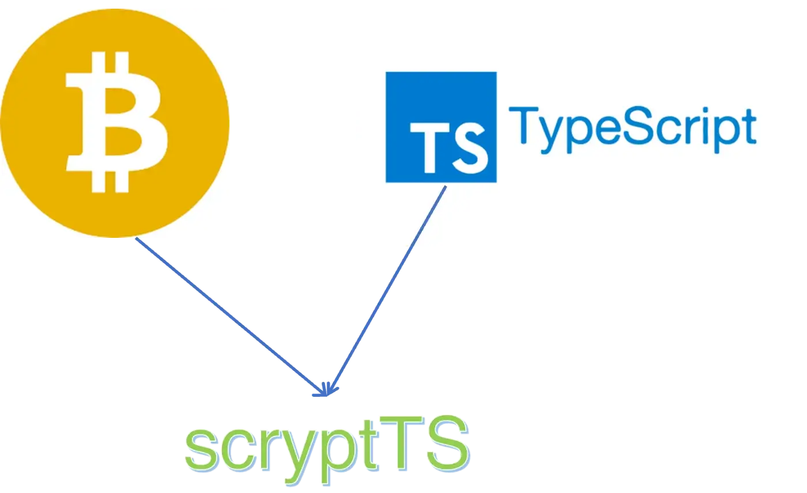
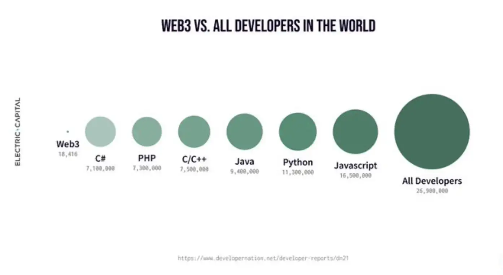

# 介绍 scryptTS：在 Typescript 中编写比特币智能合约

> 最简单的编写智能合约方法

经过数月的紧张开发，我们非常高兴地推出 *scryptTS*：一种用于在比特币上编写智能合约的 Typescript 框架。



scryptTS 是一种基于 Typescript 的领域特定语言 ([DSL](https://en.wikipedia.org/wiki/Domain-specific_language))，用于在比特币上编写智能合约，基于我们过去三年开发和培育 sCrypt 生态系统的经验。开发人员可以直接使用 Typescript 编写智能合约，Typescript 是世界上最流行的编程语言之一，每天有数百万开发人员使用。

## 比特币智能合约开发者采用的障碍

目前比特币上的智能合约开发是基于sCrypt，一种编写智能合约的高级编程语言。自推出以来，其 IDE 的下载量[已超过 4,000 次](https://marketplace.visualstudio.com/items?itemName=bsv-scrypt.sCrypt)。尽管它比使用比特币脚本（一种类似程序集的比特币低级指令集）进行开发有了显着改进，但比特币公司和项目仍然难以找到合格的智能合约开发人员，从而阻碍了比特币的广泛采用。 这主要是因为 sCrypt 仍然是一种相对小众的语言，因为它还处于初级阶段。

基于我们多年来自己开发 sCrypt 合约以及与比特币内外数百名开发人员的交谈，我们将新开发人员的主要痛点总结如下：

- 他们必须学习一门新的编程语言
- 他们必须学习新工具。


学习与日常开发工作流程不同的新事物的要求构成了巨大的进入障碍，并降低了开发人员的体验。 因此，与其他区块链相比，如今比特币开发者的数量很少。

## 终极解决方案：scryptTS

为了解决这些痛点，我们从头开始设计了 scryptTS。它的设计原则是重用许多开发人员已经熟悉的现有编程语言和工具。




Web3/区块链开发人员的数量仅占所有开发人员的 `0.07%`，而 sCrypt 开发人员的数量实际上比这还要少。

Javascript 是最流行的编程语言。 [Typescript](https://www.typescriptlang.org/) 基本上是在其中添加类型。对于控制用户资金的智能合约，类型安全至关重要。这就是我们选择 Typescript 的原因。

### 1.熟悉和简单的语法

scryptTS 就是 Typescript。创建一个循环只是写“for”和条件“if”。不需要学习的新语法。

下面是编写[阿克曼函数](https://scryptdoc.readthedocs.io/en/latest/ackermann.html)的示例。

```ts

@method
ackermann(m: bigint, n: bigint): bigint {

    let stk: string = num2bin(m, 1n);

    for(let i = 0; i < Ackermann.LOOPCOUNT; i++) {
        if (len(stk) > 0) {
            let top: string = stk.slice(0, 2);
            m = unpack(top);

            // pop
            stk = stk.slice(2, len(stk)*2);

            if (m == 0n) {
                n = n + m + 1n;
            }
            else if (n == 0n) {
                n++;
                m--;
                // push
                stk = num2bin(m, 1n) + stk;
            }
            else {
                stk = num2bin(m - 1n, 1n) + stk;
                stk = num2bin(m, 1n) + stk;
                n--;
            }
        }
    }

    return n;

}
```


是另一个实施当今最流行的智能合约的示例：Pay-to-PubKey-Hash ([P2PKH](https://learnmeabitcoin.com/guide/p2pkh))。


```ts
import { method, prop, SmartContract, assert, PubKeyHash, Sig, PubKey, hash160 } from "scrypt-ts";

class P2PKH extends SmartContract {

    @prop()
    readonly pubKeyHash: PubKeyHash;

    constructor(pubKeyHash: PubKeyHash) {
        super(pubKeyHash);
        this.pubKeyHash = pubKeyHash;
    }


    @method
    public unlock(sig: Sig, pubkey: PubKey) {
        assert(hash160(pubkey.toString()) == this.pubKeyHash.toString());
        assert(this.checkSig(sig, pubkey));
    }
}
```

### 2. 庞大的生态系统

所有现有的 Typescript/Javascript 库都可以与 *scryptTS* 无缝集成。下面是一个使用 [Mocha](https://mochajs.org/) 测试 *scryptTS* 智能合约的示例，Mocha 是最流行的 Typescript/Javascript 测试框架之一。

```ts
import { expect } from 'chai';
import { Demo } from '../contracts/demo';

describe('Test SmartContract `Demo`', () => {

  before(async () => {
    await Demo.compile(); // asm 
  })

  it('should pass the public method unit test successfully.', async () => {
    let demo = new Demo(1n, 2n);

    let result = demo.verify(() => demo.add(3n));
    expect(result.success, result.error).to.eq(true);

    result = demo.verify(() => demo.sub(-1n));
    expect(result.success, result.error).to.eq(true);

  })
})
```

<center><a href="https://github.com/sCrypt-Inc/scryptTS-examples/blob/master/tests/demo.test.ts">demo.test.ts</a></center>


### 3. 包管理

*scryptTS* 不需要它自己的包管理器。它只使用 npm，Typescript/Javascript 的包管理器。可以使用 npm 发布自己的 *scryptTS* 合约。其他任何人都可以通过 npm 将其作为依赖项导入和重用。

### 4. IDE 和调试


可以使用他最喜欢的 Typescript IDE 编写和调试 scryptTS 智能合约，包括 Visual Studio Code、WebStorm、Vim 和 Atom。下面是一个使用 Visual Studio Code 进行调试的例子。


## 我们需要你

scryptTS 框架刚刚起步。我们想听听您的反馈。立即在 https://scrypt.io/scrypt-ts 上试用。您可以在 https://github.com/sCrypt-Inc/scryptTS-examples 找到示例。我们还在 Youtube 上推出了[免费课程](https://youtube.com/playlist?list=PL0Kn1t30VSpGcbwN-bcbU1-x0fRAoq-GI)。在 [Discord](https://discord.com/invite/bsv)（#scrypt 频道）或 [Slack](https://join.slack.com/t/scryptworkspace/shared_invite/enQtNzQ1OTMyNDk1ODU3LTJmYjE5MGNmNDZhYmYxZWM4ZGY2MTczM2NiNTIxYmFhNTVjNjE5MGYwY2UwNDYxMTQyNGU2NmFkNTY5MmI1MWM) 上加入我们，直接与团队和其他爱好者交谈。