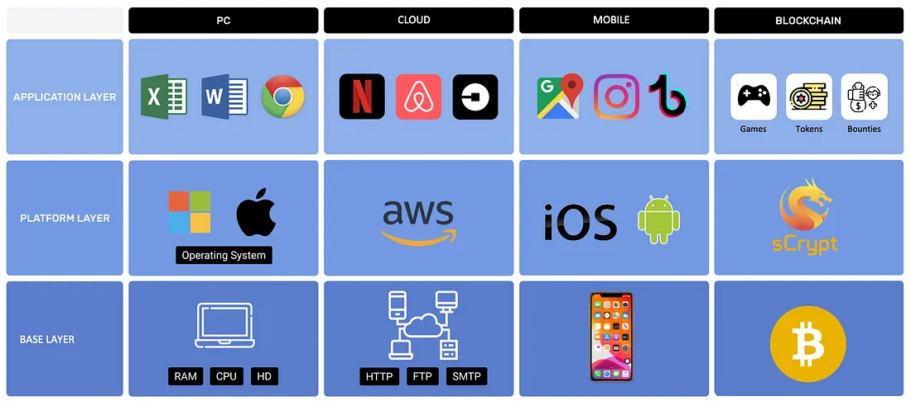
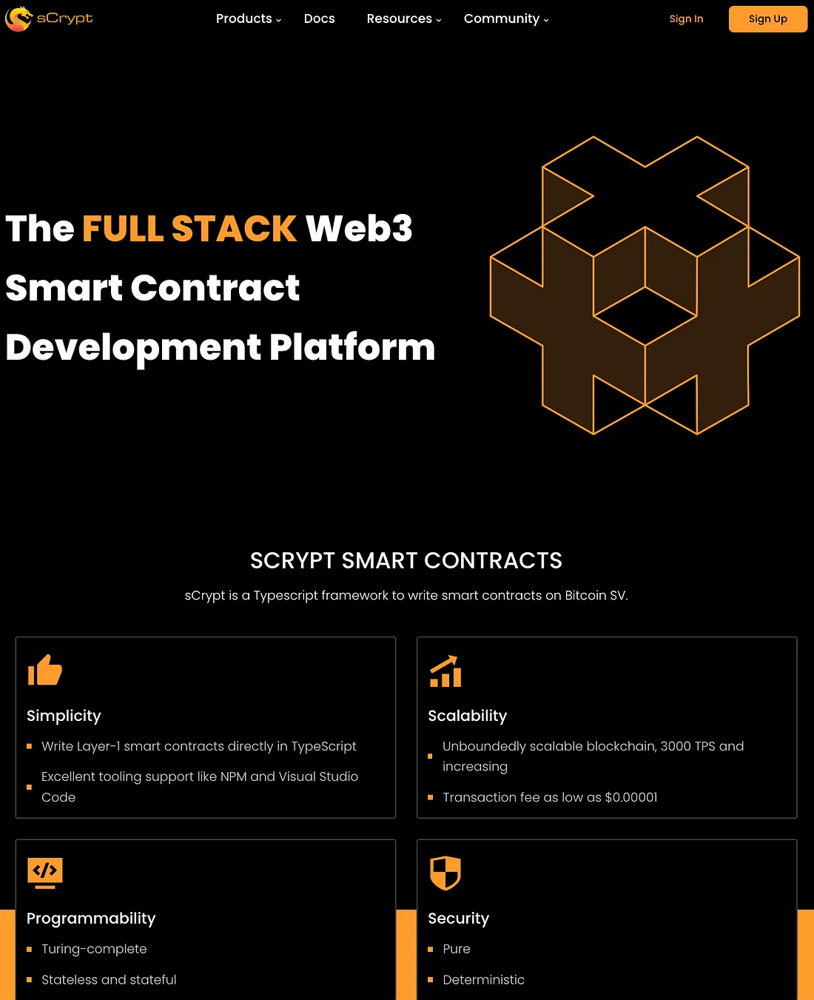
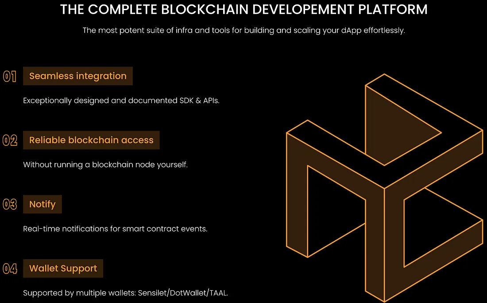

# 介绍比特币上的 sCrypt 开发平台

> 最强大的基础设施和工具套件，可轻松构建和扩展您的 dApp
>
> ## 杀手级应用在哪里？

尽管比特币在小额支付、国际汇款和供应链管理等广泛用例中具有颠覆性潜力，但在推出 14 年后，我们还没有看到一款非常受欢迎并被主流采用的杀手级应用。

相比之下，2007 年 iPhone 推出后，杀手级应用的出现仅用了几年时间：例如，愤怒的小鸟 (2009)、WhatsApp (2009) 和 Instagram (2010)。 这些引人入胜的突破性应用程序提供了巨大的价值，变得极其流行，并推动了 iPhone 的广泛采用，彻底改变了人们使用手机的方式。

比特币未被采用的主要原因之一是开发人员难以克服的陡峭学习曲线。 开发人员通常会花费数月甚至数年的时间来构建应用程序，但在发布后却发现产品不适合市场。 比特币要吸引大量用户，必须提供一流的开发者体验，使开发者能够像在 Web2 中一样轻松地构建应用程序。

对于每一种新的计算技术，在主流采用之前，都需要开发人员工具和基础设施来进行更广泛的应用程序开发。 个人计算机已由 Windows 和 Mac OS X 驱动； 智能手机由 iOS 和 Android 驱动； 云计算由 Amazon Web Services、Azure 和 Google Cloud 驱动。

在 sCrypt，我们相信这同样适用于下一代计算和货币技术的比特币。 技术堆栈中缺少一个平台层，它需要弥合了原始基础设施和 Web3 开发人员之间的鸿沟，Web3 开发人员将为该技术构建杀手级应用程序并将其推向主流。

## 进入sCrypt开发平台

我们正在构建一个开发者平台，作为平台层，弥合基础比特币协议和应用程序开发者之间的鸿沟。 它旨在通过一流的开发人员工具和基础设施来消除构建基础设施的复杂性和成本，同时改进应用程序，以便开发人员可以专注于构建和扩展应用程序。 它缩短创新周期并加快发展速度。

在良性循环中，我们提供的工具越多越好，开发人员构建产品就越容易，然后就会有更多的用户来，然后更多的开发人员来我们把工具做得更好，等等。 sCrypt 使飞轮旋转。

## 从独立的智能合约到开发平台

我们的核心产品 [sCrypt 智能合约](https://docs.scrypt.io/) 允许任何开发人员直接使用 [Typescript/Javascript](https://xiaohuiliu.medium.com/introducing-scryptts-write-bitcoin-smart-contracts-in-typescript-e59845213fbc) 编写比特币智能合约，这是数千万 Web2 开发人员已经熟悉的最流行的编程语言。 他们不必学习像 Solidity 这样的新的小众编程语言，从而设置了很高的进入门槛。 他们可以重用所有他们喜欢的工具，例如 Visual Studio Code、[WebStorm](https://www.jetbrains.com/webstorm/) 和 NPM。 这是在整个 Web3 空间中开发智能合约的最简单方法。

**然而，仅靠智能合约还不足以创建应用程序。** 有效的智能合约与用户可以与之交互的功能齐全的应用程序之间仍然存在差距。 因此，我们正在将我们的产品扩展到一个全栈平台，为开发人员提供他们构建应用程序所需的一切，以更快、更便宜地构建应用程序 `10` 到 `100` 倍，包括用户身份验证、API、SDK、读/写区块链和事件/通知。 也就是说，相当于比特币的 AWS。 我们最适合作为比特币应用程序开发的首选商店，并且可以有意义地加速整个行业。

立即[注册](https://scrypt.io/)并构建未来的比特币杀手级应用。 从[教程](https://docs.scrypt.io/tutorials/voting)和[文档](https://docs.scrypt.io/advanced/how-to-integrate-scrypt-service)开始，如果您有任何问题，请加入 [Discord](https://discord.com/invite/bsv)。