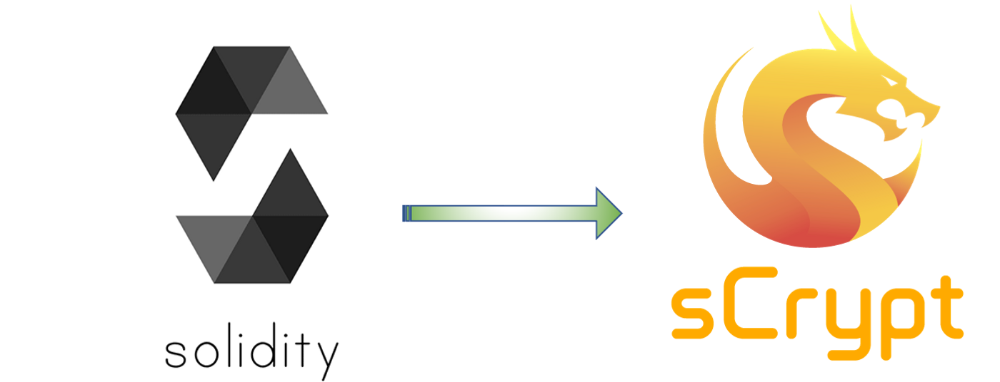
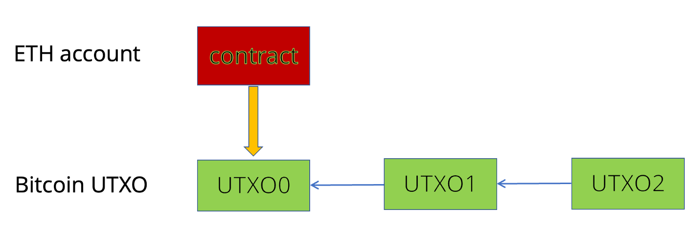
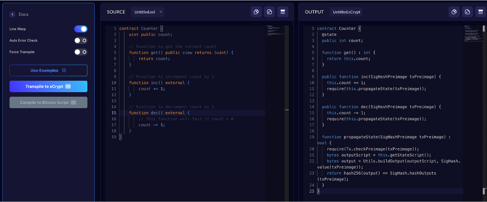

# Solidity -> sCrypt 转译器简介

> 在比特币上运行以太坊智能合约

## 为什么需要它？

sCrypt 是比特币的原生智能合约语言。理想情况下，每个人都应该在 sCrypt 中开发智能合约，利用最具扩展性的区块链。在实践中，我们也了解到许多项目和开发人员已经投入大量时间和金钱来开发他们当前的 Solidity 代码库。

转译器有助于开发人员将他们的应用程序从以太坊和其他 Solidity/EVM 兼容的区块链迁移到比特币网络，而无需从头开始编写代码。它极大地降低了他们的迁移成本，尤其是当他们的代码库包含数千行或更多代码时。

此外，现有的 Solidity 库和代码库可以被转换并用于 sCrypt 合约。

最后，它还可以用于 Solidity 开发人员通过观察 Solidity 代码与其 sCrypt 对应代码之间的相似性和差异来快速学习 sCrypt。

## 它是如何工作的？

转译不是一件容易的事，因为以太坊智能合约是基于账户的，而比特币是基于 UTXO 的。

在高层次上，我们使用单个 UTXO 来表示以太坊合约的快照，并将每个合约账户映射到一个具有等效的代码和数据存储的起始 UTXO，表示合约的初始状态。我们使用[有状态智能合约](https://blog.csdn.net/freedomhero/article/details/107307306)来映射更改合约状态的函数调用。每当合约的状态发生变化时，就会产生一笔新的交易，该交易花费合约的当前 UTXO，并生成另一个具有新状态的 UTXO。原始合约的最新状态总是在最新的 UTXO 中。转译器将合约的solidity 代码转换为 sCrypt 中的等效对应代码。更多详情，请参考[这里](https://github.com/sCrypt-Inc/article/blob/master/Introduction%20to%20Solidity%20Transpiler/Introduction%20to%20Solidity%20Transpiler-zh_CN.md)。

将以太坊合约映射到比特币有状态合约

## 在哪里使用它？

我们为转译器开发了一个 [playground](https://transpiler.bitcoinsv.com/)。只需单击一下，您就可以将 Solidity 编写的合约转换为等价的sCrypt 合约。

我们在下面展示了一个简单的计数器合约示例。

你可以看到左边的 Solidity 代码和右边的 sCrypt 代码几乎是一一对应的。
每个 Solidity 状态和函数都映射到一个 sCrypt 状态和函数。sCrypt 中的额外代码是用于将合约状态传播到下一个 UTXO 的样板代码，并且对于任何合约几乎都是相同的。

## 致谢

我们感谢 [Vaionex](https://www.vaionex.com) 开发 Web UI 和比特币协会赞助该项目。