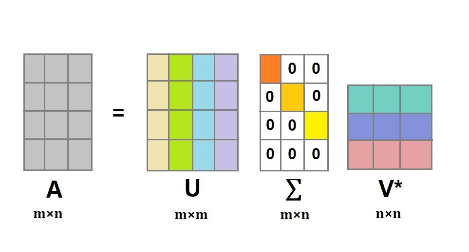
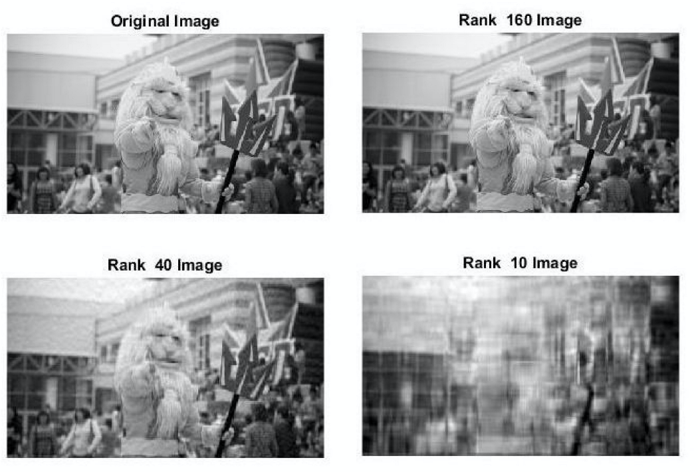

# 比特币上的机器学习

>*以奇异值分解为例*

受到最新的 [比特币课程](https://youtu.be/WaLyN3ceEJ8) 的启发，我们将展示了如何将机器学习技术应用于比特币。具体来说，我们将演示了如何基于低分辨率预览应用奇异值分解（SVD）来实现对原始图像的不信任购买。

## 奇异值分解  (SVD)

[SVD](https://en.wikipedia.org/wiki/Singular_value_decomposition) 是一种矩阵分解类型，可将单个矩阵分解为矩阵U，∑和V*。



* U和V*是正交矩阵。
* ∑是奇异值的对角矩阵。

直觉上，它可以看作是将一个复杂的矩阵转换为3个更简单的矩阵（旋转，缩放和旋转），其中

* 矩阵U和V*引起旋转
* 对角矩阵∑引起缩放

## 数据压缩

一个典型的机器学习问题是可能面对数百个或更多的变量，而如果提供的机器学习算法超过几十个，则许多机器学习算法将崩溃。这使得在机器学习中奇异值分解对于变量减少是必不可少的。



## 出售更高分辨率的图像

一位摄影师想出售他的作品。他在网上发布了模糊的版本，例如，上面的海卫一的第三张图片。在看到预览后，一些感兴趣的买家可以锁定以下合同中的一些资金，其中A是预览图像。只有高分辨率的原图的SVD可以解锁合约并赎回资金。卖方解锁后，买方可以通过计算U * ∑ * V来重建更清晰的图像。这项购买行为是由比特币网络强制执行的，因此是原子的。

```javascript

contract Matrix {
    static const int N = 4;
    static const int[N][N] Identify = [[1, 0, 0, 0],
                                       [0, 1, 0, 0],
                                       [0, 0, 1, 0],
                                       [0, 0, 0, 1]];

    static function multiply(int[N][N] mat0, int[N][N] mat1) : int[N][N] {
        int[N] zeroRow = repeat(0, N);
        int[N][N] mat2 = repeat(zeroRow, N);

        loop (N) : i {
            loop (N) : j {
                loop (N) : k {
                    mat2[i][j] += mat0[i][k] * mat1[k][j];
                }
            }
        }

        return mat2;
    }

    public function main(int[N][N] result) {
        int[N][N] mat0 = [[1, 1, 1, 1],
                          [2, 2, 2, 2],
                          [3, 3, 3, 3],
                          [4, 4, 4, 4]];
        
        int[N][N] mat1 = [[1, 1, 1, 1],
                          [2, 2, 2, 2],
                          [3, 3, 3, 3],
                          [4, 4, 4, 4]];

        // A * I = A
        auto mat0_ = Matrix.multiply(mat0, Identify);
        require(mat0_ == mat0);

        // I * A = A
        mat0_ = Matrix.multiply(Identify, mat0);
        require(mat0_ == mat0);

        auto product = Matrix.multiply(mat0, mat1);
        require(product == [[10, 10, 10, 10],
                            [20, 20, 20, 20],
                            [30, 30, 30, 30],
                            [40, 40, 40, 40]]);
        require(product == result);
    }
}

```

可以轻松修改合同，比如图像质量越高，访问该图像所需要的价格就越高。数据也可以是其他类型的数字项目，例如视频，气候或财务数据。

## 扩展

SVD 除了数据压缩之外，还有许多其他应用程序。上述合同可以推广给他们。

* [推荐系统](http://www.math.ucsd.edu/_files/undergraduate/honors-program/honors-program-presentations/2017-2018/Zecheng_Kuang_Honors_Thesis.pdf)，例如Netflix或Amazon

* [特征脸](https://heartbeat.fritz.ai/applications-of-matrix-decompositions-for-machine-learning-f1986d03571a)

* [降噪](https://towardsdatascience.com/understanding-singular-value-decomposition-and-its-application-in-data-science-388a54be95d)

# 总结

我们仅演示了一个在机器学习中应用比特币的场景。相同的原理可以轻松地扩展到许多其他机器学习相关的应用程序。