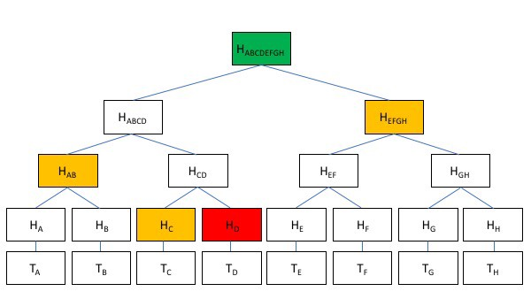

# Merklized 抽象语法树
> 对数压缩智能合约

Merklized 抽象语法树 MAST（又名 Merklized 替代脚本树）是一种使用 Merkle 树压缩比特币智能合约的技术。我们在比特币 SV 上实施了 MAST。与所有其他实现不同，我们利用原始比特币协议，没有任何共识更改。

# 问题

通常有不止一种方法可以解锁锁定在比特币智能合约中的硬币。在 sCrypt 中，每种方式都被建模为一个[公有函数](https://scryptdoc.readthedocs.io/zh_CN/latest/intro.html#public-function)，代表一种条件的解锁分支。例如，在合约 TimeCommit 中，可以通过 Alice 的原像和她的签名，或者通过 Alice 和 Bob 的签名来解锁合约。

```javascript

contract TimedCommit {
  bytes aliceHash;
  PubKey alice;
  PubKey bob;

  public function open(bytes aliceNonce, Sig aliceSig) {
    require(sha256(aliceNonce) == this.aliceHash);
    require(checkSig(aliceSig, this.alice));
  }

  public function forfeit(Sig aliceSig, Sig bobSig) {
    require(checkSig(aliceSig, this.alice));
    require(checkSig(bobSig, this.bob));
  }
}


```

[TimedCommit 合约](https://xiaohuiliu.medium.com/bitcoin-smart-contract-2-0-d1e044abed5a)

随着合约变得越来越复杂，一个合约中可能有数十个甚至数百个公有函数/分支。最终只调用其中一个，但所有这些都必须包含在区块链中，即使他们根本没有被执行。这会增加链上的足迹并增加交易费用。

```javascript

contract ContractOfManyBranches {
    
    public function branchA() { }

    public function branchB() { }

    public function branchC() { }

    public function branchC() { }

    // ... more branches
}

```

# MAST
抽象语法树 MAST 可以从区块链中删除未执行的分支。未压缩的合约（原始合约）被拆分为单独的分支并组织成 Merkle 树，其中每个分支的脚本都是一片叶子。压缩后的合约并不存储所有分支，只存储了所有分支的 merkle root，用于验证某个特定分支是否属于原始合约。

一下是 MAST 带来了巨大的好处，尤其是当分支数 n 很大时。

**可扩展性:** 部署的合约大小按 log(n)¹ 缩放，因为只需要选定的分支及其默克尔路径，而不是所有分支。在下面的例子中，当分支 Tc 被调用时，只需要黄色的默克尔路径。

**隐私性:** 未使用的分支不会在链上发布。在下面的示例中，仅显示 Tc，隐藏所有其他分支。



<center> 默克尔树和默克尔路径 </center>

# 实现

我们已经在比特币中实现了 MAST。当一个分支被执行时，它本身和它的默克尔路径被用来解锁。在压缩合约中，我们首先使用其默克尔根验证分支是否来自原始合约。接下来，使用 [P2SH](https://blog.csdn.net/freedomhero/article/details/112344420) 技术，将当前支出交易中的新锁定脚本设置为该分支的脚本，该脚本将在后续交易中花费。

```javascript

contract MAST {
    static const int DEPTH = 4;

    Sha256 merkleRoot;

    public function main(bytes branchScript, MerklePath merklePath, SigHashPreimage txPreimage) {
        require(Tx.checkPreimage(txPreimage));

        // validate branchScript is from the merkle tree
        require(calMerkleRoot(branchScript, merklePath) == this.merkleRoot);

        // "P2SH": use branch script as the new locking script, while maintaining value
        bytes output = Util.buildOutput(branchScript, Util.value(txPreimage));
        require(hash256(output) == Util.hashOutputs(txPreimage));
    }

    static function calMerkleRoot(bytes leaf, MerklePath merklePath) : Sha256 {
        Sha256 root = sha256(leaf);

        loop (DEPTH) : i {
            Sibling s = merklePath[i];
            root = s.left ? sha256(s.hash + root) : sha256(root + s.hash);
        }

        return root;
    }
}

```

<center> MAST 合约 </center>


##  脚注
--------------------------------------------------

[1] 假设所有分支的大小相似。