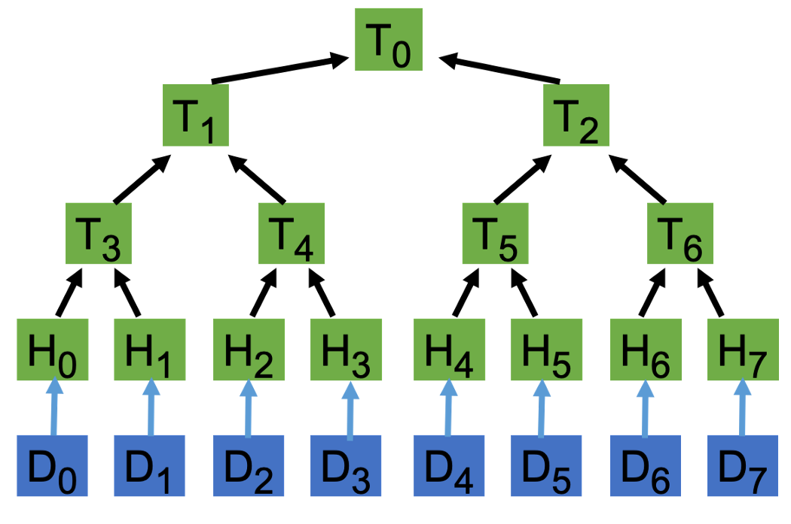

# 一种基于比特币支付通道的Netflix

> 交易延展性是一个特性，而不是一个 bug


我们展示了一种基于支付通道，按需提供电影流媒体和其他类型服务的经济且高效的方式。


## 延展性

在比特币的背景下，[延展性](https://wiki.bitcoinsv.io/index.php/Transaction_Malleability)意味着修改交易而不使其无效的能力。有两个层次：

- 脚本级别：签名不包括解锁脚本，因此修改它不会改变签名有效性
- 交易级别：[SIGHASH 标志](https://wiki.bitcoinsv.io/index.php/SIGHASH_flags)可用于控制对哪些输入/输出进行签名。

我们在这里专注于脚本级的延展性。

## 流媒体

假设 Alice 想从 Bob 那里购买一部电影。这部电影分为多个小块：D₀、D₁、D₂、...、D<sub>n</sub>。Alice 和 Bob 创建了一个[支付通道](https://wiki.bitcoinsv.io/index.php/Payment_Channels)来交换链下消息。Bob 与 Alice 共享 Merkle 树的叶子（下面的 H₀ 到 H₇）。 Alice 可以通过计算其根哈希 (T₀) 并将其与给定电影的公开哈希进行比较来验证其真实性¹。




Alice 创建了一系列交易：TX₁、TX₂、...、TX<sub>n</sub>。它将硬币锁定到以下智能合约中，由她在输入中引用的 UTXO 提供资金。


```javascript
// an example contract to malleate transaction
contract Netflix {
    PubKey alice;
    PubKey bob;

    Sha256 hash;

    // can be unlocked in two ways
    // 1) data and Bob's signature
    // 2) both Alice and Bob's signatures
    public function unlock(bytes dataOrSig, Sig bobSig) {
        if (sha256(dataOrSig) != this.hash) {
            // Alice signature is used to unlock, not the data
            Sig aliceSig = Sig(dataOrSig);
            require(checkSig(aliceSig, this.alice));
        }
        require(checkSig(bobSig, this.bob));
    }
}
```


<center><a href="
https://github.com/sCrypt-Inc/boilerplate/tree/master/contracts/netflix.scrypt">Netflix 合约</a></center>
有两种方法可以解锁硬币:

1. Bob 签署并提供正确的数据块，即当第 `12` 行 `if` 中的条件为假时
2. 当第 `12` 行 `if` 中的条件为真时，Alice 和 Bob 都签名

每次 Alice 收到 Dᵢ 时，TXᵢ 都会更新，只有两个变化:

1. Hᵢ：将上面合约中的 `hash` 更新为下一个 chunk 的 `hash`
2. 将输出增加 `100` satoshis，以支付下一个的数据块。

注意 Alice 需要再次签名。下图显示了 Alice 和 Bob 之间的交流，从通道的打开到关闭。


<center>支付通道<sub>4</sub></center>

## 关闭通道

在任何时候，Alice 或 Bob 都可以单方面或共同停止流式传输。如果 Alice 停止付款，Bob 将停止流式传输；反之亦然。没有人可以作弊<sub>3</sub>。


1. Bob 将支付交易 TX<sub>p</sub> 发送给 Alice。如图 2 所示，Alice 通过用她的签名替换 Dᵢ 来改善它。请注意，新交易 TXp' 仍然有效，并且仍然可以使用选项 2 而不是选项 1 来解锁旧合约。Bob 更喜欢以这种方式关闭通道，因为：

   - 这样节省交易费用。通常，每个块都比签名大很多（平均只有 `72` 个字节）。在极端情况				下，使用 OP_PUSHDATA4 修剪 4GB 块，导致约 60,000,000 倍的减少。

   - 数据块是私有且敏感的。Bob 不想在链上公开电影块供所有人查看。

2. 如果 Alice 拒绝签名，Bob 总是可以使用选项 1 来收取款项。


只有两笔交易最终在链上。之后可以安全地丢弃所有中间交易。


## 讨论

与Netflix等现有付费流媒体网站相比，这种基于支付渠道的流媒体具有显着优势：

- 即付即用：只为观看的电影部分付费
- 由于比特币的小额支付能力，交易成本低
- 无需注册

为了使其更实用，必须采取额外的措施来防止 Alice 在通道外双花将支出资金的交易（在 TXᵢ 中引用的 UTXO），或者广播陈旧的交易（例如，当我们已经在 TX₉ 时广播 TX₁）。 详情请参阅专利⁴。

此外，Bob 可以使用这种[技术](https://xiaohuiliu.medium.com/access-blockchain-data-from-bitcoin-smart-contracts-part-4-94dd34ce697d)迭代地仅共享下一个块及其 Merkle 证明，以避免在开始时立即共享所有树叶。


## 总结


我们以流媒体电影作为一个例子， 将这种方法扩展到 “流式传输” 其他类型的数据/服务是相当简单的，例如，Wifi、公用事业（水和电）、租赁（汽车和房子）。通过这种方式可以方便地提供许多即用即付的服务。


## 致谢

本文基于 nChain 专利 WO2020240297A1⁴。


[1] 我们假设电影的 Merkle 树根可从 IMDB 和 Netflix 等受信任的第三方公开获得。

[2] 为简洁起见，交易的某些部分未显示，例如找零输出。

[3] 从技术上讲，Alice 可以通过在 Bob 交付一个块后不付钱来作弊。但这在实践中不是问题，因为它的价值非常低。

[4] nChain 专利 [WO2020240297A](https://patents.google.com/patent/WO2020240297A1) : 区块链中的交易的延展性
