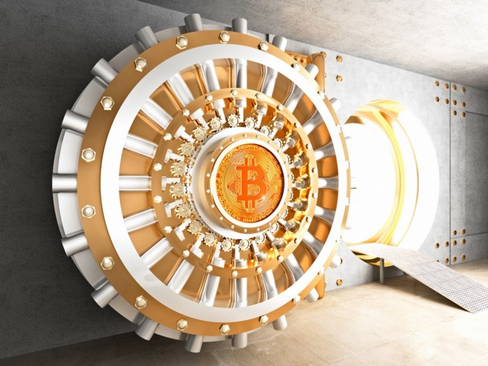

# 非托管比特币保险库

我们开发了一个基于智能合约的比特币保险库，其中锁定的比特币只能在延迟用户定义的时间后转移。



密钥盗窃是困扰比特币用户的一个主要问题。一种保护比特币的方法是将它们存储在不允许即时取款的保险库中。要花费保险库中比特币，需要两个连续的步骤。

1. 通过第一笔交易发出将硬币移出金库的请求，这称为出库 (unvault)
2. 等待预定义的时间, 称为出库期 (unvaulting)，比如在第一笔交易入块后 24 小时，然后硬币可以在后续交易中移出。

这两个步骤都使用称为保险库密钥的密钥。另一个称为恢复密钥的密钥可以在 24 小时内阻止第二笔交易，以防保险库密钥被盗。通常，保险库密钥存储在热钱包中，而恢复密钥存储在冷钱包中。

## 实现

基于[相对时间锁定](https://blog.csdn.net/freedomhero/article/details/122126885)，我们开发了以下保险库合约。

```javascript
import "blockchain.scrypt";

contract Vault {
    // time to wait before the money in the vault can be spent after unvaulted, using the vault key
    int unvaultingPeriod;
    // vault key, typically stored in a hot wallet
    PubKey vaultKey;
    // recovery key, typically stored in a cold wallet
    PubKey recoveryKey;
    // maximal target for any block to be considered valid
    int blockchainTarget;

    // initialized to false
    @state
    bool unvaulted;

    // step 1
    public function unvault(Sig sig, SigHashPreimage txPreimage) {
        require(checkSig(sig, this.vaultKey));

        require(!this.unvaulted);
        this.unvaulted = true;

        bytes outputScript = this.getStateScript();
        bytes output = Utils.buildOutput(outputScript, SigHash.value(txPreimage));
        require(hash256(output) == SigHash.hashOutputs(txPreimage));
    }

    // step 2
    public function withdraw(Sig sig, BlockHeader utxoBh, BlockHeader latestBh, MerkleProof merkleproof, SigHashPreimage txPreimage) {
        require(this.unvaulted);
        require(checkSig(sig, this.vaultKey));

        // ensure UTXO has been locked long enough
        this.validateHelper(utxoBh, latestBh, merkleproof, txPreimage);
        // enough time has elapsed since being unvaulted
        require(latestBh.time - utxoBh.time >= this.unvaultingPeriod);
    }

    // cancel if vault key is stolen
    public function cancel(Sig sig) {
        require(checkSig(sig, this.recoveryKey));
    }
}
```

首先，通过在交易来调用的第 `18` 行 `unvault()` 来出库锁定在合约中的硬币。它在 `22` 行将出库状态 `unvaulted` 从 `false` 设置为 `true`，并在 `24` 到 `26` 行[传播状态](https://xiaohuiliu.medium.com/introducing-stateful-properties-f0f6bce45a06)。如果一切顺利，在第一笔交易入块后，等待超过预设的出库期 (unvaulting) 后，通过调用 `30` 行的 `withdraw()` 来提取硬币。第 `35-37` 行和以前一样使用相对时间锁。如果在此期间检测到盗窃企图，则恢复密钥可以撤消交易并将硬币移动其他地方，见 `41` 行。

## 讨论

- 我们开发了一个延时提款的比特币保险库。与受信任的第三方（如 [Coinbase](https://help.coinbase.com/en/coinbase/getting-started/other/vaults-faq)）提供的保险库相比，它是非托管的。
- 它不需要任何共识更改或新的操作码，例如 [BIP 119](https://github.com/bitcoin/bips/blob/master/bip-0119.mediawiki#Wallet_Vaults) 中的 OP_CheckTemplateVerify 或 [比特币契约](https://hackingdistributed.com/2016/02/26/how-to-implement-secure-bitcoin-vaults/) 中的 [OP_CheckOutputVerify](http://fc16.ifca.ai/bitcoin/papers/MES16.pdf)。


可以添加其他措施以使保险库更加安全，例如白名单或[支出限制](https://xiaohuiliu.medium.com/patreon-on-bitcoin-4c3626d4ce5)。将这个方法应用到 Token 上也很简单。

[1] : 将其扩展为持有令牌也很简单。有一些方法可以在不运行完整节点的情况下执行此操作，例如 mAPI 中的实时通知。