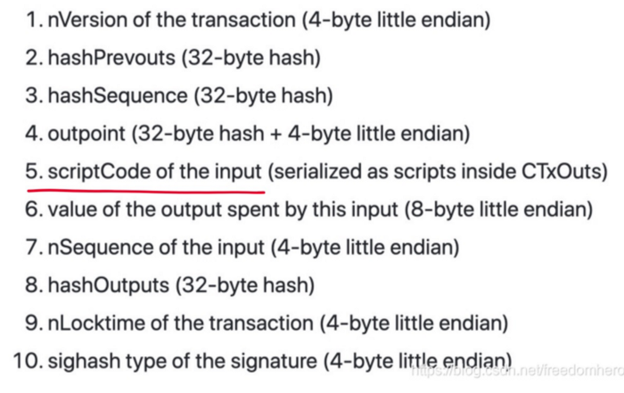
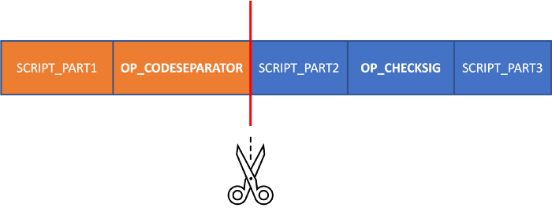

# 操作码 OP_CODESEPARATOR

OP_CODESEPARATOR 可以说是比特币脚本中[最神秘的](https://bitcoin.stackexchange.com/questions/34013/what-is-op-codeseparator-used-for)操作码。在本文章我们将介绍它并演示其在实际应用中的用法：优化 [OP_PUSH_TX](https://xiaohuiliu.medium.com/op-push-tx-3d3d279174c1) 中的原像大小。

## OP_CODESEPARATOR

Sighash 原像是在比特币签名中被签名的交易摘要，其​​格式如下：




第 5 部分，`scriptCode`，通常包含整个锁定脚本。唯一的例外是锁定脚本中包含有 `OP_CODESEPARATOR` 操作码 (OCS)。在这种情况下，`scriptCode` 不包括执行 `OP_CHECKSIG` 之前最后执行的 `OCS` 以及它之前的所有操作码。



## sCrypt 的 `OCS`

我们在 sCrypt 中添加了 [OCS](https://scryptdoc.readthedocs.io/en/latest/syntax.html#code-separator) 支持。一行中的三个或更多 `*` 就会插入一个 `OCS`。我们在下面的合约示例中展示了两个 `OCS`：第一个用 `3` 个星号表示，第二个用 `5` 个星号表示。

```javascript
contract P2PKH_OCS {
    Ripemd160 pubKeyHash;

    public function unlock(Sig sig, PubKey pubKey) {
        // code separator 1
        ***
        require(hash160(pubKey) == this.pubKeyHash);
        // code separator 2
        *****
        require(checkSig(sig, pubKey));
    }
}
```

自 [v1.4.1](https://marketplace.visualstudio.com/items/bsv-scrypt.sCrypt/changelog) 起， [SDK](https://github.com/sCrypt-Inc/scryptlib/blob/master/docs/preimage_under_codeseparator_zh_CN.md) 和 IDE 中添加了支持。

## 用例：优化 OP_PUSH_TX

在许多情况下，使用 OP_PUSH_TX 时不需要 `scriptCode` 或其中的一部分。OCS 可以用来削减原像的大小。例如，在下面的合约中，只需要整个原像的第 9 部分 `nLocktime`。我们使用 `Tx.checkPreimageOCS()`，它是传统 `Tx.checkPreimage()` 的变体。唯一的区别是前者会将 `OCS` 插入到的 `OP_CHECKSIG` 之前。另请注意，我们将 `Tx.checkPreimageOCS()` 作为最后一条语句可以最大化优化的效果。

```javascript
contract CheckLockTimeVerifyOCS {
    int matureTime;

    public function unlock(SigHashPreimage preimage) {
        require(SigHash.nLocktime(preimage) > this.matureTime);
        require(Tx.checkPreimageOCS(preimage));
    }
}
```

更改后，原像大小从 `915` 字节减少到 `201` 字节，显着节省了约 `80%`。

## 总结

我们已经展示了 `OCS` 的第一个广泛适用的用法。其他潜在用途包括[脚本内置函数](https://patents.google.com/patent/WO2020240299A1)和在链下交易中[签署不同的执行路径](https://github.com/coins/bitcoin-scripts/blob/master/op-codeseparator.md)。