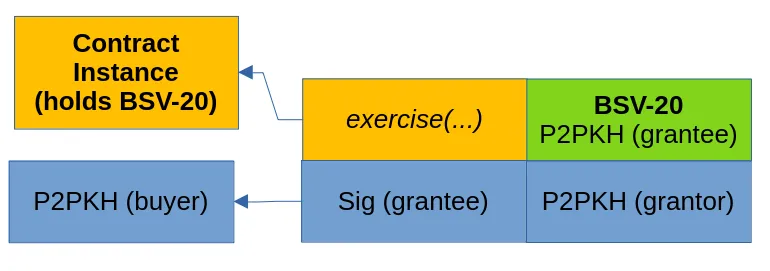

# 使用契约的链上期权合约


我们很高兴地宣布利用比特币契约的力量在链上实施期权合约。 只要该链支持比特币式契约（例如 Bitcoin SV 和 MVC），就可以直接在区块链上执行复杂的金融合约，例如看涨期权和看跌期权。 与通常需要多个中介机构的传统金融平台不同，链上期权合约可以减少结算时间和运营成本，使其更加安全、高效和透明。

出于说明目的，我们实现了看涨期权和看跌期权合约，授予持有人以设定价格购买或出售一定数量的 BSV-20 Ordinals 代币的权利。

## 期权合约


<center>图片源自: Investopedia</center>


期权合约为交易者提供在特定时间范围内以预定价格买入（看涨期权）或卖出（看跌期权）资产的权利，但没有义务。 买方为获得此权利向卖方支付溢价。 期权合约在金融市场中通常用于对冲、投机和风险管理。

**看涨期权示例**

在这种情况下：

标的资产：XYZ Corp 股票
当前股价：每股 50 美元
看涨期权的执行价格：每股 55 美元
有效期：即日起三个月

您为看涨期权支付溢价，假设每股 `3` 美元（溢价是购买期权的成本）。 通过购买此看涨期权：

如果三个月后 XYZ Corp 的股价高于每股 `55` 美元，您可以行使期权并以 `50` 美元的较低执行价格购买股票。 这可以让您通过立即以较高的市场价格出售股票来获利。
如果三个月后股价低于每股 `55` 美元，您没有义务行使该期权。 您可以让期权到期，您的损失仅限于您支付的权利金。

## 实现

与[链上限价订单](https://github.com/sCrypt-Inc/article/blob/master/On-chain%20Limit%20Orders%20Using%20Covenants/README.md)类似，我们使用契约来实现期权。 在期权合约的背景下，授予人可以将资产锁定在契约合约中，如果在规定的时间内满足期权的条件，则受让人可以索取这些资产。

### 看涨期权

例如，在看涨期权中，授予人可以在智能合约中锁定 `100` 个 BSV-20 代币，允许受让人在到期日之前以设定价格（例如每个代币 `5000` 聪）购买这些代币。

如果市场价格超过执行价格，持有者可以行使选择权，以约定的价格购买 BSV-20 代币，从价差中受益。 如果在到期日之前未行使该期权，合约允许授予者收回锁定的 BSV-20 代币。



<center>描绘期权行使的交易图</center>

智能合约有以下公共(`public`)方法：

- `exercise`：此方法允许受让人行使选择权。 它需要受让人签名并执行检查以确保交易的有效性，包括受让人与授予人之间的代币交换和付款。
- `transfer`：允许当前期权持有者将其转让给新的受让人。
- `expire`：授予者在合同到期时使用它来处理合同。 它需要授予人的签名并检查该选项是否已过期。


```ts
class Bsv20CallOption extends BSV20V2 {
    @prop()
    grantor: PubKey

    @prop(true)
    grantee: PubKey

    @prop()
    tokenAmt: bigint

    @prop()
    strikePrice: bigint

    @prop()
    expirationTime: bigint

    ...

    @method()
    public exercise(sigGrantee: Sig) {
        // Check grantee sig.
        assert(this.checkSig(sigGrantee, this.grantee), 'invalid sig grantee')

        // Ensure grantee gets payed tokens.
        let outputs = BSV20V2.buildTransferOutput(
            pubKey2Addr(this.grantee),
            this.id,
            this.tokenAmt
        )

        // Ensure grantor gets payed satoshis.
        const satAmt = this.strikePrice * this.tokenAmt
        outputs += Utils.buildAddressOutput(pubKey2Addr(this.grantor), satAmt)

        outputs += this.buildChangeOutput()

        // Enforce outputs in call tx.
        assert(hash256(outputs) == this.ctx.hashOutputs, 'hashOutputs mismatch')
    }

    @method()
    public transfer(sigGrantee: Sig, newGrantee: PubKey) {
        // Check grantee sig.
        assert(this.checkSig(sigGrantee, this.grantee), 'invalid sig grantee')

        // Set new grantee.
        this.grantee = newGrantee

        // Propagate contract.
        let outputs = this.buildStateOutputFT(this.tokenAmt)
        outputs += this.buildChangeOutput()
        assert(hash256(outputs) == this.ctx.hashOutputs, 'hashOutputs mismatch')
    }

    @method()
    public expire(sigGrantor: Sig) {
        // Check grantor sig.
        assert(this.checkSig(sigGrantor, this.grantor), 'invalid sig grantor')

        // Check if expired.
        assert(this.timeLock(this.expirationTime), 'option has not yet expired')
    }
}
```

### 看跌期权

看跌期权合约的结构与看涨期权合约的结构非常相似。 主要区别在于授予者将聪支付锁定在智能合约中，而不是 BSV-20 代币。 然后，受让人可以通过以预定的执行价格将代币转让给卖方来行使该期权。

然而，由于智能合约本身无法直接验证受让人在行使期权时提供的持有代币的 UTXO 的有效性，因此我们使用预言机。 该预言机负责通过签名来验证和验证 UTXO 的合法性。

```ts
@method()
public exercise(sigGrantee: Sig, oracleSig: RabinSig, oracleMsg: ByteString) {
    // Check oracle signature.
    assert(
        RabinVerifier.verifySig(oracleMsg, oracleSig, this.oraclePubKey),
        'oracle sig verify failed'
    )

    // Check that we're unlocking the UTXO specified in the oracles message.
    assert(
        slice(this.prevouts, 0n, 36n) == slice(oracleMsg, 0n, 36n),
        'first input is not spending specified ordinal UTXO'
    )

    // Get token amount held by the UTXO from oracle message.
    const utxoTokenAmt = byteString2Int(slice(oracleMsg, 36n, 44n))

    // Check token amount is correct.
    assert(utxoTokenAmt == this.tokenAmt, 'invalid token amount')

    // Check grantee sig.
    assert(this.checkSig(sigGrantee, this.grantee), 'invalid sig grantee')

    // Ensure grantor gets payed tokens.
    let outputs = BSV20V2.buildTransferOutput(
        pubKey2Addr(this.grantor),
        this.id,
        this.tokenAmt
    )

    // Ensure grantee gets payed satoshis.
    const satAmt = this.strikePrice * this.tokenAmt
    outputs += Utils.buildAddressOutput(pubKey2Addr(this.grantee), satAmt)

    outputs += this.buildChangeOutput()

    // Enforce outputs in call tx.
    assert(hash256(outputs) == this.ctx.hashOutputs, 'hashOutputs mismatch')
}
```

## 无需信任的交易期权

上述智能合约只有一个简单的转让方法，允许当前持有人将期权分配给新的持有人，从而在二级市场上有效地交易期权。

但由于期权的转让通常需要支付权利金，因此我们可以直接在上面的智能合约中添加出售机制。

我们添加两个 `public` 方法：

- `listForSale`：允许当前受让人以指定的溢价列出出售期权。 此方法需要受让人签名并更新合同的销售状态和保费金额。
- `buy`：允许新的受让人购买正在出售的期权。 它更新合同的受让人并处理向前一个受让人的溢价支付。

```ts
@method()
public listForSale(sigGrantee: Sig, premium: bigint) {
    // Check grantee sig.
    assert(this.checkSig(sigGrantee, this.grantee), 'invalid sig grantee')

    // Store premium value in property.
    this.premium = premium

    // Toggle for sale flag.
    this.forSale = true

    // Propagate contract.
    let outputs = this.buildStateOutputFT(this.tokenAmt)
    outputs += this.buildChangeOutput()
    assert(hash256(outputs) == this.ctx.hashOutputs, 'hashOutputs mismatch')
}

@method()
public buy(newGrantee: PubKey) {
    // Check if option is up for sale.
    assert(this.forSale, 'option is not up for sale')

    // Set new grantee.
    const prevGrantee = this.grantee
    this.grantee = newGrantee

    // Toggle for sale flag.
    this.forSale = false

    // Propagate contract.
    let outputs = this.buildStateOutputFT(this.tokenAmt)

    // Make sure premium is payed to previous grantee / holder.
    outputs += Utils.buildAddressOutput(
        pubKey2Addr(prevGrantee),
        this.premium
    )

    outputs += this.buildChangeOutput()
    assert(hash256(outputs) == this.ctx.hashOutputs, 'hashOutputs mismatch')
}
```

[看涨期权](https://github.com/sCrypt-Inc/boilerplate/blob/master/src/contracts/bsv20CallOption.ts)和[看跌期权](https://github.com/sCrypt-Inc/boilerplate/blob/master/src/contracts/bsv20PutOption.ts)智能合约的完整代码可在 GitHub 上获取。