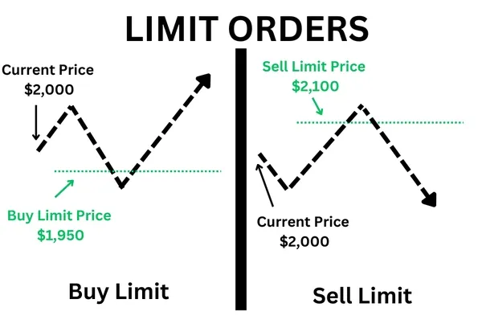
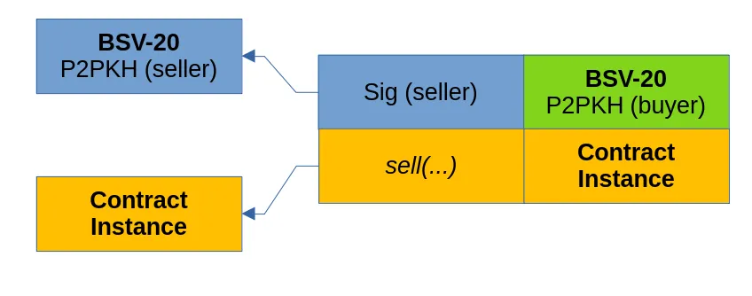

# 使用契约的链上限价订单

我们开发了链上限价订单。 它基于一种称为[契约](https://fc17.ifca.ai/bitcoin/papers/bitcoin17-final28.pdf)的智能合约，只有在花费输出的交易满足特定条件时才可以花费输出。 为了演示其工作原理，我们实施了以比特币支付的 Ordinals 代币买卖限价订单，无需托管人。 它可以运行在任何比特币协议链上，例如Bitcoin SV和[MVC](https://www.microvisionchain.com/)。

## 限价订单

限价单使买方或卖方（通常称为制造商）能够确定他们愿意在市场上买卖资产的特定价格。 随后，另一个交易者可以选择“接受”该报价并进行交易。 这一过程通常在托管交易所中得到促进，交易所暂时持有双方的资金，并采用内部结算机制来相应地分配资金。 然而，这种方法涉及将资金信任给第三方，从而使他们面临因系统黑客或内部盗窃而造成的潜在损失，其中第三方可能会消失或盗用资金。



## 契约

[比特币契约](https://medium.com/r?url=https%3A%2F%2Ffc17.ifca.ai%2Fbitcoin%2Fpapers%2Fbitcoin17-final28.pdf) 限制了 UTXO 的使用方式。 它是在 sCrypt 中使用 [ScriptContext](https://docs.scrypt.io/how-to-write-a-contract/scriptcontext) 实现的。

例如，做市商可以下一个卖出订单，将 10 个 PEPE 代币锁定到契约合约中，允许任何购买者提取最多 10 个 PEPE 代币，只要他们向卖家支付，例如，他们移除的每个 PEPE 1000 聪。

如果买方希望交易的金额低于 10 个 PEPE 限制（例如 7 个），他们可以选择为其余 3 个 PEPE 创建受相同契约约束的代币找零输出。 在这种特殊情况下，卖方被确定为做市商，买方在限价订单的框架内扮演接受者的角色。 该机制有利于部分履行限价订单的过程。

该限价订单可以看作是 [RUN 代币的 OrderLock](https://www.youtube.com/watch?v=gq8Guj5ft4U) 和 [Ordinals 的 OrdinalLock](https://docs.1satordinals.com/ordinal-lock) 的扩展，只能进行全额交易。

如果订单未 100% 成交，合同还允许卖方取消订单并拿走剩余的 PEPE。

## 实现

我们使用 [BSV-20 同质化代币](https://docs.1satordinals.com/bsv20) 作为创建限价订单的示例，并用比特币进行交易。

### 限价卖出订单

一定数量的 BSV-20 代币被锁定在契约智能合约中。 买方可以从智能合约中获取部分或全部代币，前提是他在同一合约调用交易中向卖方支付要价。


<center>描述卖出限价订单的交易图</center>

买家可以通过在同一合约调用交易中将聪转移到买家的地址来兑换 BSV-20 代币。 这是在调用合约的 `buy` 公共方法时完成的。

还有一个 `cancel` 方法，允许买家在订单未 100% 成交时取回资金。

```ts
class BSV20SellLimitOrder extends BSV20V2 {
    // Total amount of tokens we're selling.
    @prop()
    readonly tokenAmt: bigint

    // Amount of tokens already sold.
    @prop(true)
    tokenAmtSold: bigint

    // The seller's public key.
    @prop()
    seller: PubKey

    // Asking price per BSV-20 token unit.
    @prop()
    pricePerUnit: bigint

    ...

    @method()
    public buy(amount: bigint, buyerAddr: Addr) {
        // Check token amount doesn't exceed total.
        assert(
            this.tokenAmtSold + amount < this.tokenAmt,
            'insufficient tokens left in the contract'
        )

        // Update cleared amount.
        this.tokenAmtSold += amount

        // Build transfer inscription.
        const transferInscription = BSV20V2.createTransferInsciption(
            this.id,
            amount
        )
        const transferInscriptionLen = len(transferInscription)

        // Fist output is the contract itself, holding the remaining tokens.
        // If no tokens are remaining, then terminate the contract
        const tokensRemaining = this.tokenAmt - this.tokenAmtSold
        let outputs = toByteString('')
        if (tokensRemaining > 0n) {
            outputs = this.buildStateOutput(1n)
        }

        // Ensure the sold tokens are being payed out to the buyer.
        outputs += BSV20V2.buildTransferOutput(
            pubKey2Addr(this.seller),
            this.id,
            amount
        )

        // Ensure the next output is paying the to the Bitcoin to the seller.
        const satsForSeller = this.pricePerUnit * amount
        outputs += Utils.buildPublicKeyHashOutput(
                        hash160(seller), satsForSeller)

        // Add change output.
        outputs += this.buildChangeOutput()

        // Check outputs.
        assert(hash256(outputs) == this.ctx.hashOutputs, 'hashOutputs mismatch')
    }

    @method()
    public cancel(buyerSig: Sig) {
        assert(this.checkSig(buyerSig, this.seller))
    }
}
```

[BSV20SellLimitOrder](https://github.com/sCrypt-Inc/boilerplate/blob/master/src/contracts/bsv20SellLimitOrder.ts)

### 限价买入订单

限价卖出订单非常相似。 只是这一次，智能合约中锁定了一定数量的比特币，而不是 BSV-20 代币。



<center>描述买入限价订单的交易图</center>

由于智能合约本身无法确认 BSV-20 代币的真实性，因此使用了预言机服务。 预言机通过签署其引用以及金额和代币的铭文来保证代币的有效性。 智能合约验证此签名。

```ts
class BSV20BuyLimitOrder extends BSV20V2 {
    // Total amount of tokens we're buying.
    @prop()
    readonly tokenAmt: bigint

    // Amount of tokens already cleared.
    @prop(true)
    tokenAmtCleared: bigint

    // Public key of the oracle, that is used to verify the transfers
    // genesis.
    @prop()
    oraclePubKey: RabinPubKey

    // The buyer's public key.
    @prop()
    buyer: PubKey

    // Offered price per BSV-20 token unit.
    @prop()
    pricePerUnit: bigint

    ...

    @method()
    public sell(oracleMsg: ByteString, oracleSig: RabinSig, sellerAddr: Addr) {
        // Check oracle signature.
        assert(
            RabinVerifier.verifySig(oracleMsg, oracleSig, this.oraclePubKey),
            'oracle sig verify failed'
        )

        // Get token amount held by the UTXO from oracle message.
        const utxoTokenAmt = byteString2Int(slice(oracleMsg, 36n, 44n))

        // Check token amount doesn't exceed total.
        const remainingToClear = this.tokenAmt - this.tokenAmtCleared
        assert(
            utxoTokenAmt <= remainingToClear,
            'UTXO token amount exceeds total'
        )

        // Update cleared amount.
        this.tokenAmtCleared += utxoTokenAmt

        // Build transfer inscription.
        const transferInscription = BSV20V2.createTransferInsciption(
            this.id,
            utxoTokenAmt
        )
        const transferInscriptionLen = len(transferInscription)

        // Check that the ordinal UTXO contains the right inscription.
        assert(
            slice(oracleMsg, 44n, 44n + transferInscriptionLen) ==
                transferInscription,
            'unexpected inscription from oracle'
        )

        // Ensure the tokens are being payed out to the buyer.
        let outputs = BSV20V2.buildTransferOutput(
            pubKey2Addr(this.buyer),
            this.id,
            this.tokenAmt
        )

        // Ensure the second output is paying the Bitcoin to the seller.
        const satsForSeller = this.pricePerUnit * utxoTokenAmt
        outputs += Utils.buildPublicKeyHashOutput(sellerAddr, satsForSeller)

        // If there's tokens left to be cleared, then propagate contract.
        if (this.tokenAmtCleared == this.tokenAmt) {
            outputs += this.buildStateOutput(
                this.ctx.utxo.value - satsForSeller
            )
        }

        // Add change output.
        outputs += this.buildChangeOutput()

        // Check outputs.
        assert(hash256(outputs) == this.ctx.hashOutputs, 'hashOutputs mismatch')
    }

    @method()
    public cancel(buyerSig: Sig) {
        assert(this.checkSig(buyerSig, this.buyer))
    }
}
```

[BSV20BuyLimitOrder](https://gist.github.com/xhliu/85503fc00a1c5f44ff59fd8d0feb9969#file-bsv20buylimitorder-ts)