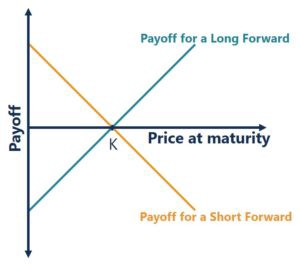

# 点对点比特币结算衍生品：远期合约

## 远期合约简介

[远期合约](https://en.wikipedia.org/wiki/Forward_contract)是两方在特定未来时间以预定价格买卖资产的[衍生工具](https://en.wikipedia.org/wiki/Derivative_(finance))。它是一种非常常见的对冲波动性的工具。因此，使用美元远期合约可以对冲美元兑比特币汇率的波动。



<center><a href="https://corporatefinanceinstitute.com/resources/derivatives/forward-contract/">远期合约的收益图</a></center>

例如，Alice 与 Bob 签订了一份美元远期合约。Alice 同意从现在起一个月后以每比特币 `100` 美元的价格从 Bob 那里购买 5000 美元（即每美元 100,000 聪（=0.01 比特币））。


Alice 是一名矿工，必须每月支付电费，并希望减轻波动风险。该合同到期后将赋予她 `5000` 美元的权利，无论当时的比特币汇率如何。 Bob 是一名交易员，他将这份合约作为一种投机手段，期望比特币的价格上涨并获利。

他们同意以比特币结算合同。各方将相互支付约定价格与比特币市场价格之间的差额¹。因此，如果比特币的美元价值贬值（即比特币价格下跌），Bob 将向 Alice 支付差额。同样，如果比特币升值，Alice 将不得不支付给 Bob。

## 比特币美元远期合约

有了这种远期合约，价格波动风险得到了缓解，但它引入了交易对手风险。Alice 或 Bob 可能在合同到期时不履行合同并拒绝付款。

我们分两步使用比特币上的智能合约来实现合约：

1. Alice 和 Bob 各自将 50 个比特币（5000 美元 * 0.01 比特币/美元）锁定到以下合约中。抵押品不需要第三方保管人。
2. 当合约到期且预言机公布现货价格时，可以使用公布的价格分割抵押品。交易对手风险得到缓解，因为任何一方都不能作弊。


```js
import "rabin.scrypt";

// price info published by oracle
struct OraclePrice {
    // spot/market price
    int price;
    int time;
}

// a USD forward contract settled in bitcoin, as denominated
contract Forward {
    Ripemd160 alice;
    Ripemd160 bob;

    // how much bitcoin Alice plans to sell to Bob, in dollars
    int dollars;

    // predetermined delivery price, in satoshis / dollar
    int deliveryPrice;
    // contract mature time
    int matureTime;

    RabinPubKey oraclePubKey;

    public function settle(OraclePrice op, RabinSig sig, SigHashPreimage txPreimage) {
        Tx.checkPreimage(txPreimage);

        // oracle signs serialized price data
        bytes msg = serializePrice(op);
        // verify price info
        require(RabinSignature.checkSig(msg, sig, this.oraclePubKey));

        // verify price is for the agreed-on matrue time
        require(op.time == this.matureTime);

        // total collateral amount, in satoshis
        int totalSats = SigHash.value(txPreimage);

        // Bob pays Alice the difference; could be nagative
        int payoff = this.dollars * (op.price - this.deliveryPrice);
        int aliceAmount = totalSats / 2 + payoff;
        if (aliceAmount < 0) aliceAmount = 0;   //bounded
        int bobAmount = totalSats - aliceAmount;
        if (bobAmount < 0) bobAmount = 0;       //bounded

        // split according to the price when the contract is mature

        bytes aliceScript = Utils.buildPublicKeyHashScript(this.alice);
        bytes aliceOutput = Utils.buildOutput(aliceScript, aliceAmount);

        bytes bobScript = Utils.buildPublicKeyHashScript(this.bob);
        bytes bobOutput = Utils.buildOutput(bobScript, bobAmount);

        require(hash256(aliceOutput + bobOutput) == SigHash.hashOutputs(txPreimage));
    }

    // serialized price data. It is what oracle signs
    static function serializePrice(OraclePrice op) : bytes {
        return num2bin(op.price, 4) + num2bin(op.time, 4);
    }
}
```

<center><a href="https://github.com/sCrypt-Inc/boilerplate/tree/master/contracts/forward.scrypt">远期合约源代码</a></center>


智能合约中的预言机使用 [Rabin Signature](https://blog.csdn.net/freedomhero/article/details/107237537) 签署喂价（第 `29` 行）并使用 [OP_PUSH_TX](https://blog.csdn.net/freedomhero/article/details/107306604) 分割抵押品，即 `100` 个比特币。

合同到期有三种可能：

1. 价格等于 `100K` sats/美元（即每个比特币 `100` 美元）。第 `38` 行的收益为 `0`。Alice 和 Bob 各取回他们的 `50` 个比特币。

2. 价格高于 `100K` sats/dollar。例如，它是 `200K` sats/dollar（即比特币价格跌至 `50` 美元）。 Bob 将支付 Alice `5000 * (200K -100K) = 5 亿 sats = 5 个比特币`。 Alice 得到 `55` 个比特币，Bob 得到 `45` 个。

3. 价格低于 `100K` sats/dollar。例如，它是 `50K` sats/dollar（即比特币价格上涨到 `200` 美元）。 Alice 将支付 Bob `5000 * (100K -50K) = 2.5 亿 sats = 2.5 个比特币`。 Alice 得到 `47.5` 个比特币，Bob 得到 `52.5` 个。

## 讨论

我们只实施了基本的智能合约作为概念证明。有很多方法可以使它更实用，我们列出了其中的一些。

* *最大曝光*：当价格上涨到 1100K sats/美元（比特币价格下跌到 90.9 美元）。 Bob 将支付 `Alice 5000 * (1100K -100K) = 50 亿 sats = 50 个比特币`。如果价格进一步上涨，Bob 将无法用 50 比特币抵押品支付全部金额。需要更多的抵押品来应对更多的波动风险。

* *以美元结算*：当美元代币可用于比特币时，合约可以以美元而非比特币结算。也可以使用美元抵押品。

* *故障安全*：如果预言机没有发布所需的价格数据，我们可以在智能合约中添加一个公共函数，让 Alice 和 Bob 都签署以取回他们的抵押品。

* *多个预言机*：为了降低恶意预言机的风险，可以使用多个预言机。

## 总结

我们展示了一个以比特币结算的美元远期合约。它可以很容易地扩展到任何需要根据外部未来价值划分以比特币计价的资金的金融工具。

标的资产可以是任何东西，例如黄金、小麦或石油。只要有预言机发布价格，就可以使用上面的智能合约构建远期合约。

---------------

[1] 这种类型的远期称为[不可交割远期](https://www.dripcapital.com/en-us/resources/blog/what-is-a-forward-contract#10)。