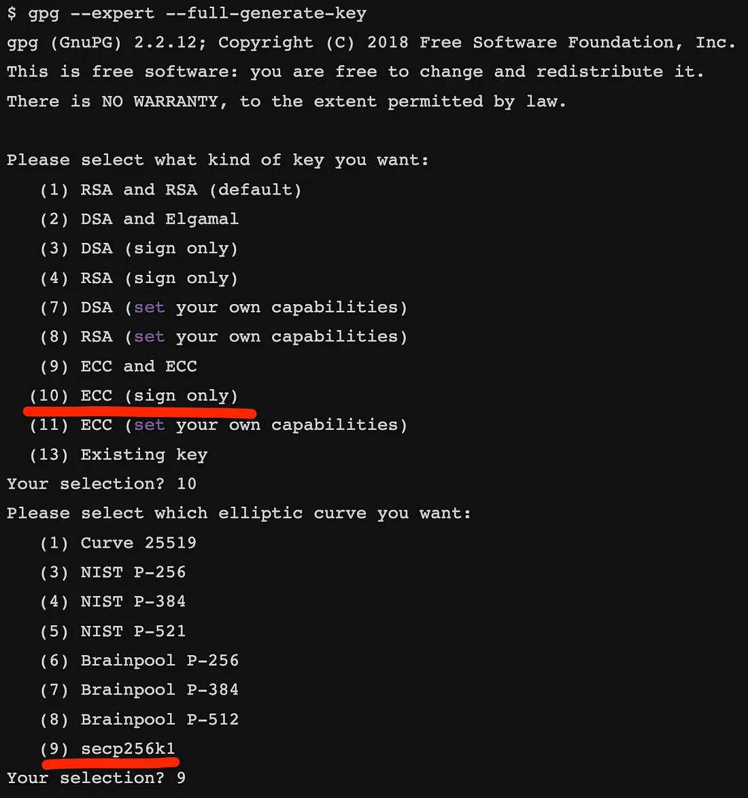

# PGP 遇上比特币

> 重复使用 PGP 密钥作为比特币密钥


## 介绍

在数字安全领域，密码学在确保数据的完整性和真实性方面发挥着至关重要的作用。 一种广泛使用的加密技术是使用 [Pretty Good Privacy](https://en.wikipedia.org/wiki/Pretty_Good_Privacy) (PGP<sup>1</sup>)。 PGP 为安全通信（例如电子邮件、文件传输和数据存储）提供加密和身份验证。

PGP 可以使用与比特币相同的椭圆曲线，称为 [secp256k1](https://bitcoin.stackexchange.com/questions/18174/is-it-possible-to-use-a-pgp-key-as-a-bitcoin-address)，因此可以与比特币兼容并利用。 现有的 PGP 椭圆密钥密钥对可以重复用作比特币密钥对，因此我们可以

- 将比特币发送到[从 PGP 公钥派生的地址](https://bitcoin.stackexchange.com/questions/18174/is-it-possible-to-use-a-pgp-key-as-a-bitcoin-address)。 只有用 PGP 私钥花费比特币。

- 对可信任的来自 PGP 用户的消息进行签名。

在本文中，我们将深入研究可信预言机使用 secp256k1 椭圆曲线生成 PGP 签名的示例，该签名使用 sCrypt 在链上进行验证和使用。

## 生成 PGP 签名

第一步是确保您的机器安装了 [GnuPG](https://gnupg.org/)。 这是一个使用非常广泛的程序，您的系统上可能已经安装了它。

### 生成私钥

运行以下命令：

```
gpg --full-gen-key --expert
```


这将运行一个交互式提示来生成您的密钥。 当它要求您选择 ECC 密钥进行签名时，使用“secp256k1”作为曲线。



完成后，您的系统上将存储一个新密钥。 要列出所有密钥，请运行以下命令：

```
gpg --list-keys --with-fingerprint
```

### 创建签名

由于我们将在比特币中验证的签名需要采用原始形式 `(r, s)`，因此我们准备了一个工具，可以从 GnuPG 生成的文件中提取此数据。 使用以下命令从 [GitHub](https://github.com/sCrypt-Inc/parse-pgp-sig) 克隆它：


```
git clone https://github.com/sCrypt-Inc/parse-pgp-sig && cd parse-pgp-sig
```

该工具是[原始工具](https://github.com/markblundeberg/gpg-checkdatasig-play)的一个分支，由 Mark Blundeberg 编写。

现在，让我们对存储在“testmsg”文件中的消息进行签名。 首先，编辑“makesig.sh”中的密钥 ID 以使用您在上一步中创建的密钥的 ID。 然后运行以下命令：

```
./makesig.sh
```


这将创建一个名为“testmsg.sig”的文件，其中包含签名。 因为我们还需要公钥，所以我们必须将其导出，如下所示：

```
gpg --output pubkey.gpg --export <KEY_ID>
```

最后，运行以下命令：

```
./parsesig.py
```

这将以正确的格式打印所需的所有数据，以用于验证。 输出应如下所示：

```
pubkey.gpg loaded, key ID AF73C8F7B546F94B39317588BC4509E6210D4B78
Public key point coordinates:
x = 48421684640566418104679532805542050894296452248858999768503364580534732096841
y = 27832515582888013475460648727797934257300201948678282835754427898215825506626
Message: b'Hello world!\n'
Message hex: 48656c6c6f20776f726c64210a04001308001d162104af73c8f7b546f94b39317588bc4509e6210d4b7805026453693704ff00000023
Sig:
r: 64359296802826103123327210017080540130282890114880640962625134547151700407256
s: 8795100933587794005356181940782496292717652651227485898667966611241902738847
Signature validity on message: True
```

### 在比特币中验证签名

这是一个简单的 sCrypt 智能合约，它可以验证我们刚刚创建的签名。


```ts

export class Verify extends SmartContract {
    @prop()
    msg: ByteString

    constructor(msg: ByteString) {
        super(...arguments)
        this.msg = msg
    }

    @method()
    public unlock(sig: Signature, pubKey: Point) {
        // Hash message.
        const hashInt = byteString2Int(
            reverseByteString(sha256(this.msg), 32) + toByteString('00')
        )

        // Verify signature.
        assert(
            SECP256K1.verifySig(hashInt, sig, pubKey),
            'Sig invalid'
        )
    }
}
```

正如我们所观察到的，已部署的合约将原始消息存储为合约属性。 一旦有人调用“unlock”公共方法，它就会对该消息进行哈希处理并将其转换为整数，然后使用我们的“SECP256K1”库继续验证签名。 您可以从我们的 [scrypt-ts-lib](https://www.npmjs.com/package/scrypt-ts-lib) 包中导入该库。

使用上面的数据，我们将初始化并调用合约，如下所示：


```js

await Verify.compile()
instance = new Verify(toByteString('48656c6c6f20776f726c64210a04001308001d162104af73c8f7b546f94b39317588bc4509e6210d4b7805026453693704ff00000023'))

...

const sig: Signature = {
    r: 64359296802826103123327210017080540130282890114880640962625134547151700407256n,
    s: 8795100933587794005356181940782496292717652651227485898667966611241902738847n,
}

const pubKey: Point = {
    x: 48421684640566418104679532805542050894296452248858999768503364580534732096841n,
    y: 27832515582888013475460648727797934257300201948678282835754427898215825506626n,
}

const { tx: callTx, atInputIndex } = await instance.methods.unlock(
    sig,
    pubKey,
    {
        fromUTXO: getDummyUTXO(),
    } as MethodCallOptions<Verify>
)

const result = callTx.verifyScript(atInputIndex)
```


一旦我们验证了该消息，我们就可以在我们的合约中使用它，并确信它来自给定的 PGP 用户。


-------

参考:

- https://gist.github.com/markblundeberg/af59d7cd234cbdb14dcf9e00f0ea2c17

[1] Hal Finney 是一位早期的比特币贡献者，他从比特币的创造者中本聪那里收到了第一笔比特币交易，他在 PGP 公司工作，在那里他开发了一些最早的 PGP 代码。