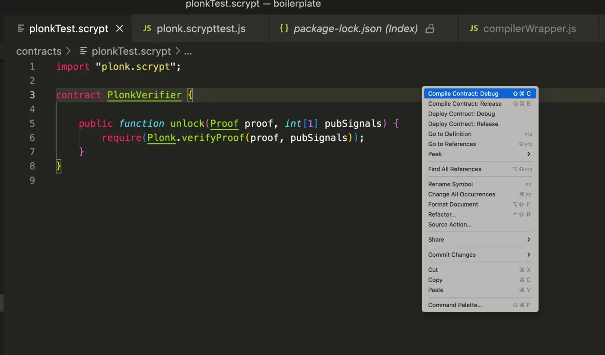
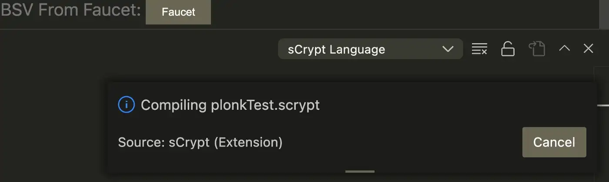
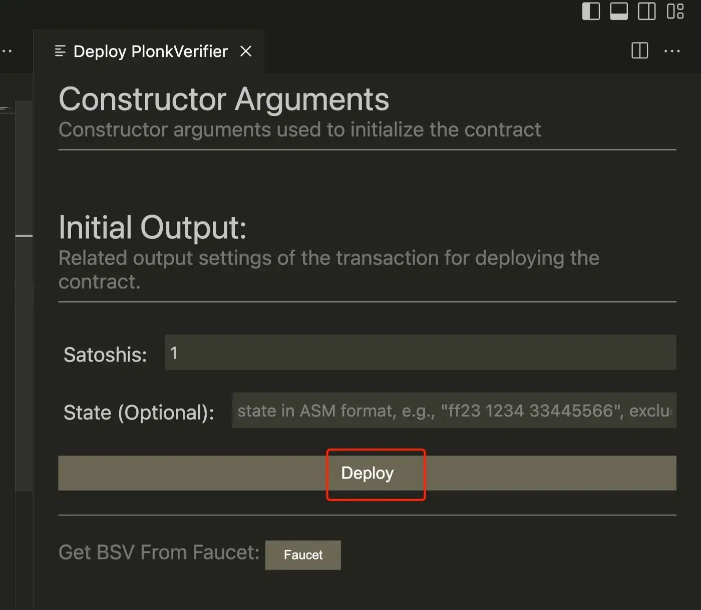
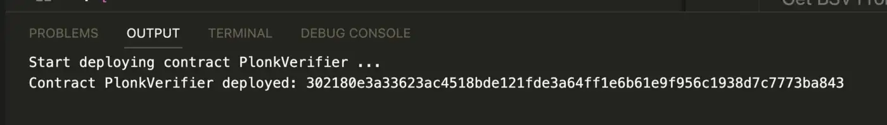

# BSV 上的 PLONK

我们很自豪地宣布比特币现在支持 PLONK。关于 PLONK 工作原理的详细说明，可以参考我们之前的解释 [第一部分](https://blog.csdn.net/freedomhero/article/details/127675853) 和 [第二部分](https://blog.csdn.net/freedomhero/article/details/127813993)。


我们之前已经实现了 [Groth16](https://blog.csdn.net/freedomhero/article/details/127814104)，这是最小且最高效的 SNARK 构造。但是，它需要为每个电路进行可信设置。通过消除对每条电路的可信设置的需要，PLONK 既减轻了对该过程安全性的担忧，又确保如果电路在未来发生变化，则不再需要安全的多方计算 (MPC) 设置仪式，由于， 例如，关键错误修复。通用和可更新的设置仪式，例如 Perpetual Powers of Tau，可以重复用于 PLONK 中的任何电路。它使部署新电路和升级现有电路变得更加容易和安全。

## 在比特币上运行你的第一个 PLONK

我们在现有的 [snarkJS](https://github.com/sCrypt-Inc/snarkjs) 库中添加了 PLONK 支持，它与 Circom 完全兼容。所有为 Groth16 开发的 Circom 电路都可以直接在 PLONK 中重复使用，无需任何改动。可以在[此处](https://github.com/sCrypt-Inc/boilerplate/blob/master/contracts/plonk.scrypt)找到完整的 PLONK 验证程序代码以及 Javascript 中的[测试](https://github.com/sCrypt-Inc/boilerplate/blob/master/tests/js/plonk.scrypttest.js)。生成 PLONK 验证器类似于[在 snarkJS 中生成 Groth16 验证器](https://learn.scrypt.io/zh/courses/Build-a-zkSNARK-based-Battleship-Game-on-Bitcoin-630b1fe6c26857959e13e160/lessons/3/chapters/1)。


您需要先安装 Circom 编译器和我们的 snarkJS。

```
curl -Ls https://scrypt.io/scripts/setup-circom.sh | sh
npm i -g snarkjs-scrypt
```

## 1. 设计电路

用 Circom 语言实现电路。例如，这个名为 `factor.circom` 的简单电路/程序证明人们知道将整数 `n` 分解为两个整数而无需透露整数。该电路有两个名为 `p` 和 `q` 的私有输入以及一个名为 `n` 的公共输入。关于如何使用 Circom 的更多信息，您可以参考 https://docs.circom.io。

```
// p and q are factorizations of n
pragma circom 2.0.0;

template Factor() {

    // Private Inputs:
    signal input p;
    signal input q;

    // Public Inputs:
    signal output n;

    assert(p > 1);
    assert(q > 1);

    n <== p * q;

}

component main = Factor();
```
## 2. 编译电路

使用以下命令编译电路：

```
circom factor.circom --r1cs --wasm
```

## 3. 开启新的**powers of tau**仪式


`new` 命令用于启动 **powers of tau** 的仪式。


```
snarkjs powersoftau new bn128 12 pot12_0000.ptau
snarkjs powersoftau contribute pot12_0000.ptau pot12_0001.ptau --name="First contribution" -e="$(openssl rand -base64 20)"
snarkjs powersoftau prepare phase2 pot12_0001.ptau pot12_final.ptau
```

最终验证生成的 ptau 文件：

```
snarkjs powersoftau verify pot12_final.ptau
```

## 4. 设置

这将为电路生成一个证明密钥并使用 PLONK 验证该密钥。请注意，由于 PLONK 的通用设置，不再像 Groth16 中的电路特定的第 2 阶段的提交。

```bash
snarkjs plonk setup factor.r1cs pot12_final.ptau circuit_final.zkey
```

## 5. 导出验证密钥


我们将从证明密钥 `circuit_final.zkey` 导出得到 `verification_key.json` 验证密钥。

```
snarkjs zkey export verificationkey circuit_final.zkey verification_key.json
```

## 6. 计算见证人

首先，我们创建一个包含电路输入的文件 `input.json`，内容如下：

```json
{
    "p": 7,
    "q": 13
}
```

接下来，我们使用从编译电路中获得的 `factor.wasm` 来计算见证人：


```
cd factor_js/
node generate_witness.js factor.wasm ../input.json ../witness.wtns
```

## 7. 创建证明

它使用证明密钥和见证来生成证明，使用 PLONK。

```
snarkjs plonk prove circuit_final.zkey witness.wtns proof.json public.json
```

## 8. 导出 sCrypt 验证器

这会输出一个智能合约文件 “verifier.scrypt”，其中包含验证链上证明所需的所有代码。

```
snarkjs zkey export scryptverifier
```

可以在本地验证它：

```
snarkjs plonk verify verification_key.json public.json proof.json
```

## 9. 部署验证器

您现在可以将验证器部署到比特币。将 `verifier.scrypt` 包装在测试合约 `PlonkVerifier` 中，如下所示。


```js
import "verifier.scrypt";

contract PlonkVerifier {

    public function unlock(Proof proof, int[1] pubSignals) {
        require(Plonk.verifyProof(proof, pubSignals));
    }
}
```

现在您可以使用 [sCrypt IDE](https://scrypt-ide.readthedocs.io/zh_CN/latest/deploy.html) 来部署它。




右键单击并选择 **Deploy Contract: Debug**




合约编译完成后，将在几分钟内完成，应弹出以下面板。单击 **Deploy**。




如果一切顺利，应该已经部署了验证者合约。



## 10. 验证证明

接下来，您需要将 `proof.json` 复制并粘贴到调用面板中，然后单击 **Call unlock()**。

如果一切正常，您应该会看到在消费交易中验证的证明。

# 总结

恭喜！您刚刚在比特币上创建了您的第一个 PLONK 证明。到目前为止，我们已经实现了 Groth16 和 PLONK。由于比特币的可编程性和可扩展性，任何[证明系统](https://github.com/sCrypt-Inc/awesome-zero-knowledge-proofs#proof-systems)都可以像智能合约一样实现。现在是时候实现你最喜欢的证明系统了，包括 Marlin、Sonic、Halo、Bulletproof 和 STARK。