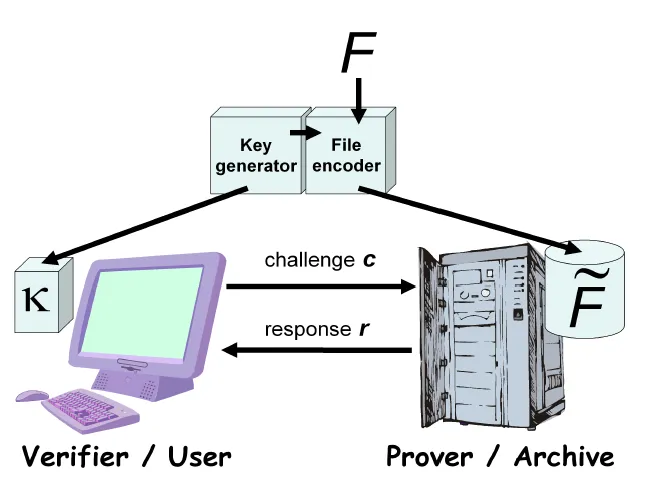
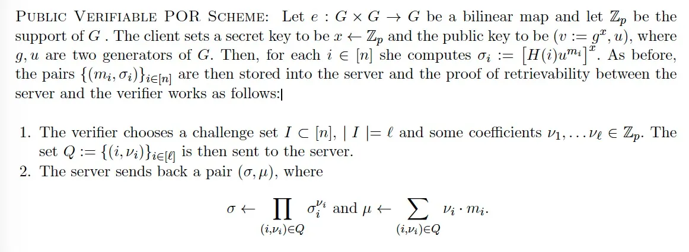

# 在比特币上使用可检索性证明支付存储费用

我们为用户开发了一种为云存储付费的新方法。 与亚马逊的 S3 等传统云存储相比，用户不必信任服务器。 我们使用比特币智能合约来确保支付取决于服务器的可检索性证明 (PoR)，该证明只能在数据仍然可用且需要时可以检索的情况下生成。

## 可检索性证明 (PoR)

许多人通过将他们的数据（如音乐、照片和文档）上传到远程服务器来外包存储，以确保可靠性和从许多设备（包括手机和笔记本电脑）轻松访问。

这些用户受其存储提供商的摆布，必须信任服务器。 如果很少访问数据，恶意服务器可能会丢弃数据以节省资源，或者掩盖数据丢失事故以保护自己的声誉。

PoR 方案是一种加密协议，允许用户或第三方（如审计员）验证服务器是否存储了他的数据。这种审计能力使用户放心，他的数据仍在存储中。 这对于像不知名的初创公司这样的存储提供商来说也可能至关重要，因为用户可能不愿意将他们的数据委托给初创公司。

## 使用 PoR 支付存储费用

朴素的 PoR 是用户简单地请求服务器下载所有数据并验证真实性。 然而，当存储的数据很大时，这是非常低效的。

Shacham/Waters PoR 方案¹ 是客户端和服务器之间的高效审计协议。 通过审核的服务器必须知道所有客户端数据。 它也是可公开验证的，这是我们在智能合约中验证证明时所需要的。

文件首先使用[Erasure code](https://en.wikipedia.org/wiki/Erasure_code)（一种纠错码）进行编码，即使服务器丢失了文件的一小部分，也可以恢复。 编码的文件被分成n个块。 为每个块计算一个标签（也称为验证器），其中包含其元信息并且是有效验证所必需的。 块及其标签都被发送到服务器进行存储。

为了测试服务器是否还有文件，用户在挑战中随机选择一组块。 服务器收到质询后，需要发回一个响应，由用户验证。

PORs：大文件的可检索性证明

形式上，Shacham/Waters PoR 由三个步骤组成。

我们需要区块链设置中的非交互式协议，其中用户/验证者和服务器/证明者不必来回通信。在第 1 步中，我们让证明者（在本例中为服务器）自己生成挑战。 为确保公正的挑战，我们需要可公开追踪且不可控制的随机源，例如最新的 blockhash³。 在步骤 2 中，服务器根据步骤 1 中的挑战生成链下 PoR。在步骤 3 中，智能合约验证 PoR。 验证需要[椭圆曲线算法](https://blog.csdn.net/freedomhero/article/details/128075468)和[线性配对](https://blog.csdn.net/freedomhero/article/details/124943936)，两者都已实现。

用户部署智能合约，只有在提供有效的 PoR 时才会释放资金。 服务器只有在他可以提交有效的 PoR 时才能获得报酬，只有在他仍在存储用户文件的情况下他才能生成该 PoR。

## 定期付款

我们可以通过在顶部添加定期付款来将一次性付款扩展为订阅，以便定期支付服务器固定金额。

## 支付渠道

如果用户和服务器可以定期交互，他们也可以通过开通支付通道来实现循环支付。 用户每月向服务器发出挑战。 服务器以 PoR 响应。 在验证 PoR 后，用户通过增加服务器的通道余额来发送他的每月付款。 当存储订阅到期时，任何一方都可以关闭通道。

--------------

[1] H Shacham 2008 的[可检索性紧凑证明](https://eprint.iacr.org/2008/073.pdf)

[2] 最多丢失多少取决于纠错率。

[3] 只要付款少于区块奖励，这是安全的。