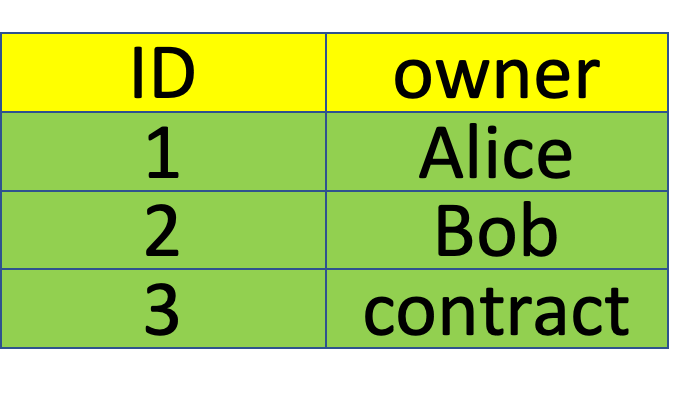
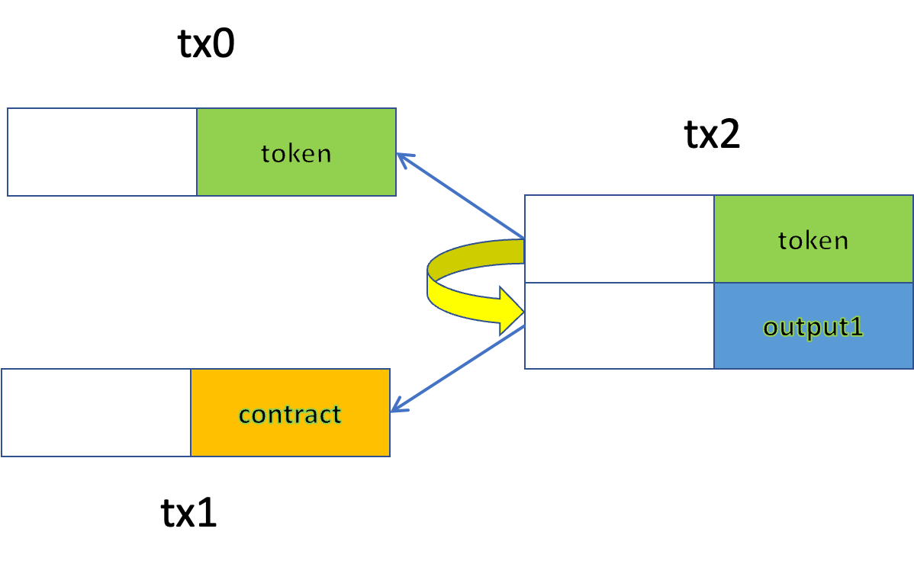

# 支付到合约哈希 (Pay to Contract Hash) —— 一种解决比特币智能合约限制的方法

> 可扩展且高效的比特币智能合约


<center> <a href="https://unsplash.com/@theshubhamdhage?utm_source=unsplash&utm_medium=referral&utm_content=creditCopyText"> 照片 </a> </center>

事实证明，比特币上的智能合约比以前想象的更强大、更通用。然而，仍然有两个严重的限制：

1. 合约一旦部署就不能支持新功能。例如，我们可以部署一个代币合约，但后来发现由于缺乏某些功能，它无法集成到一些新的交易所或投票应用程序中。这极大地阻碍了它与第三方应用程序的互操作性，从而阻碍了它的广泛采用。

2. 第一个限制也暗示所有受支持的功能都必须包含在代币合约中。即使我们可以预见到令牌在最初构思时需要支持的所有功能，也只有少数功能是常用的，而大多数功能很少使用。

## 支付到合约哈希 (Pay to Contract Hash)

我们提出了一种新颖的方法来同时解决这两个限制，称为支付到合约哈希 (P2CH)。我们以 NFT 为例来演示它是如何工作的。它也适用于其他加密资产，例如原生比特币和同质化代币。在我们之前的 [NFT 合约](https://blog.csdn.net/freedomhero/article/details/122884351)中，我们维护了一个表，将每个代币映射到其所有者的地址。所有者拥有可以授权转移令牌的私钥。


<center> 图 1: NFT 3 由合约拥有</center>

在 P2CH 下，所有者也可以是合约的地址，定义为其脚本的哈希值。哈希值作为合约的唯一 ID，用于引用合约。

具体来说，使用了 [hash160](https://learnmeabitcoin.com/technical/public-key-hash)，与用于将比特币公钥散列到地址中的散列算法相同。合约哈希看起来与普通比特币地址相同，因为它们都是 `20` 字节。新的 NFT 合约如下所示：
```javascript
contract Pay2ContractHash {
    @state
    HashedMap<int, PubKeyHash> owners;

    public function transferFrom(PubKeyHash from, PubKeyHash to,    // can be hash of a user's public key, or a contract
        Sig fromSig, PubKey fromPubKey,                             // only needed when token belongs to a user controlling a private key
        bytes prevouts, bytes contractTx, int contractInputIndex,   // only needed when token belongs to a contract
        int tokenId, int keyIndex, SigHashPreimage preimage) {
        // verify ownership
        require(this.owners.canGet(tokenId, from, keyIndex));
        
        // authenticate
        if (hash160(fromPubKey) == from) {
            // belongs to a user
            require(checkSig(fromSig, fromPubKey));
        } else {
            // belongs to a contract, not a user
            require(TxUtil.verifyContractByHash(
                        prevouts,
                        contractInputIndex,
                        contractTx,
                        from,
                        preimage));
        }

        require(this.owners.set(tokenId, to, keyIndex));
    
        require(this.propagateState(preimage));
    }
}

```
<center><a href="https://github.com/sCrypt-Inc/boilerplate/blob/master/contracts/pay2ContractHash.scrypt"> Pay2ContractHash 合约</a> </center>

除了 else 分支， 这与之前的 NFT 合约相同。else 分支负责处理当代币由合约而不是用户的私钥控制时的代币传输。

我们需要确保合约在同一交易的另一个输入中被解锁，就像我们在[合约间调用](https://xiaohuiliu.medium.com/inter-contract-call-on-bitcoin-f51869c08be)中所做的那样。

在图 2 所示的示例中，输入 `0` 中引用的令牌需要验证同一交易 `tx2` 中的输入 `1` 是否引用了预期合约。

- 第 `20`-`22` 行获取包含合约的交易的 `id`（图中的 tx1）和它包含的输出（`tx1` 中的输出 `0`）
- 第 `24` 行验证完整交易是否与 txid 匹配。
- 第 `26` 行解析合约交易以获取合约的完整脚本并将其与第 `27` 行的所有者“地址”进行哈希匹配。


<center> 图 2: 转让合约拥有的代币</center>

## 代币销售合约示例

一个示例合约可能如下：
```javascript
contract TokenSale {
    PubKeyHash recvAddr;
    int recvAmount;

    public function unlock(SigHashPreimage txPreimage) {
        SigHashType sigHashType = SigHash.SINGLE | SigHash.FORKID;
        require(Util.checkPreimageSigHashType(txPreimage, sigHashType));

        bytes outputScript = Util.buildPublicKeyHashScript(this.recvAddr);
        bytes output = Util.buildOutput(outputScript, this.recvAmount);

        require(hash256(output) == Util.hashOutputs(txPreimage));
    }
}
```
<center><a href="https://github.com/sensible-contract/token_sensible/blob/master/contracts/tokenSell.scrypt"> TokenSale 合约 </a></center>

当且仅当给定地址支付特定金额时，才能使用它。使用这个合约，我们可以通过三个步骤以给定的价格原子地出售代币：

1. 部署 TokenSale 合约。
2. 将代币转入上述合约的哈希，即其锁定脚本的 `hash160`。现在代币受合约控制，而不是用户的私钥。这类似于以太坊中的合约账户，没有对应的私钥，以太坊中用户常用的是[EOA账户](https://www.zastrin.com/courses/ethereum-primer/lessons/2-4)。
3. 在一次交易中同时解锁代币和 `TokenSale` 合约，如图 2 所示。买方将把代币从合约中转移给自己。

可以在此处找到完整的[代码示例](https://github.com/sensible-contract/token_sensible)。

## 总结

值得注意的是，合约可以是任意的，可以由第三方独立开发，也不必事先知道。这意味着令牌是无限可扩展的（限制 `1`）。此外，它结构紧凑，仅处理适用于任何合约的 P2CH（限制 `2`）。此外，还可以使用模式匹配合约的替代方法。上面例子我们使用完整合约脚本的哈希匹配，也可以使用部分脚本的哈希进行匹配，例如[有状态合约](https://blog.csdn.net/freedomhero/article/details/107307306)的代码部分。

## 致谢

这个想法来自[Sensible Contract](https://sensiblecontract.org/)的[陈诚](https://zhuanlan.zhihu.com/p/335212771)。