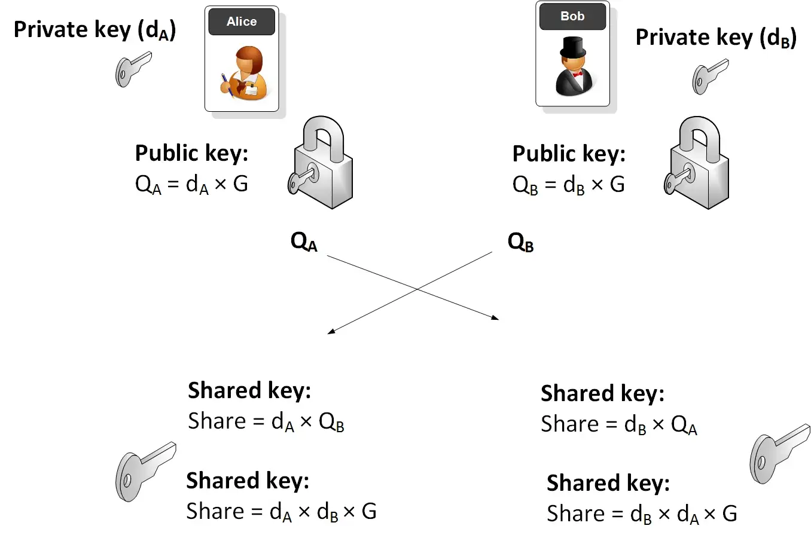
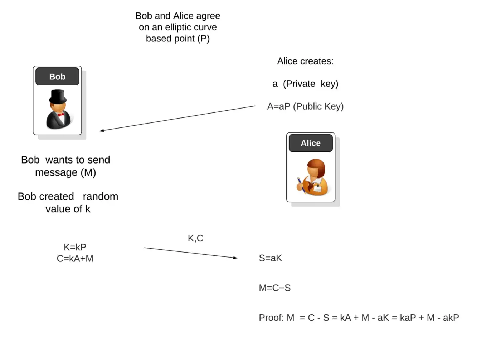

# 付费解密

> 使用 ElGamal 加密

Alice 有一条加密消息，即密文。Bob 有原始消息，明文。Alice 想支付给 Bob 比特币以换取明文。如果 Alice 先付钱给 Bob，Bob 可能不会给她明文。相反，如果 Bob 先把明文告诉 Alice，Alice 可能会拒绝支付。

我们设计了一个称为支付解密的智能合约，使交易原子化且无需信任，确保只有正确的明文才能赎回锁定的资金¹。

## Diffie–Hellman 密钥交换

[Diffie–Hellman 密钥交换 (DHKE)](https://en.wikipedia.org/wiki/Diffie%E2%80%93Hellman_key_exchange) 是一种密钥协商协议，允许两方通过不安全的通道建立共享秘密。

下图显示了椭圆曲线上的 DHKE。一开始，Alice 和 Bob 各有一对公私钥。交换后，他们生成一个共享密钥。



<center>椭圆曲线 Diffie Hellman</center>

## ElGamal 加密

ElGamal 加密是一种基于 Diffie–Hellman 密钥交换的非对称密钥加密算法，以 Taher Elgamal² 命名。Alice 用他的公钥加密给 Bob 的消息，只能用 Bob 的私钥解密。

下图显示了它如何在椭圆曲线上工作，例如比特币中的 [secp256k1](https://wiki.bitcoinsv.io/index.php/Secp256k1)。与在标准 DHKE 中一样，建立了以下共享秘密。

> S = k * A = a * K = k * a * P

`a` 是 Alice 的密钥，`k` 可以看作是 Bob 的。

为了加密消息 `M`，Bob 只需将其添加到 `S`：

> C = S + M

Bob 将密文，即 `(K, C)` 对发送给 Alice。

要解密，Alice 可以简单地减去以恢复 `M`：

> M = C - S

注意 Alice 从 `K` 知道 `S`：

> S = a * K



## 付费解密

Alice 在给定 `K` 和 `C` 的情况下将资金锁定在以下合约中。Bob 只有提供正确的明文和解密密钥才能赎回它。我们使用之前的椭圆曲线库进行点运算。

```js
contract Pay2Decrypt {
    // ciphertext: (K, C)
    Point K;
    Point C;

    public function decrypt(PrivKey privKey, Point plaintext) {
        Point sharedSecret = EC.multByScalar(this.K, privKey);
        require(EC.addPoints(sharedSecret, plaintext) == this.C);
    }
}
```

<center><a href="https://github.com/sCrypt-Inc/boilerplate/blob/master/contracts/pay2decrypt.scrypt">Pay2Decrypt 合约</a></center>

## 致谢

这是 nChain 白皮书 1611 的实现。

-------------------------------------

[1] 这适用于可以公开的明文，因为它将暴露在区块链上。

[2] Taher Elgamal 被称为“SSL 之父”，与 Diffie–Hellman 一样，也是 Martin Hellman 的博士生。