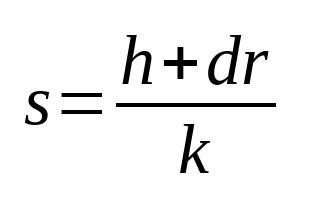
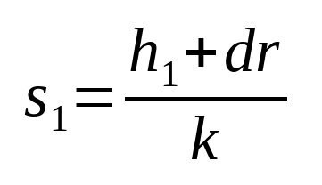
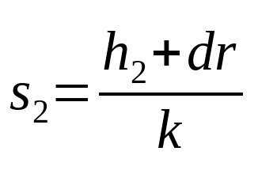
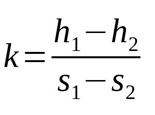
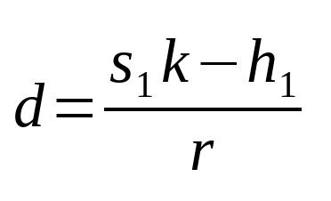
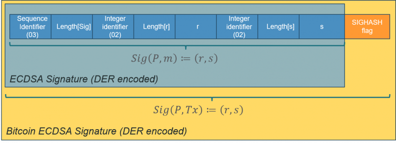

# 私钥谜题 (Private Key Puzzles)

我们引入了一种称为私钥谜题的新型比特币智能合约，它只能通过提供给定公钥的对应私钥来解锁。

在以前的合约中，只需要以数字签名的形式证明拥有私钥。私钥保密，不会暴露。私钥谜题合约则相反，私钥是被公开的。

## 对 ECDSA 的 Nonce 重用攻击

为了生成签名，[ECDSA](https://en.wikipedia.org/wiki/Elliptic_Curve_Digital_Signature_Algorithm) 需要一个私钥 `d`、一个随机数 `k`（称为 nonce）和消息的散列 `h`。`r` 是点 `k * G` 的 `x` 坐标，其中 `G` 是生成器。




(r, s) 就是签名。

当使用相同的私钥和相同随机数 `k` 的对不同消息进行签名时，就会出现问题。我们将有两个签名 (r, s1) 和 (r, s2)。 `r` 相同，因为 `k` 相同。





我们可以通过以下方式恢复随机数：




我们还可以通过以下方式恢复私钥：




索尼 PlayStation 3 因为暴露了此漏洞被黑客[入侵](https://fahrplan.events.ccc.de/congress/2010/Fahrplan/attachments/1780_27c3_console_hacking_2010.pdf)。因此，为不同的签名选择不同的 `k` 至关重要。

## 私钥谜题

我们将利亚漏洞来间接曝光私钥。我们有意要求对使用相同私钥和随机数签名的两条不同消息的两个有效签名，如下所示。

```js
contract PrivateKeyPuzzle {
    PubKey pubKey;

    // extract r from DER-encoded signature
    static function extractRFromSig(Sig sig) : bytes {
        int rlen = unpack(sig[3 : 4]);
        return sig[4 : 4 + rlen];
    }

    public function unlock(Sig sig1, Sig sig2) {
        require(checkSig(sig1, this.pubKey));
        // ensure signed messages are different option (1): insert CODESEPERATOR in between two checkSigs
        ***
        require(checkSig(sig2, this.pubKey));

        // sign with same r, thus same ephemeral key k
        require(extractRFromSig(sig1) == extractRFromSig(sig2));
    }
}
```

<center><a href="https://github.com/sCrypt-Inc/boilerplate/blob/master/contracts/privkeypuzzle.scrypt"> PrivateKeyPuzzle 合约</a></center>

我们在第 `11` 行和第 `14` 行验证两个签名使用了相同的公钥和私钥。 第 `5` 行的函数 `extraRFromSig()` 允许我们从签名中提取 `r`，DER 编码如下。




第 `17` 行确保 `r` 相同，因此在两个签名中相同的 `k` 使用。

签名的消息称为 [sighash 原像](https://github.com/bitcoin-sv/bitcoin-sv/blob/master/doc/abc/replay-protected-sighash.md)。请注意，我们在第 `13` 行插入了一个 [OP_CODESEPARATOR](https://blog.csdn.net/freedomhero/article/details/122497817) 以确保两个签名的消息是不同的，因为它们具有不同的 scriptCode（sighash 原像的第 5 部分）。


还有其他方法可以确保签名消息不同。例如，我们可以在签名时使用不同的 sighash 标志（sighash 原像的第 10 部分）。

```js

// extract SIGHASH flag from DER-encoded signature
static function extractSighashFlagFromSig(Sig sig) : SigHashType {
    int len = len(sig);
    return SigHashType(sig[len - 2 : ]);
}

public function unlock(Sig sig1, Sig sig2) {
    require(checkSig(sig1, this.pubKey));
    require(checkSig(sig2, this.pubKey));

    // ensure signed messages are different option (2): use different sighash flags
    require(extractSighashFlagFromSig(sig1) == (SigHash.NONE | SigHash.FORKID));
    require(extractSighashFlagFromSig(sig2) != (SigHash.NONE | SigHash.FORKID));

    // sign with same r, thus same ephemeral key k
    require(extractRFromSig(sig1) == extractRFromSig(sig2));
}
```

<center><a href="https://github.com/sCrypt-Inc/boilerplate/blob/master/contracts/privkeypuzzle.scrypt"> PrivateKeyPuzzle 合约</a></center>


`sig1` 使用 NONE ，将交易输出的从签名的消息中排除，而 `sig2` 包含了交易输出，因此不同。

## 替代实现

还有其他方法可以强制公开私钥：

- 直接用[椭圆曲线点乘法](https://xiaohuiliu.medium.com/efficient-elliptic-curve-point-addition-and-multiplication-in-scrypt-script-f7e143a752e2)验证公钥等于d * G

- 使用 OP_PUSH_TX 技术来[验证私钥和公钥是一对](https://xiaohuiliu.medium.com/ecdsa-based-oracles-on-bitcoin-e69d15afe6c5)。

私钥谜题比它们更紧凑和高效。

## 致谢

本文改编自论文[比特币私钥锁定交易](https://eprint.iacr.org/2016/1184.pdf)的想法。