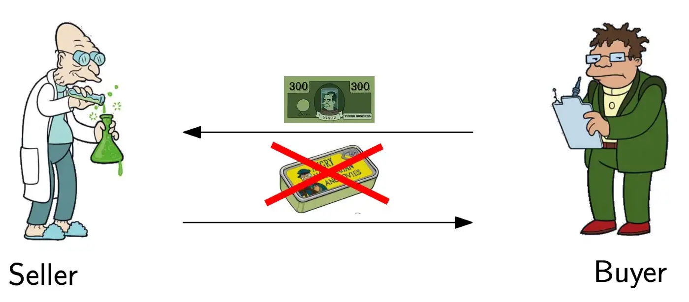
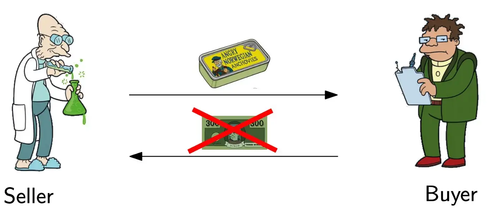
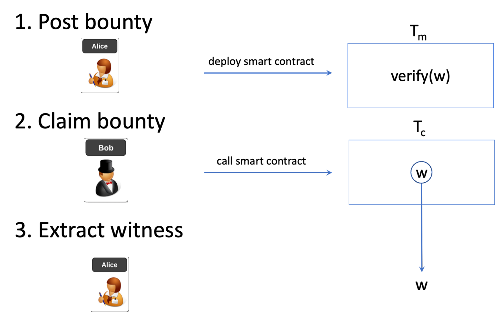
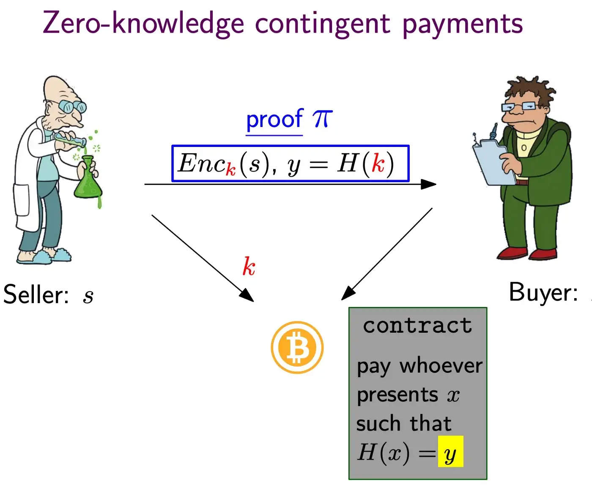
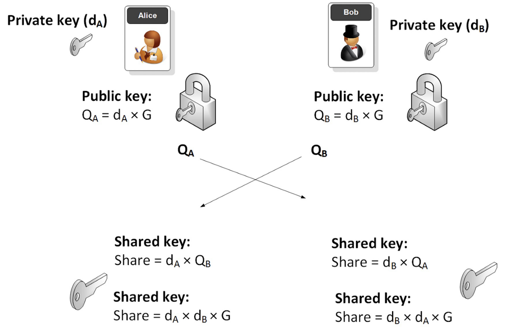
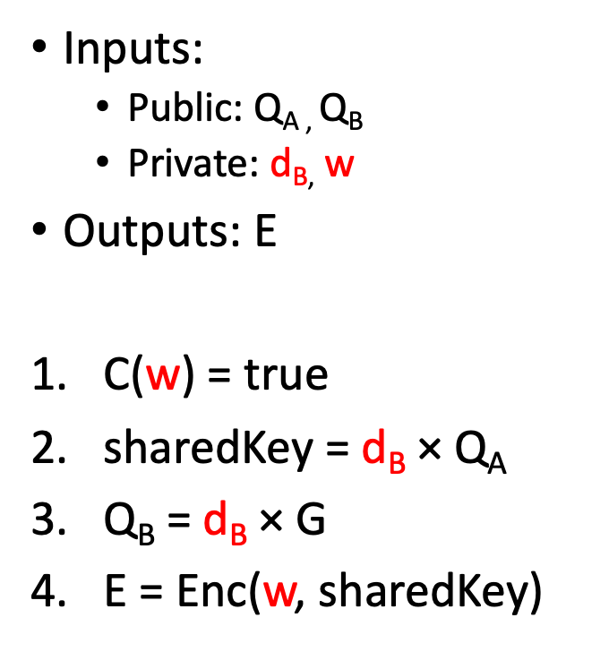
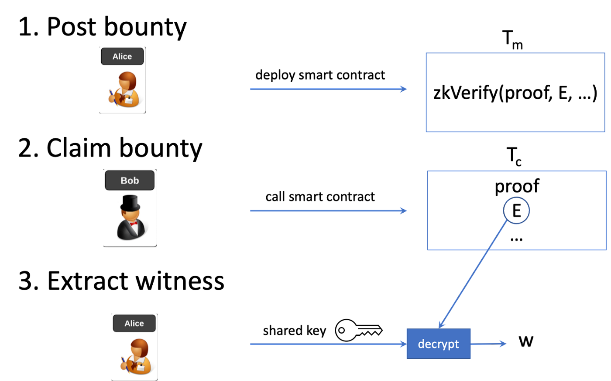

# BSV 上用于通用计算的隐私非交互式赏金

> 如何安全地外包任何计算

我们提出了一种新颖的赏金机制，可以在区块链上安全私密地外包任意计算。解决方案和付款的交换是原子的和无需信任的：赏金发布者获得解决方案而赏金收集者获得奖励，或者两者都不发生。赏金发布者部署一个智能合约，当且仅当提供解决方案时才会释放资金。为了防止解决方案泄露，它使用只有双方知道的密钥进行加密。为了验证加密的解决方案，零知识证明 (ZKP) 用于证明加密的解决方案是有效的，并且使用正确的密钥对其进行加密，同时保密。

据我们所知，这是有史以来第一个也是唯一一个在没有可信第三方的情况下安全外包任何计算的方法。

## 公平交换问题

买家想知道计算问题的解决方案，例如数独游戏。她不想或不能自己解决它，所以她通过悬赏支付给提供解决方案的卖家来将其外包。

如果买家先付款，卖家可能不会告诉他解决方案。

买家先付款

同样，如果卖方先公开解决方案，买方可能会拒绝付款。

卖家先透露

这是典型的公平交换问题。如果存在双方都信任的第三方托管，解决起来很简单。在没有托管的情况下已经进行了多次尝试来解决它。

### 第一次尝试

图一

一种天真的方法是简单地在公共区块链上部署一个赏金智能合约来解决这个问题，就像我们外包旅行商问题所做的那样。它由三个步骤组成，如图 1 所示：

1. 赏金发布者 Alice 放置了一个赏金交易 Tm，其中包含一个智能合约，该合约支付给见证人 `w` 以满足电路 `C` 中表示的问题，即 `C(w)` 评估为真。

2. 赏金收集者 Bob 在另一个交易 Tc 中将 `w` 提交给赏金交易。

3. 发布者爱丽丝从上述交易中提取 `w`。

任何人都可以通过向智能合约提交解决方案来尝试收集赏金。智能合约在验证确实解决问题的建议解决方案后向收集者付款。由于公共区块链的透明性，这有两个缺点：

1. 攻击者，例如恶意矿工，可以拦截收集者的交易，提取解决方案，并创建竞争交易以自己领取赏金，而无需解决问题。

2. 任何人都可以通过观察发布在链上的解决方案来获取解决方案。如果赏金发布者打算将他支付的解决方案保密，这是有问题的。

### 第二次尝试：零知识条件支付（ZKCP）

[ZKCP](https://en.bitcoin.it/wiki/Zero_Knowledge_Contingent_Payment) 允许买家使用不需要信任任何人的比特币从卖家那里购买解决方案。它包括两个步骤：

1. 使用 ZKP，卖方说服买方相信哈希原像 `k` 是链下有效加密解决方案 `s` 的加密密钥，而无需披露解决方案。

2. 然后买方将比特币锁定在支付给卖方的交易中，只有在卖方提供正确的原像时才能赎回比特币，买方用它来解密解决方案。

### 我们的解决方案

我们的赏金机制解决了上述所有问题，并具有以下显着特性。

1. 非交互式：赏金发布者通过向区块链发送单个交易来创建用于解决计算难题的赏金。

2. 开放：任何人只要有解决方案就可以在后续交易中收取赏金，并且在赏金创建时收集者是未知的。

3. 可提取：保证赏金发布者能够从赏金收集交易中提取解决方案。

4. 安全：恶意窃听方即使拦截收款交易也无法领取赏金

5. 隐私：局外人无法通过观察区块链获知解决方案。

实现满足所有这些要求的赏金会很困难，因为在发布赏金时解决问题的用户的身份是未知的。在图 1 中，恶意攻击者，例如矿工，可以窃听 Tc，获得见证并自行赎回奖励，因为 Tm 中的智能合约允许任何拥有 `w` 的人赎回。此外，任何第三方都可以在区块链上观察 Tc 并了解秘密 `w`，赏金发布者为此付费并可能希望保密。需要一种方法来加密和隐藏 `w`，同时仍然确保 C(w) 为真。

为了防止这些攻击，`w` 使用对称加密的共享密钥进行加密。它源自椭圆曲线 Diffie–Hellman (ECDH) 密钥交换，如图 2 所示。Alice 的公钥 QA 在 Tm  中发布。 Bob 必须使用 QA 来导出共享密钥。他将自己的公钥QB暴露在Tc中，Alice用它推导出相同的共享密钥，对加密解进行解密得到 `w`。

图 2：ECDH 密钥交换

## ZK电路

Tm 中的智能合约验证了 Tc 中的证明，证明了图 3 所示的复合电路。它需要多个输入，包括私密见证人 `w`，并输出使用共享密钥加密的见证人。第 1 步确保 `w` 有效，其余验证 `w` 是否使用正确的共享密钥加密，以便 Alice 可以解密它。第 2 步使用 ECDH 推导共享密钥。步骤4中的enc()可以是任何对称加密。在实践中，为了提高效率，需要 ZKP 友好的加密，例如 [Poseidon 加密](https://dusk.network/uploads/Encryption-with-Poseidon.pdf)。

 图 3: 电路

### 最终工作流程

最终改进的赏金机制如图 4 所示。

1. 赏金发布者 Alice 放置了一个包含智能合约的赏金交易 Tm，如果证明证明 `E` 是 `w` 加密的，该智能合约就会释放资金。

2. 赏金收集者鲍勃根据他的私钥和爱丽丝的公钥求解 `w` 并使用共享的 ECDH 密钥对其进行加密。他生成一个 ZK 证明并提交交易 Tc 以领取赏金，其中包含证明和密文 E。

3. Alice 根据她的私钥和 Bob 的公钥导出相同的共享 ECDH 解密密钥。她在 Tc 中解密 E 并得到 `w`。

如果攻击者拦截 Tc 并更改接收者，则证明将失效，因为它与 Bob 的公钥绑定。攻击者无法重定向和窃取赏金。该证明类似于常规支付交易中使用的数字签名，可防止篡改。攻击者也看不到见证，因为它是加密的。

 图 4

在实践中，最后期限将被添加到赏金中。如果在一定时间内没有人认领，爱丽丝可以取回她的钱。

### 如何获得 Bob 的公钥

Bob 的公钥 QB，即认领交易的发送者，在基于账户的区块链（例如以太坊）中很容易获得。以太坊的 Solidity 编程语言将其公开在全局事务变量 [tx.origin 或 msg.sender](https://docs.soliditylang.org/en/develop/units-and-global-variables.html#block-and-transaction-properties) 中。

在BSV中，我们基于一种称为 OP_PUSH_TX 的技术提取 QB。 OP_PUSH_TX 允许智能合约（在 Tm 中）访问支出交易（Tc），从而强制执行赏金到收集者公钥 QB 的位置，在 ECDH 中用于派生共享加密密钥¹。

### BSV与其他区块链

这种赏金机制可以应用在很多区块链中。 在 BTC 和 Ethereum 等未确认交易可能会被更高费用的后续交易延迟的区块链中，赏金发行人 Alice 有可能拦截 Tc，解密并获取见证人 `w`。 她可以使用 `w` 创建一个竞争性收集交易，以在 Tc 被开采到一个区块之前以更高的交易费用领先 Tc。 在BSV上，这是极不可能的，因为交易是按照先见原则处理的。

### 可信设置

有两类 ZKP：需要可信设置的和不需要可信设置的。 在许多情况下，后者是首选，因为它往往更有效。 如果 Bob 进行设置，他可以创建一个伪造的证明并窃取赏金而无需解决 `w`。 由于无法信任第三方，因此 Alice 必须进行设置。

与 ZKCP 不同，如果 Alice 通过破坏 ZKP 使用的零知识属性来恶意操纵设置以从证明中获取部分或全部见证人，这不是问题²。 无论如何，她都会解密证据以获得见证人。 为了额外的安全性，Bob 可以对设置进行额外的检查，以确保它是由 Alice 诚实地执行的，并且公共参考字符串的格式正确。 他还可以通过在本地运行验证者智能合约来验证他的证明确实通过了验证，并且只有在通过后才广播 Tc。

## 潜在用例

本发明开辟了许多将任意实际计算问题外包给公众的方法。 任何先提交解决方案的人都可以保证获得报酬。 下面只是几个例子。

- 挖矿：矿池通过向任何发现使给定区块头哈希满足共享难度目标的随机数的矿工支付报酬来外包哈希。 矿工不必像在传统矿池中那样信任矿池进行支付。 支付是无需信任且即时的。

- 机器学习：企业希望在给定数据集上训练机器学习模型，例如自然语言处理或线性回归，以改善用户体验。 它将培训外包，希望以可承受的价格找到最准确的模型，而无需像 Kaggle 这样的集中式平台。

- 可证明的高分辨率图像：网站的用户喜欢图像，该图像分辨率低且只是预览。 他想购买高分辨率副本，可能缩小到预览版。

- 旅行商问题：一家物流公司希望找到最短路线，将包裹高效地运送到一系列收件人手中，从而最大限度地降低汽油成本。

- 数独谜题：爱丽丝是数独游戏的狂热粉丝，她有一个数独谜题难住了她好几个小时。 她放弃并悬赏给提供谜题解决方案的人。

ZKP 的快速技术进步使得证明许多实际应用的陈述成为可能。 我们将很快演示如何利用这种赏金机制来解决实际问题。 敬请关注！

## 致谢
感谢 [ZeMing Gao](https://zemgao.com/) 审阅本文的早期草稿并提供建设性反馈。

---------------------------------

[1] 如果在交易中使用从公钥散列派生的地址，而不是公钥本身，QA 和 QB 将替换为 Alice 和 Bob 的地址，并且需要额外的步骤来确保地址是从公钥派生的。

[2] [WI 是不够的：重新审视零知识或有（服务）支付](https://eprint.iacr.org/2019/964)