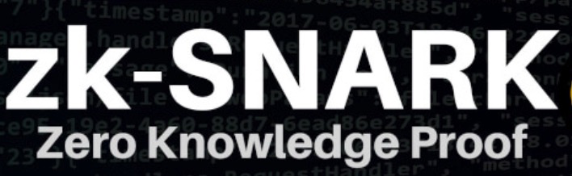
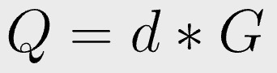

# 使用 zk-SNARKs 的可编程零知识证明：第 1 部分

> 不通过签名来证明知道私钥



理论上，可以为任何数学问题构建零知识证明 (ZKP)，而无需揭示此解决方案。在实践中，为一个问题开发 ZKP 通常需要发明一种全新的密码算法。它没有标准配方，需要广泛而深入的密码学知识。例如，[零知识谜题](https://blog.csdn.net/freedomhero/article/details/125817327)涉及 ∑-protocols 、[零知识密钥声明](https://github.com/sCrypt-Inc/article/blob/1cbdb31a0b31b91f68920ffe2293ffc9385afc61/Zero-Knowledge%20Key-Statement%20Proof/Zero-Knowledge%20Key-Statement%20Proof.md)、 Pedersen 承诺和 Fiat-Shamir 启发式。


zk-SNARKs 为任意问题标准化 ZKP 生成。只需用 ZK 格式表达要证明的原始问题，例如[领域特定语言 (DSL)](https://en.wikipedia.org/wiki/Domain-specific_language) [Circom](https://docs.circom.io/) 或 [Zokrates](https://zokrates.github.io/)。其余的都由通用的 zk-SNARK 框架处理，隐藏了底层密码学的所有复杂性。

在 zk-SNARK 之前，为新问题构建 ZKP 类似于在设计新的 ZKP 应用程序时需要构建新的 ASIC。zk-SNARK 允许通过简单地对通用“ZK CPU”进行编程来构建新的 ZKP。前者需要一个密码学家，而后者只需要一个程序员，大大降低了ZKP的进入门槛。

为了展示这种范式转变的力量，我们用它来构建最流行的 ZKP：给定公钥的私钥知识，也就是[离散对数](https://crypto.stackexchange.com/questions/15075/is-the-term-elliptic-curve-discrete-logarithm-problem-a-misnomer)。


## 通过 ZKP 证明知道私钥


要将锁定到公钥/地址的比特币转移，所有者必须证明他知道相应的私钥。但他不能简单地透露，否则比特币可能会被盗。这是通过数字签名（一种形式的 ZKP²）完成的。我们将展示另一种使用 zk-SNARK 实现相同目标的方法。

在比特币中，公钥 `Q` 只是私钥 `d` 乘以生成器 `G`。



以下 Circom 代码在比特币的椭圆曲线 `secp256k1` 上实现标量乘法。我们可以很容易地用它证明 `Q` 是 `d` 的公钥：

* 将第 `3` 行的输入标量设置为 `d`：注意它是私有的，因此保持秘密
* 将第 `4` 行的输入点设置为 `G`
* 将第 `6` 行的输出设置为 `Q`

```js
// encoded with k registers of n bits each
template Secp256k1ScalarMult(n, k) {
    signal private input scalar[k];
    signal public input point[2][k];

    signal output out[2][k];

    component n2b[k];
    for (var i = 0; i < k; i++) {
        n2b[i] = Num2Bits(n);
        n2b[i].in <== scalar[i];
    }

    // has_prev_non_zero[n * i + j] == 1 if there is a nonzero bit in location [i][j] or higher order bit
    component has_prev_non_zero[k * n];
    for (var i = k - 1; i >= 0; i--) {
        for (var j = n - 1; j >= 0; j--) {
            has_prev_non_zero[n * i + j] = OR();
            if (i == k - 1 && j == n - 1) {
                has_prev_non_zero[n * i + j].a <== 0;
                has_prev_non_zero[n * i + j].b <== n2b[i].out[j];
            } else {
                has_prev_non_zero[n * i + j].a <== has_prev_non_zero[n * i + j + 1].out;
                has_prev_non_zero[n * i + j].b <== n2b[i].out[j];
            }
        }
    }

    signal partial[n * k][2][k];
    signal intermed[n * k - 1][2][k];
    component adders[n * k - 1];
    component doublers[n * k - 1];
    for (var i = k - 1; i >= 0; i--) {
        for (var j = n - 1; j >= 0; j--) {
            if (i == k - 1 && j == n - 1) {
                for (var idx = 0; idx < k; idx++) {
                    partial[n * i + j][0][idx] <== point[0][idx];
                    partial[n * i + j][1][idx] <== point[1][idx];
                }
            }
            if (i < k - 1 || j < n - 1) {
                adders[n * i + j] = Secp256k1AddUnequal(n, k);
                doublers[n * i + j] = Secp256k1Double(n, k);
                for (var idx = 0; idx < k; idx++) {
                    doublers[n * i + j].in[0][idx] <== partial[n * i + j + 1][0][idx];
                    doublers[n * i + j].in[1][idx] <== partial[n * i + j + 1][1][idx];
                }
                for (var idx = 0; idx < k; idx++) {
                    adders[n * i + j].a[0][idx] <== doublers[n * i + j].out[0][idx];
                    adders[n * i + j].a[1][idx] <== doublers[n * i + j].out[1][idx];
                    adders[n * i + j].b[0][idx] <== point[0][idx];
                    adders[n * i + j].b[1][idx] <== point[1][idx];
                }
                // partial[n * i + j]
                // = has_prev_non_zero[n * i + j + 1] * ((1 - n2b[i].out[j]) * doublers[n * i + j] + n2b[i].out[j] * adders[n * i + j])
                //   + (1 - has_prev_non_zero[n * i + j + 1]) * point
                for (var idx = 0; idx < k; idx++) {
                    intermed[n * i + j][0][idx] <== n2b[i].out[j] * (adders[n * i + j].out[0][idx] - doublers[n * i + j].out[0][idx]) + doublers[n * i + j].out[0][idx];
                    intermed[n * i + j][1][idx] <== n2b[i].out[j] * (adders[n * i + j].out[1][idx] - doublers[n * i + j].out[1][idx]) + doublers[n * i + j].out[1][idx];
                    partial[n * i + j][0][idx] <== has_prev_non_zero[n * i + j + 1].out * (intermed[n * i + j][0][idx] - point[0][idx]) + point[0][idx];
                    partial[n * i + j][1][idx] <== has_prev_non_zero[n * i + j + 1].out * (intermed[n * i + j][1][idx] - point[1][idx]) + point[1][idx];
                }
            }
        }
    }

    for (var idx = 0; idx < k; idx++) {
        out[0][idx] <== partial[0][0][idx];
        out[1][idx] <== partial[0][1][idx];
    }
}
```

<center>标量点乘法。归功于：<a href="https://github.com/0xPARC/circom-ecdsa/blob/08c2c905b918b563c81a71086e493cb9d39c5a08/circuits/secp256k1.circom#L313">0xPARC/circom-ecdsa</a></center>

为了便于说明，我们使用标准的 [double-and-add 算法](https://en.wikipedia.org/wiki/Elliptic_curve_point_multiplication#Double-and-add)。可以在[此处](https://github.com/0xPARC/circom-ecdsa/blob/08c2c905b918b563c81a71086e493cb9d39c5a08/circuits/ecdsa.circom#L14)找到[更有效的算法](https://0xparc.org/blog/zk-ecdsa-2)。主循环发生在第 `33` 行到第 `65` 行。我们在第 `42` 行使用 `Secp256k1AddUnequal` 进行点加法，并在第 `43` 行使用 `Secp256k1Double` 进行点加倍。在每次迭代中，我们在第 `355-358` 行继续加倍。如果设置了当前位，我们还会添加。

一旦我们有了 Circom 代码，我们就可以使用我们的[通用 zk-SNARK 库](https://blog.csdn.net/freedomhero/article/details/125599764)来证明知道私钥，同时确保保密。我们已经展示了没有数字签名的证明！

请继续关注更多利用 zk-SNARK 的可编程性的 ZKP 示例。

## 致谢

这篇文章的灵感来自于[这篇出色的文章](https://0xparc.org/blog/zk-group-sigs)。

---------------------------


[1] 事实上，ZKP 可以针对任何 [NP 问题](https://crypto.stackexchange.com/questions/64347/can-you-explain-what-an-np-statement-is-when-they-refer-to-it-in-zero-knowledge)构建。

[2] 我们在这里[松散地](https://crypto.stackexchange.com/questions/35177/is-using-digital-signatures-to-prove-identity-a-zero-knowledge-proof)使用 ZK。