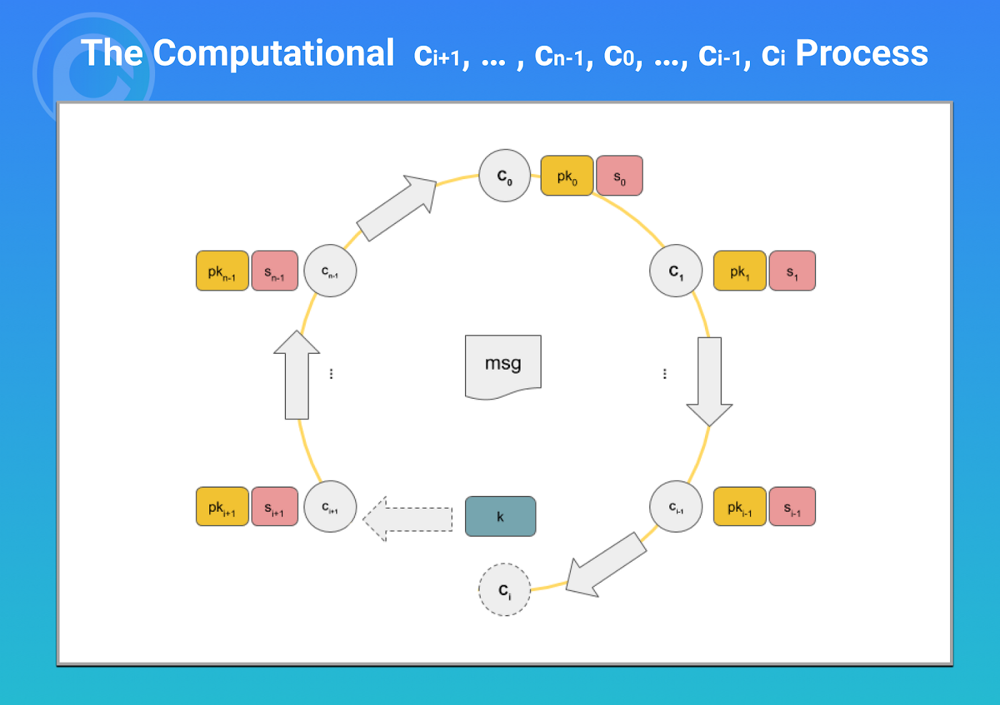

# 使用 zk-SNARKs 的可编程零知识证明：第 2 部分

> 不使用环签名的情况下证明组成员身份


在[第 1 部分](https://blog.csdn.net/freedomhero/article/details/126928566)中，我们演示了 zk-SNARK 将密码问题转化为编程问题。例如，我们“编程”了椭圆曲线点乘法来证明给定公钥的私钥知识，相当于数字签名。


今天，我们展示了如何通过使用零知识语言 [Circom](https://docs.circom.io/) 简单地“编程”它来实现另一个复杂的密码学技术：[环签名](https://en.wikipedia.org/wiki/Ring_signature)。

## 使用 zk-SNARKs 的环签名

在环签名中，组/环的任何成员都可以签名以证明其成员资格，而无需透露其具体身份。基于签名，验证者可以确定组成员中有人签名，但他无法知道是哪一个签名。我们之前已经[实现了环签名](https://github.com/sCrypt-Inc/article/blob/b1dc4bbbcb728459f3408b20e6a5758e78cb8013/Ring%20Signatures%20in%20Bitcoin/Ring%20Signatures%20in%20Bitcoin.md)。尽管它是可行的，但这绝非易事，需要全面的密码学知识和独创性才能提出。



<center>环签名</center>

由于 zk-SNARK 的可编程性和可组合性，我们可以在前面的[点乘库的基础](https://github.com/0xPARC/circom-ecdsa/blob/08c2c905b918b563c81a71086e493cb9d39c5a08/circuits/secp256k1.circom#L313)上简单地“编码”如下环签名。

```
// `n`: chunk length in bits for a private key
// `k`: chunk count for a private key
// `m`: group member count
template Main(n, k, m) {
  signal private input privkey[k];
  
  signal public input pubKeyGroup[m][2][k];
  signal output existInGroup;

  // get pubkey from privkey
  component privToPub = ECDSAPrivToPub(n, k);
  for (var i = 0; i < k; i++) {
    privToPub.privkey[i] <== privkey[i];
  }

  signal pubkey[2][k];

  // assign pubkey to intermediate var
  for (var i = 0; i < k; i++) {
    pubkey[0][i] <== privToPub.pubkey[0][i];
    pubkey[1][i] <== privToPub.pubkey[1][i];
  }

  // check whether pubkey exists in group
  var exist = 0;
  component eq[2*m];
  var compareResult[m];

  for (var i = 0; i < m; i++) {
    // pubkey `x` comparer
    eq[i] = BigIsEqual(k);

    // pubkey `y` comparer
    eq[i+m] = BigIsEqual(k);

    for(var j = 0; j < k; j++) {
      // compare `x`
      eq[i].in[0][j] <== pubkey[0][j];
      eq[i].in[1][j] <== pubKeyGroup[i][0][j];

      // compare `y`
      eq[i+m].in[0][j] <== pubkey[1][j];
      eq[i+m].in[1][j] <== pubKeyGroup[i][1][j];
    }
    
    compareResult[i] = eq[i].out * eq[i+m].out;
  }

  component checker = InGroupChecker(m);
  for(var i = 0; i < m; i++) {
    checker.in[i] <== compareResult[i];
  }

  existInGroup <== checker.out;
}
```

<center><a href="https://github.com/sCrypt-Inc/boilerplate/blob/master/circuits/group_pubkey.circom">group_pubkey.circom</a></center>


从第 `11` 行到第 `22` 行，我们使用第 1 部分中介绍的 ECDSAPrivToPub 从第 `5` 行的私钥派生出第 `16` 行的公钥（注意它被声明为私有）¹。然后，我们只需将生成的公钥与第 `7` 行定义的组中的每个公钥进行比较（注意它是公开的）。当且仅当它与第 `54` 行的组中的任何一个匹配时，我们才返回 `true`。

可以在这里找到[测试](https://github.com/sCrypt-Inc/boilerplate/blob/master/tests/ts/group_pubkey.circom.scrypttest.ts)。


由于私钥输入是私有的并且保持隐藏状态，因此验证者无法使用它来识别哪个成员创建了证明。我们创建了一个 ZKP 用于组/环中的成员资格和环签名的等价物，而无需了解任何底层密码学！这就是 zk-SNARKs 的力量。

--------------


[1] 我们更喜欢这里的 ECDSAPrivToPub 而不是 [Secp256k1ScalarMult](https://github.com/0xPARC/circom-ecdsa/blob/08c2c905b918b563c81a71086e493cb9d39c5a08/circuits/secp256k1.circom#L313)，因为它更有效。

