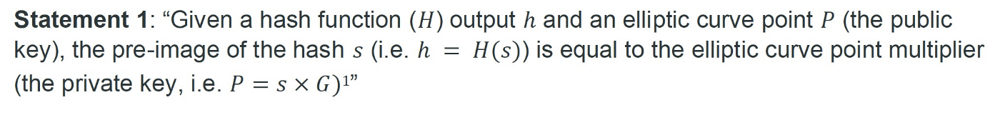

# 使用 zk-SNARKs 的可编程零知识证明：第 3 部分

> 零知识密钥声明证明


[之前](https://blog.csdn.net/freedomhero/article/details/127315179)，我们已经展示了如何使用称为零知识密钥声明证明 (ZKKSP) 的技术为以下声明构建零知识证明 (ZKP)。



基本上，它证明了不仅证明者知道给定公钥的密钥，而且还证明知道给定摘要的秘密哈希，而不会泄露秘密。


<center>图片来自<a href="https://coingeek.com/zero-knowledge-key-statement-proof">CoinGeek</a></center>

虽然 ZKKSP 有效，但它有一个严重的限制：它只适用于一种特定形式的声明，即秘密是给定公钥的私钥，也是给定哈希的原像。
目前尚不清楚如何将其扩展为稍作修改的声明，例如，除了作为私钥和原像之外，私钥也是偶数。此外，提出它需要密码学的专利级知识，例如 ∑ 协议和承诺方案。

## 使用 zkSNARKs 的 ZKKSP

我们通过利用 zkSNARKs 的可编程性来重新实现 ZKKSP。我们简单地将[第 2 部分](https://blog.csdn.net/freedomhero/article/details/127239367)中使用的椭圆曲线点乘法和[散列库](https://github.com/iden3/circomlib/blob/master/circuits/sha256/sha256.circom)结合起来。生成的 Circom 代码如下所示：


```js
// library circuits from https://github.com/0xPARC/circom-ecdsa
include "lib-circom-ecdsa/ecdsa.circom";
include "../node_modules/circomlib/circuits/sha256/sha256.circom";
include "../node_modules/circomlib/circuits/bitify.circom";

// `n`: chunk length in bits for a private key
// `k`: chunk count for a private key
template Main(n, k) {
  // n * k == 256
  assert(n * k >= 256);
  assert(n * (k-1) < 256);

  // little-endian
  signal private input privkey[k];
  signal public input pubkey[2][k];

  signal public output privkeyHash[k];

  // get pubkey from privkey
  component privToPub = ECDSAPrivToPub(n, k);
  for (var i = 0; i < k; i++) {
    privToPub.privkey[i] <== privkey[i];
  }

  // verify input pubkey
  signal pub_x_diff[k];
  signal pub_y_diff[k];
  for (var i = 0; i < k; i++) {
    pub_x_diff[i] <-- privToPub.pubkey[0][i] - pubkey[0][i];
    pub_x_diff[i] === 0;
    pub_y_diff[i] <-- privToPub.pubkey[1][i] - pubkey[1][i];
    pub_y_diff[i] === 0;
  }

  // calculate sha256 of privkey
  component sha256 = Sha256(256);
  for (var i = 0; i < k; i++) {
    for (var j =0; j < n; j++) {
      // change privkey to big-endian as sha256 input
      sha256.in[i * n + j] <-- (privkey[k-1-i] >> (n-1-j)) & 1;
    }
  }

  // set output
  component b2n[k];
  for (var i = 0; i < k; i++) {
    b2n[i] = Bits2Num(n);
    for(var j = 0; j < n; j++) {
      // `b2n` input is little-endian in bits, `sha256` out is big-endian in bits
      b2n[i].in[n-1-j] <== sha256.out[i * n + j];
    }
    privkeyHash[i] <== b2n[i].out;
  }

}

component main {public [pubkey]} = Main(64, 4);
```

<center><a href="https://github.com/sCrypt-Inc/boilerplate/blob/master/circuits/key_stmt.circom">key_stmt.circom</a></center>


和以前一样，我们在第 `15` 行使用 `ECDSAPrivToPub` 从第 `14` 行的私钥派生出一个公钥（注意它被声明为私有）。然后我们使用第 `3` 行导入的 `sha256` 库中的 `Sha256` 对相同的私钥进行哈希处理，以确保结果与第 `17` 行的给定哈希匹配。我们刚刚“编程” 实现了 ZKKSP，不需要高级密码学的先验知识。此外，由于 zkSNARKs 的可组合性，我们可以轻松地对其进行扩展以添加对秘密的约束，例如，秘密是偶数。

可以在这里找到一个[测试](https://github.com/sCrypt-Inc/boilerplate/blob/master/tests/ts/key_stmt.circom.scrypttest.ts)。