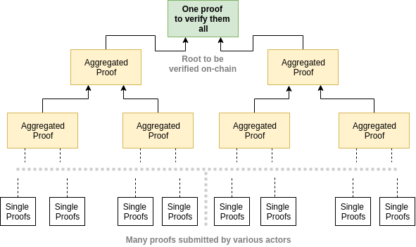
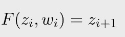
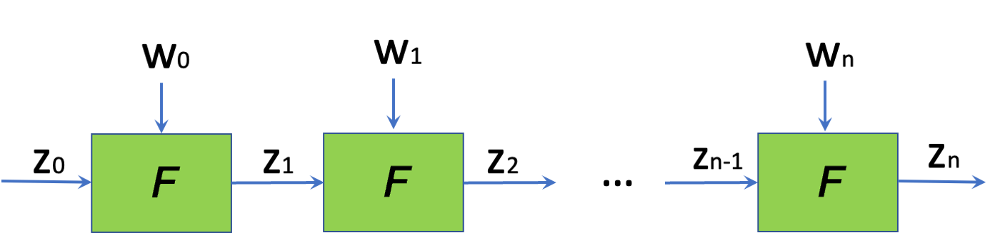
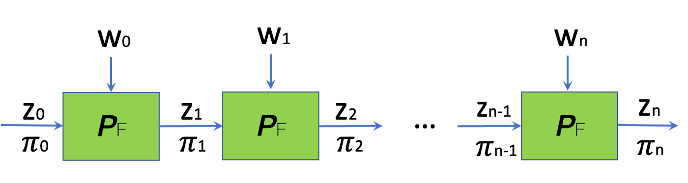
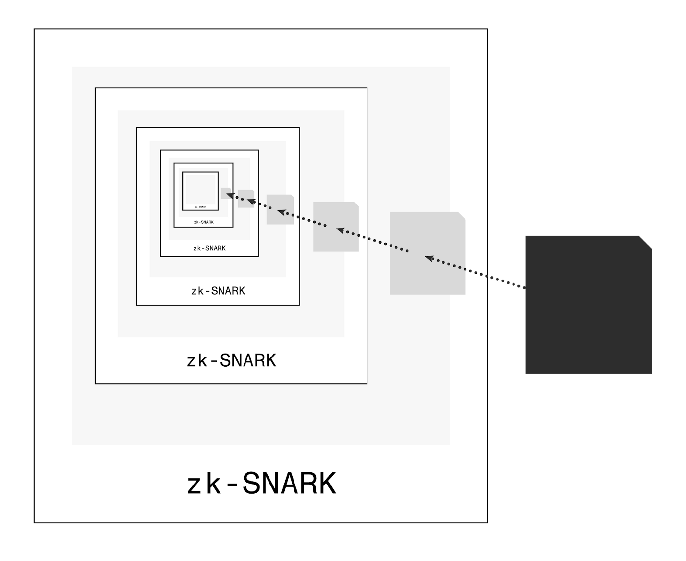
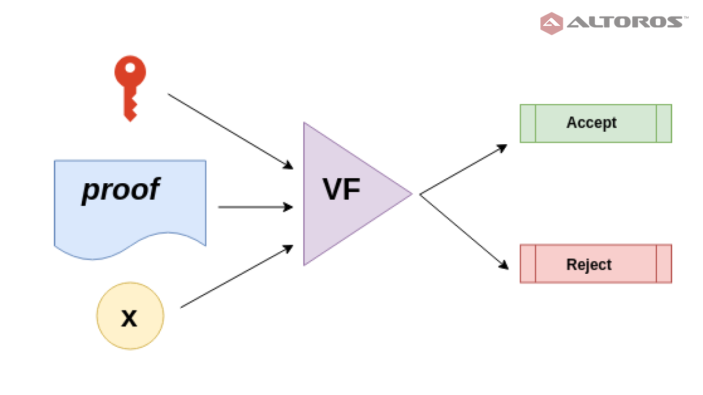
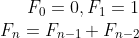

# 递归零知识证明

> 一个证明的证明的证明...

我们提出了递归零知识证明（ZKP），即一个证明证明了另一个证明的有效性。我们将展示了它优于标准非递归零知识证明 (ZKP) 的优势，并通过将其应用于证明 费拨那契 (Fibonacci) 序列来展示它的强大功能。

## 什么是递归 ZKP

假设 Peggy 想向 Victor 证明她下周将在公园度过，而她只想使用一张照片来证明这一点。她可以做到以下几点：


[图1: 递归证明](https://mirror.xyz/benlaw.eth/BjTsWkGYK9mytMpp6m0BFEv8x1Wxc1zgIcFkXoXpYBk)

第 1 天，她在公园里拍了一张照片，上面有显示日期的日历。

第 2 天，她拿着第 1 天的照片在公园里用日历拍了另一张照片。

第 3 天，她拿着日历在公园里拍了另一张照片，同时拿着第 2 天拍摄的照片。

重复相同的程序直到第 7 天。现在，她用一张照片证明了她为期一周的旅行。

类似于上面的比喻示例，在递归 ZK 证明中，该证明证明了另一个证明的有效性，该证明本身也验证了另一个证明，依此类推。

## 为什么我们需要它

与标准 ZKP 相比，递归 ZKP 具有几个显着优势。

### 聚合

多个证明可以聚合成一个证明。单一证明只有在所有组成证明都有效时才有效，并且更容易验证。当在区块链上验证证明时，这尤其有吸引力。数以千计的证明可以压缩成一个证明，从而节省大量的验证成本。



[图2: 多个证明合并为一个证明](https://ethresear.ch/t/reducing-the-verification-cost-of-a-snark-through-hierarchical-aggregation/5128)

### 并行化证明生成

假设我们要证明一批 `1000` 笔交易在 [rollup](https://medium.com/coinmonks/zk-rollups-on-bitcoin-ce35869b940d) 中是有效的。使用标准 ZKP，证明者需要为每笔交易生成一个单独的证明来依次验证 `1000` 笔交易，这是一项非常耗时的工作。所有证明都可以**并行**生成，因为它们都是独立的，因此证明时间要短得多。这些单独的交易证明可以递归地聚合在一个单一的证明中，如上所示。

### 增量可验证计算 (IVC)

如果证明是可增量更新的，那么证明某些类型的计算会更有效。

* 长计算：证明一个过长的计算会在证明者端占用大量内存。有些计算甚至无法放入内存中，因此无法证明。

* 演进计算：例如，我们想证明区块链的状态，但它在不断增长。我们计算一个新的证明，它不仅可以验证新块，还可以验证现有的证明本身。

我们将计算分解为更小的步骤并迭代地证明它们。每个步骤都包含一个证明，证明计算的当前状态。使用递归 ZKP（更具体地说，[IVC](https://iacr.org/archive/tcc2008/49480001/49480001.pdf)），可以通过递归使用当前步骤及其证明来为下一步生成新证明。证明更新不需要像标准 ZKP 那样从第一步开始重新计算，并且与计算的总长度无关。

例如，对于 `i` 从 `0` 到 `n` 的函数 `F`，我们有以下计算：



`zᵢ` 是公共输入， `wᵢ` 是秘密输入（即见证人）。如果我们从 `z₀` 开始，我们想要有效地证明最终输出是 `zₙ`。



IVC 通过生成初始证明 `𝛑₀`（`F` 是证明者算法）并在每一步逐步更新它来实现这一点。例如，`𝛑₂` 不仅证明了 `F(z₁, w₁) = z₂`，而且还证明了 `𝛑₁` 也是有效的。通过归纳，最后的 `𝛑ₙ` 证明所有中间步骤都是正确的。



[图5: 增量可验证计算](https://youtu.be/UNwlBq1FQ3E?t=485)

## 它是如何工作的

在高层次上，诸如 SNARK 之类的 ZKP 可以验证任意计算。**由于验证 SNARK 本身就是一种计算**，因此 SNARK 可以验证其他 SNARK 证明。递归 SNARK 证明证明存在先前存在有效的证明。此计算/电路的证明证明了内部证明的有效性，该证明可能包括另一个证明。



<center>图6: 递归 SNARK</center>



[图7: 验证者](https://www.altoros.com/blog/securing-a-blockchain-with-a-noninteractive-zero-knowledge-proof/)

到目前为止，我们已经解释了递归 SNARK 在理论上是如何工作的。在实践中，验证是一种密集计算，涉及繁重的密码学操作，例如[双线性配对](https://blog.csdn.net/freedomhero/article/details/124943936)。必须采用许多新技术，例如[椭圆曲线的循环](https://www.michaelstraka.com/posts/recursivesnarks/)，才能有效地工作。在这篇简短的博文中，我们不会详述这些实际问题。

## 斐波那契示例

我们将递归 SNARK 应用于斐波那契数列。斐波那契数列由递归关系定义：



Peggy 想要让 Victor 相信序列中有一个数字，比如 `55 (F₁₀)`。可以使用 [snarkyjs](https://github.com/o1-labs/snarkyjs)，一种用于递归 SNARK 的 Typescript/Javascript 框架。

```js
import { SelfProof, Field, ZkProgram, verify} from 'snarkyjs';

let FibonacciSequence = ZkProgram({
  publicInput: Field,

  methods: {
    // those are our base cases that we start with - defined as:
    // fib_0 = 0
    // fib_1 = 1
    // we need a proof associated with the base cases so we can recursively verify their correctness
    fib0: {
      privateInputs: [],

      method(fib: Field) {
        fib.assertEquals(Field.zero);
      },
    },
    fib1: {
      privateInputs: [],

      method(fib: Field) {
        fib.assertEquals(Field.one);
      },
    },

    inductiveFib: {
      privateInputs: [SelfProof, SelfProof],

      method(fib: Field, fib1: SelfProof<Field>, fib2: SelfProof<Field>) {
        // recursion below
        fib1.verify();
        fib2.verify();
        let newFib = fib1.publicInput.add(fib2.publicInput);
        fib.assertEquals(newFib);
      },
    },
  },
});

console.log('compiling ..');
const { verificationKey } = await FibonacciSequence.compile();
console.log('compiling finished');

// proving: generating proof by doing the actual computation
let fib_n_2 = await FibonacciSequence.fib0(Field.zero);
let fib_n_1 = await FibonacciSequence.fib1(Field.one);
// following the formula fibn = fibn-1 + fibn-2
let fib_n;
// proving fib_N
const N = 10;
for (let n = 2; n <= N; n++) {
  console.log(`working on fib_${n}..`);
  let publicInput: Field = fib_n_1.publicInput.add(fib_n_2.publicInput);
  fib_n = await FibonacciSequence.inductiveFib(
    publicInput,
    fib_n_1,
    fib_n_2
  );

  fib_n_2 = fib_n_1;
  fib_n_1 = fib_n;

  console.log(`got fib_${n} = ${fib_n.publicInput.toString()}`);
}


// verifying: verifier only needs the latest proof fib_n
console.log('verify...');
let ok = await verify(fib_n, verificationKey);
console.log(`is ${fib_n.publicInput.toString()} in the sequence? ${ok}`);
```

<center>使用 snarkyjs 对斐波那契数列进行递归证明</center>

第 `3-38` 行定义了递归证明。我们在第 `11` 行有基本案例 `fib0`，在第 `18` 行有 `fib1`。归纳案例从第 `26` 行开始。证明在第 `31` 行和第 `32` 行递归验证，表示只有当 `Fₙ-₁` 和 `Fₙ-2` 的证明都有效时，`Fₙ` 的证明才有效，并遵循公式。

第 `41` 行编译电路并检索验证密钥。

Peggy 从第 `44` 行到第 `64` 行迭代生成证明。

Victor 使用验证密钥验证最终证明。值得注意的是，他只需要最终证明并在几秒钟内验证它，而不管第 `50` 行的序列索引 `N` 是多少。

在这个简单示例中，Victor 可能只是重新计算整个序列直到 N 为 `10` 并立即验证它。当 N 很大时，例如 `1,000,000,000,000`，递归 SNARK 的优势更加明显。Victor 仍然可以在几秒钟内验证证明，比重新计算要快得多。