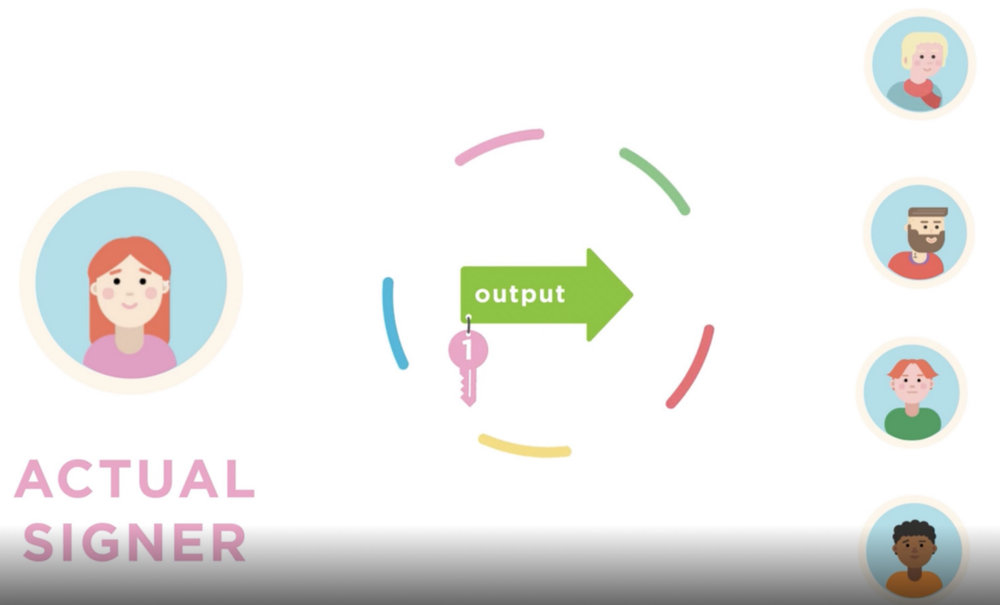
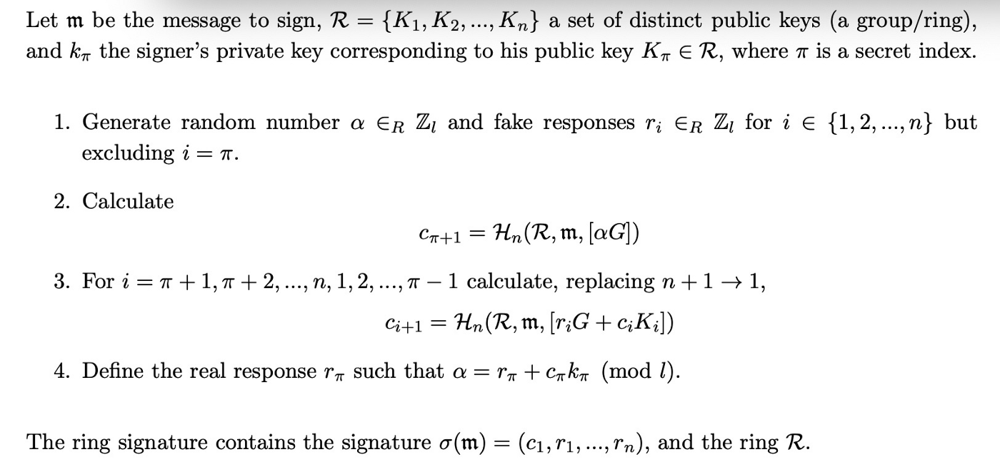
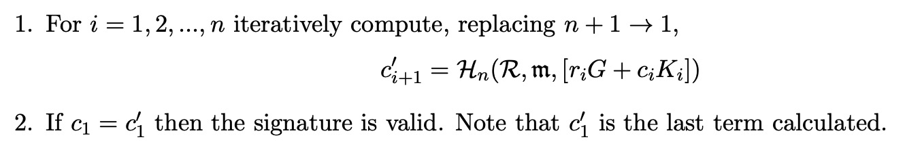

# 比特币中的环签名 (Ring Signatures)

> 在比特币上运行门罗币

我们已经在比特币中实现了第一个环签名。

## 环签名 (Ring Signatures)



<center>圈子里的任何人都可以签名，没有人知道是谁签名的</center>

[环签名](https://en.wikipedia.org/wiki/Ring_signature)是一种数字签名，它允许组中的单个成员或环中的单个成员对消息进行签名。它证明了环中确实有人签名，但无法识别环成员中的实际签名者。


其增加的隐私性支持许多应用程序，例如：

**举报**: 一位政府举报人想要泄露他的机构正在秘密收集公民的私人数据，但由于有被解雇的风险，他希望保持匿名。通过使用环签名，他可以证明他为该机构工作，从而增加了声明的可信度，同时隐藏了他的身份。

**电子投票**: 选民代表所有有资格投票的人签署他的选票。她证明她已注册并有资格投票，但没有透露她的投票¹。

**私人会员身份验证**: 用户向应用程序证明她已注册但不透露她是谁。

它已被许多区块链用于保护隐私，尤其是在门罗币中。

## 比特币中的环签名

有多种方法可以实现环签名。我们选择了一种称为自发匿名组签名²的方案，因为它基于椭圆曲线并且可以在比特币中实现。

### 签名

给定一条消息、一组公钥/环和一个私钥，生成如下签名：



<center>签名</center>

### 验证

给定一个签名、一条消息和一个公钥环，以下算法分两步确定签名是否由对应于环中公钥的私钥创建：



<center>验证</center>

### 实现

我们使用[椭圆曲线库](https://xiaohuiliu.medium.com/efficient-elliptic-curve-point-addition-and-multiplication-in-scrypt-script-f7e143a752e2)实现了环签名验证。
任何知道这组公钥的私钥的人都可以签署和使用锁定在合约中的硬币。没有人知道是哪一个签名的，即使是小组成员。


```js
import "ec.scrypt";	

// a ring signature	
struct RSig {	
    int c;	
    int[N] rs;	
}	

// ring signature
contract RingSig {
    // ring size
    static const int N = 11;

    // public keys
    Point[N] pks;

    // verification
    public function verify(bytes m, RSig sig) {
        bytes ringPubKey = this.calcRingPubKey();

        int c = sig.c;
        loop (N) : i {
            // compute: r * G + c * PubKey
            Point rG = EC.multByScalar(EC.G, sig.rs[i]);
            Point cPK = EC.multByScalar(this.pks[i], c);
            Point A = EC.addPoints(rG, cPK);
            bytes A_ = EC.point2PubKey(A);

            // update: c = H(R || m || A)
            c = Utils.fromLEUnsigned(sha256(ringPubKey + m + A_));
        }

        // check if ring closes
        require(c == sig.c);
    }

    // concatenate all public keys to form the ring public key
    private function calcRingPubKey() : bytes {
        bytes concatPks = b'';
        loop (N) : i {
            concatPks += EC.point2PubKey(this.pks[i]);
        }

        return concatPks;
    }
}
```

<center><a href="https://github.com/sCrypt-Inc/boilerplate/blob/master/contracts/ringsig.scrypt">环签名合约</a><center>

第 `21` 到 `31` 行迭代更新 `c` ，如第 1 步。第 `34` 行检查第 2 步。

------------------------------------------


[1] 检测双重投票需要一个[可链接](https://crypto.stackexchange.com/questions/8456/linkable-ring-signature-scheme)的环签名，它允许识别两个签名是否属于同一个签名者。

[2] [从零到门罗币](https://www.getmonero.org/library/Zero-to-Monero-2-0-0.pdf)的第 3.3 节。
