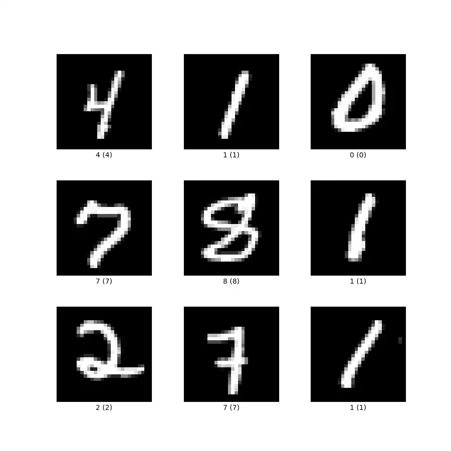
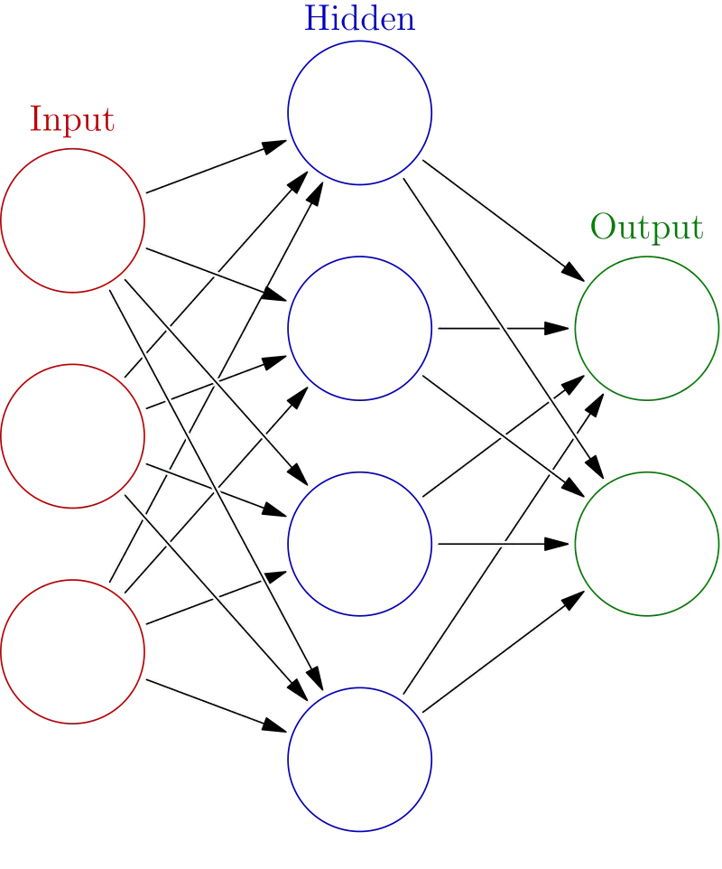
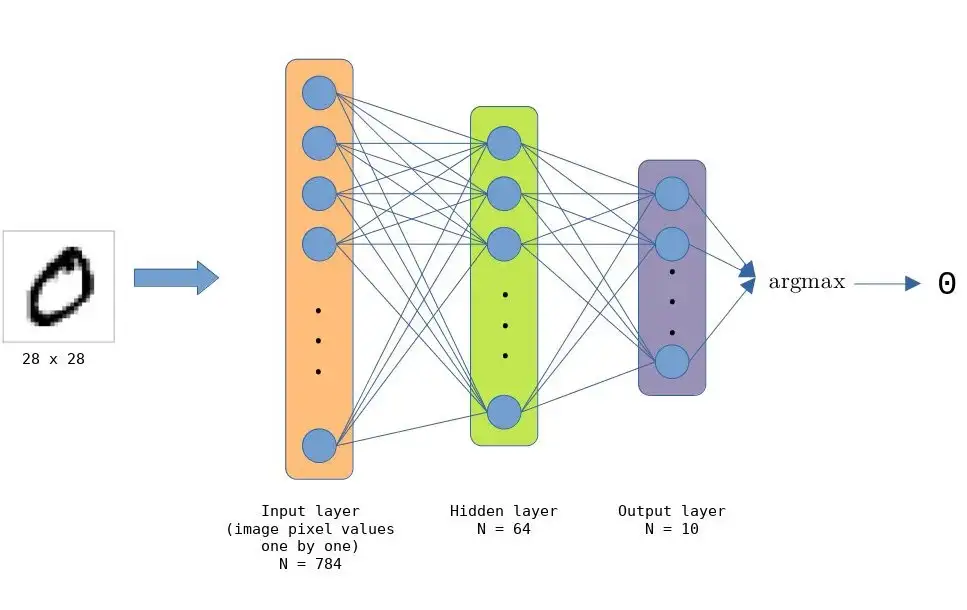

# 在BSV上运行深度神经网络

> 实现链上手写数字分类器

我们已经实现了一个用于手写数字分类的深度神经网络。已经训练好的模型完全在链上运行。它使用手写数字的 [MNIST 数据集](http://yann.lecun.com/exdb/mnist/)进行离线训练。该模型采用 28x28 灰度像素的图像并输出 `0` 到 `9` 的数字。



## 深度神经网络简介

人工神经网络是受生物神经网络启发而构建的。网络通过接触大量带标签的数据示例来学习。这个过程也称为[监督学习](https://en.wikipedia.org/wiki/Supervised_learning)。

该网络由几个组件组成：神经元/节点、连接、偏差和激活函数。这些组件被连续分组到层中。第一层称为“输入层”，数据通过该层传入网络，最后一层称为“输出层”，网络通过该层返回其输出。一个非常简单的神经网络只包含这两层。为了提高性能，我们可以在两者之间添加一个或多个“隐藏层”。具有隐藏层的网络称为“深度神经网络”(DNN)。


<center> 深度神经网络的图示 </center>

网络中神经元之间的每个连接都用特定值加权。每个神经元还有一个称为“偏差”的值，该值会添加到其输入的总和中。学习是找到一组这些权重和偏差的过程，这样网络将在给定一些输入的情况下返回有意义的输出。

为了直观地了解深层神经网络的工作原理，我们建议您观看有关该主题的[短视频系列](https://www.youtube.com/watch?v=aircAruvnKk&list=PLZHQObOWTQDNU6R1_67000Dx_ZCJB-3pi)。

## 网络架构

MNIST 手写数字的 DNN 由 `784` (28 x 28) 个节点的输入层、`64` 个节点的隐藏层和 `10` 个节点的输出层（可能的类/数字的数量）组成。这些层都是[全连接](https://medium.com/swlh/fully-connected-vs-convolutional-neural-networks-813ca7bc6ee5)的，这使得网络总共包含 501760 (784 * 64 * 10) 个连接。




隐藏层中的节点使用 [ReLU 激活函数](https://machinelearningmastery.com/rectified-linear-activation-function-for-deep-learning-neural-networks/)。 [Argmax](https://machinelearningmastery.com/argmax-in-machine-learning/) 用于输出节点以获得正确的值，即分类的数字。

## 训练模型

DNN 使用 [Keras](https://keras.io/) 进行训练。通过我们概述的网络架构并使用 [RMSprop 优化器](https://keras.io/api/optimizers/rmsprop/)进行训练，该模型能够在 `50` 个时期后达到 `98%` 的分类准确率。

```python

import numpy as np
from tensorflow import keras
from tensorflow.keras import layers


# Model / data parameters
num_pixels = 28 * 28
num_nodes_hl = 64
num_classes = 10

batch_size = 469
epochs = 50

# Load the data and split it between train and test sets.
(x_train, y_train), (x_test, y_test) = keras.datasets.mnist.load_data()

# Reshape images to [784, 1] and scale them to the [0, 1] range.
x_train = x_train.reshape(x_train.shape[0], num_pixels).astype("float32") / 255
x_test = x_test.reshape(x_test.shape[0], num_pixels).astype("float32") / 255

# Model
model = keras.Sequential([layers.Dense(num_nodes_hl, activation="relu"),
                          layers.Dense(num_classes, activation="softmax")
                         ]) 

model.compile(loss="sparse_categorical_crossentropy", optimizer="rmsprop", metrics=["accuracy"])

model.fit(x_train, y_train, batch_size=batch_size, epochs=epochs, validation_split=0.1)
```


训练模型后，必须以我们可以在 sCrypt 智能合约中使用的格式来导出权重和偏差。出于性能原因，我们将[这些值](https://github.com/sCrypt-Inc/scrypt-ml/blob/19b7473cf45695caf0ac8b2914d8b5bafaeb680b/predict-onchain/nn/mnist/train/modelParams.scrypt#L8-L14)编码为 [bytes 字节](https://scryptdoc.readthedocs.io/en/latest/syntax.html#basic-types)，而不是[数组](https://scryptdoc.readthedocs.io/en/latest/syntax.html#array-types)。

## 实现

我们已经实现了上面的 DNN，类似于我们之前实现的[单层神经网络](https://github.com/sCrypt-Inc/article/blob/master/AI%20on%20Bitcoin/AI%20on%20Bitcoin.md)（又名感知器）。完整的代码可以在 [GitHub](https://github.com/sCrypt-Inc/scrypt-ml/tree/master/predict-onchain/nn/mnist) 上找到。


```js
import "../train/modelParams.scrypt";


library Model {

    static function applyWeights0(int[ModelParams.N_INPUTS] in) : int[ModelParams.N_NODES_HL] {
        int[ModelParams.N_NODES_HL] res = repeat(0, ModelParams.N_NODES_HL);

        loop (ModelParams.N_NODES_HL) : i {
	        int sum = 0;
            loop (ModelParams.N_INPUTS) : j {
		        sum += (ModelParams.getWeight0(i, j) * in[j]) / 100000000;
            }
	        res[i] = sum;
        }

        return res;
    }

    static function applyWeights1(int[ModelParams.N_NODES_HL] in) : int[ModelParams.N_NODES_OUT] {
        int[ModelParams.N_NODES_OUT] res = repeat(0, ModelParams.N_NODES_OUT); 

        loop (ModelParams.N_NODES_OUT) : i {
            int sum = 0;
            loop (ModelParams.N_NODES_HL) : j {
                sum += (ModelParams.getWeight1(i, j) * in[j]) / 100000000;
            }
            res[i] = sum;
        }

        return res;
    }

    static function addBiases0(int[ModelParams.N_NODES_HL] in) : int[ModelParams.N_NODES_HL] {
        int[ModelParams.N_NODES_HL] res = repeat(0, ModelParams.N_NODES_HL); 

        loop (ModelParams.N_NODES_HL) : i {
            res[i] = in[i] + ModelParams.getBias0(i);
        }

        return res;
    }

    static function addBiases1(int[ModelParams.N_NODES_OUT] in) : int[ModelParams.N_NODES_OUT] {
        int[ModelParams.N_NODES_OUT] res = repeat(0, ModelParams.N_NODES_OUT); 

        loop (ModelParams.N_NODES_OUT) : i {
            res[i] = in[i] + ModelParams.getBias1(i);
        }

        return res;
    }

    static function applyReLU(int[ModelParams.N_NODES_HL] in) : int[ModelParams.N_NODES_HL] {
        int[ModelParams.N_NODES_HL] res = repeat(0, ModelParams.N_NODES_HL); 

        loop (ModelParams.N_NODES_HL) : i {
            int inVal = in[i];
            if (inVal > 0) {
                res[i] = inVal;
            }
        }

        return res;
    }

    static function predict(int[ModelParams.N_INPUTS] inputs) : int {
        int[ModelParams.N_NODES_HL] step0 = applyWeights0(inputs);
        int[ModelParams.N_NODES_HL] step1 = addBiases0(step0);
        int[ModelParams.N_NODES_HL] step2 = applyReLU(step1);
        int[ModelParams.N_NODES_OUT] step3 = applyWeights1(step2);
        int[ModelParams.N_NODES_OUT] step4 = addBiases1(step3);

        int idxMaxVal = 0;
        int maxVal = step4[0];
        loop (ModelParams.N_NODES_OUT) : i {
            int outVal = step4[i];
            if (outVal > maxVal) {
                idxMaxVal = i;
                maxVal = outVal;
            }
        }

        return idxMaxVal;
    }

}
```

函数 `predict()` 接受输入层的初始值。在我们的例子中，这是手写图像的序列化值。它返回一个代表分类结果的整数，即图像上的数字。

因为 sCrypt 不支持原生浮点数，所以我们通过简单地将值缩放 10⁸ 来使用[定点表示](https://blog.csdn.net/freedomhero/article/details/118709814)。例如，`0.86758491` 变成整数 `86758491`。当将两个值相乘时，我们重新缩放结果，即除以 10⁸。

## 潜在用例

像这样的 DNN 可以在智能合约中以多种方式使用。例如，您可以训练模型以一定的准确度识别图像中是否包含热狗。鼓励用户在互联网上搜索此类照片，并自动通过提交这些照片获得比特币小额支付。可以收集这些照片来训练模型并提高其准确性。