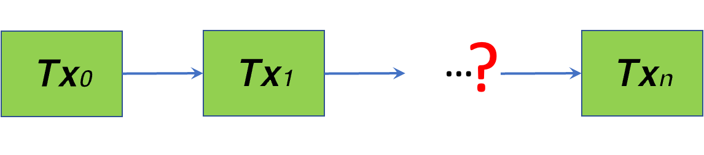
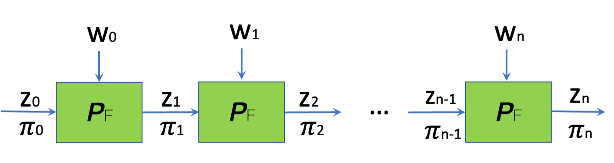
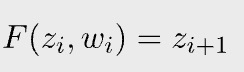
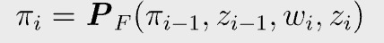
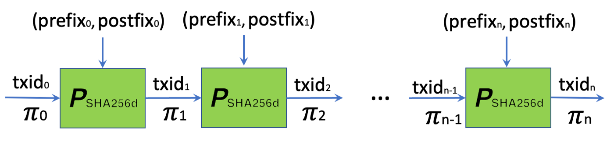
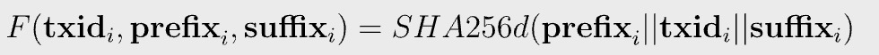
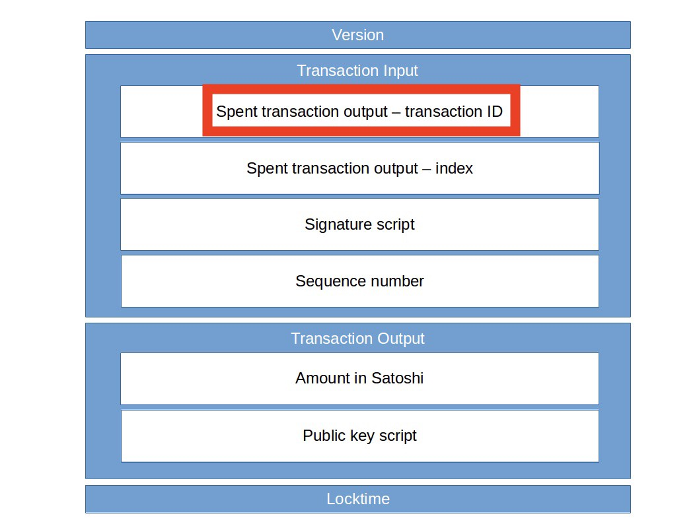
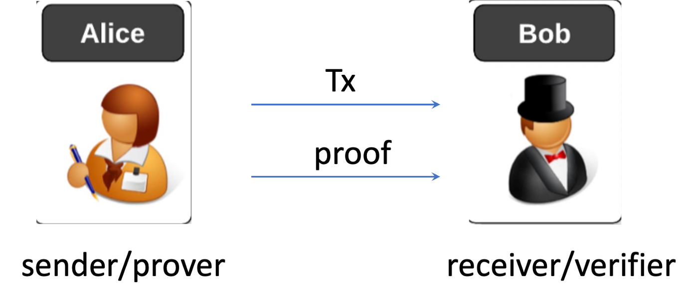

# 比特币上可扩展的点对点代币

> 使用递归 SNARKs 解决回溯问题

这是 [nChain 解决方案](https://nchain.com/solving-back-to-genesis-using-a-transaction-chain-proof/)的实现¹。

## 回到创世纪的问题

比特币上的代币通常存储在 UTXO 中。当收到包含代币的交易时，用户需要一种有效且快速地检查其真实性的方法。一个主要部分是检查它是否链接到某个发行代币的创世交易。




今天比特币上的所有[代币](https://bitcoinsv.com/token/)都必须依赖一些受信任的第三方来解决这个问题，因为当链过长时，轻量级用户验证自己在计算上变得具有挑战性²。
例如，DotWallet 的 [Badge](https://developers.dotwallet.com/badge/en) 代币使用代币索引器，而 [Sensible](https://sensiblecontract.org/) 代币使用预言机。这种第三方依赖阻碍了比特币的代币采用，因为它不像原生比特币那样可扩展且对 [SPV](https://wiki.bitcoinsv.io/index.php/Simplified_Payment_Verification) 友好。

我们[之前的提议](https://xiaohuiliu.medium.com/peer-to-peer-tokens-6508986d9593)试图在没有任何第三方的情况下解决这个问题。然而，随着链的增长，代币交易的规模呈指数增长，严重限制了其在实践中的使用。

## 递归 SNARKs

回想一下递归 SNARKs，特别是增量可验证计算 (IVC)，我们想要证明函数 `F` 对初始输入 `z₀` 应用 `n` 次会产生 `zₙ`。



在每个步骤中，`zᵢ` 是公共输入，`wᵢ` 是私有输入（即见证人）。



每一步都会产生一个新的证明。在步骤 i 中，证明者算法计算 `𝛑ᵢ`，证明直到 i 的所有步骤都是正确的，仅使用来自最后一步和当前步骤的本地信息，如下所示。



<center>证明者算法：增量计算证明</center>

## 将递归 SNARKs 应用于回到创世纪

IVC 自然地成为了回到创世纪问题的优雅解决方案。




具体来说，IVC实例化如下：

* `zᵢ`：`txidᵢ`，链中第 i 个交易的交易 id
* `wᵢ`：剩余的第 i 个交易。我们将它分为两​​部分：`prefixᵢ` 和 `postfixᵢ`，代表 `txidᵢ` 之前和之后的内容。
* 函数 `F`：一笔交易的 txid 是它的双重 SHA256，第 (i+1) 笔交易花费了第 i 笔交易，它的 txid 和 函数 `F` 的关系计算如下：



txid 是红框部分，前缀/后缀分别是它之前/之后的所有内容。

||是串联符号。


<center><a href="https://leftasexercise.com/2018/03/11/transactions-in-the-bitcoin-network/">一个交易的结构</a> </center>

我们现在可以通过验证单个简短证明来证明交易从给定交易下降，而不管交易链的长度如何，而无需一直追溯。

## 一个简单的 NFT 代币协议

让我们使用上述方法构造一个简单的 NFT 代币。NFT 在发行交易中铸造，也就是创世交易。为简单起见，让我们在每个转账交易中只使用一个输入和一个输出³。



当 Alice 将 NFT 转移给 Bob 时，她构建了一个以 Bob 作为接收方的交易，并将其直接从链下交给 Bob。由于比特币的点对点性质，她还随交易发送了一个 SNARKs 证明。正如我们之前解释的那样，Alice 可以在不追踪创世交易的情况下生成证明。

Bob 仅在两项检查都通过时才接受 NFT：

1. 他使用 [SPV](https://medium.com/nchain/simplified-payment-verification-48ac60f1b26c) 验证交易，类似于常规的比特币支付

2. 他验证了交易附带的证明⁴。

如果没有第一次检查，攻击者可以创建源自创世交易的替代交易链，但不在比特币区块链上。如果没有第二次检查，代币交易可能不会链接到创世交易。

证明的大小恒定，只有几个 KB，无论链长如何，都可以在几秒钟内验证，产生的开销可以忽略不计。代币转移实际上是即时的，就像普通的比特币支付一样。

## 证明时间

递归 SNARK 最耗时的部分是生成证明，在资源受限的设备上可能长达一分钟。为了启用即时令牌转移，可以在 Bob 收到令牌后立即预先计算证明，以便在 Bob 将其转移给下一个所有者时准备好。如果 Bob 需要在收到 Alice 的令牌后立即将其发送给 Charlie，他可以发送从 Alice 收到的旧证明，并让 Charlie 验证交易链中的最后两个链接，而无需生成新的证明作为后备。

## 实现

我们使用 [snarkyjs](https://github.com/o1-labs/snarkyjs) 实现了递归 SNARKs，如下所示。

```js
let TraceableCoin = ZkProgram({
    publicInput: TxId,

    methods: {
        genesis: {
            privateInputs: [],

            method(txId: TxId) {
                txId.assertEquals(GENESIS_TX_ID);
            }
        },

        transfer: {
            privateInputs: [RawTxPrefix, RawTxPostfix, SelfProof],

            method(curTxId: TxId, prefix: RawTxPrefix, postfix: RawTxPostfix, earlyProof: SelfProof<TxId>) {
                earlyProof.verify();
                let curRawTx = [...prefix.value, ...earlyProof.publicInput.value, ...postfix.value];
                curTxId.assertEquals(hash2TxId(curRawTx));
            }
        }
    }
})
```
<center><a href="https://github.com/sCrypt-Inc/snarkyjs-sha256/blob/master/src/back2gen.ts">回到创世纪递归证明</a></center>

首先，我们需要先编译程序以获取验证密钥。请注意，没有受信任的设置。

```js
const { verificationKey } = await TracebleCoin.compile();
```

密钥可以在与创世交易相关的中央注册表中公开，也可以放置在创世交易的另一个输出中。

从第 `5` 行开始的 `genesis` 方法被调用来生成初始证明，它简单地检查 txid0 是第 `9` 行的 `genesis` 交易 id。

```js
let genesisProof = await TracebleCoin.genesis(GENESIS_TX_ID);
```

从第 `13` 行开始的 `transfer` 方法被调用来生成一个新的证明用来：

* 证明最后一个证明在第 `17` 行有效
* 当前交易在第 `18` 行和第 `19` 行花费了最后一笔交易。

```js
prevProof = await TracebleCoin.transfer(txId, new RawTxPrefix(txPrefix), new RawTxPostfix(txPostfix), prevProof);
```

最后，我们可以根据验证密钥验证证明。

```js
let ok = await verify(prevProof, verificationKey);
```

完整的代码可以在这个 [Github repo](https://github.com/sCrypt-Inc/snarkyjs-sha256/blob/master/src/back2gen.ts) 中找到。

## 总结

我们只展示一个使用递归 SNARKs 的简单 NFT 示例。它可以扩展到有向无环图（DAG），而不仅仅是交易链。它还可以扩展到可替代令牌或用户需要有效确保交易可以链接到某些祖先交易的任何其他用例。

## 致谢

我们感谢 nChain 分享了将递归 SNARK 应用于 B2G 问题的最初想法。我们还要感谢 [O(1) Labs](https://o1labs.org/) 的 Gregor Mitscha-Baude 帮助实现 SHA256 电路。

--------------------

[1] WP1590 交易链证明，M. S. Kiraz 和 O. Vaughan，正在申请专利的 GB2200400.6。

[2] 在更一般的形式中，交易形成有向无环图 (DAG)，使得解决 B2G 的计算更加密集。

[3] 这可以在智能合约或 SNARKs 电路中强制执行，或两者兼而有之。在前者中，我们可以使用 [OP_PUSH_TX](https://blog.csdn.net/freedomhero/article/details/107306604) 技术来限制从创世交易下降的所有交易中的输入和输出数量。例如，我们可以强制任何 NFT 交易有两个输入和一个输出。第二个输入包括交易费用。

[4] 可选地，证明的验证可以在链上完成。它只需要实现[snarkyjs证明系统](https://o1-labs.github.io/proof-systems/)中的验证器，类似于我们已经实现的[Groth16验证器](https://blog.csdn.net/freedomhero/article/details/125599764)。