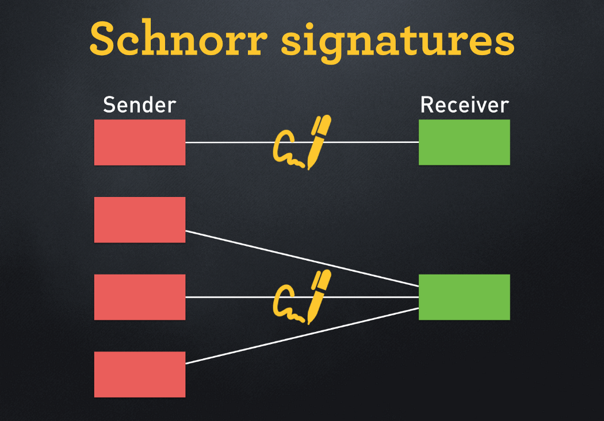

# 比特币上的 Schnorr 签名

我们已经在比特币上实现了 [Schnorr](https://en.wikipedia.org/wiki/Schnorr_signature) 签名。这是第一个也是唯一一个已知的实现，没有对原始协议进行任何更改¹。



<center> <a href="https://medium.com/@SDWouters/why-schnorr-signatures-will-help-solve-2-of-bitcoins-biggest-problems-today-9b7718e7861c">一笔交易一个签名</a> </center>

Schnorr 是一种可以用于替代比特币签名当前使用的 ECDSA 算法的替代算法。一个关键优势是，同一交易的一个输入或多个输入中的多个签名可以聚合为一个签名。关于 BTC 上的 Schnoor 签名有很多炒作，但是都需要像 [BIP 340](https://github.com/bitcoin/bips/blob/master/bip-0340.mediawiki) 细节一样进行巨大的更改。

我们将展示了如何通过原始的比特币协议来实现它。下面列出了验证 Schnorr 签名的完整代码，其中使用我们之前发布的椭圆曲线操作。

```javascript

import "ec.scrypt";

// Schnorr signatures verification for secp256k1
contract Schnorr {
    public function verify(Sig sig, PubKey pubKey, bytes msg, int lambda,
        Point R, PointMulAux rAux,
        Point E, PointMulAux eAux,
        Point S, PointMulAux sAux) {

        int r = unpack(pubKey[ : 32]);
        int s = unpack(pubKey[32 : 64]);

        // R = r * G
        require(EC.isMul(EC.G, r, R, rAux));

        // e = Hash(r || P || msg)
        int e = unpack(sha256(pack(r) + pubKey + msg));

        // E = e * P
        Point P = pubKey2Point(pubKey);
        require(EC.isMul(P, e, E, eAux));

        // S = s * G
        require(EC.isMul(EC.G, s, S, sAux));

        // S == R + H?
        require(EC.isSum(R, E, lambda, S));
    }

    // convert public key to a point, assuming it's uncompressed
    static function pubKey2Point(PubKey pubKey) : Point {
        require(pubKey[: 1] == b'04');
        return { unpack(pubKey[1 : 33]), unpack(pubKey[33 : 65]) };
    }
}

```

<center> <a href="https://github.com/sCrypt-Inc/boilerplate/blob/master/contracts/schnorr.scrypt">Schnorr签名合约</a> </center>


[1] 使用 Schnorr 签名的法律含义超出了本文的范围。