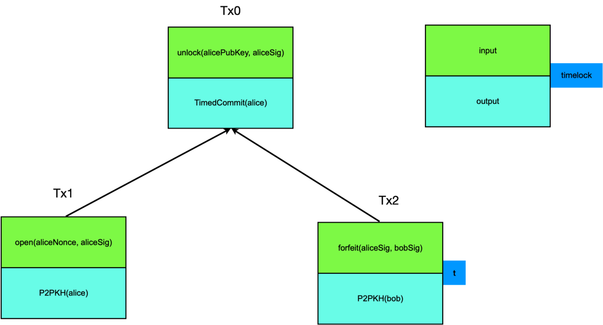
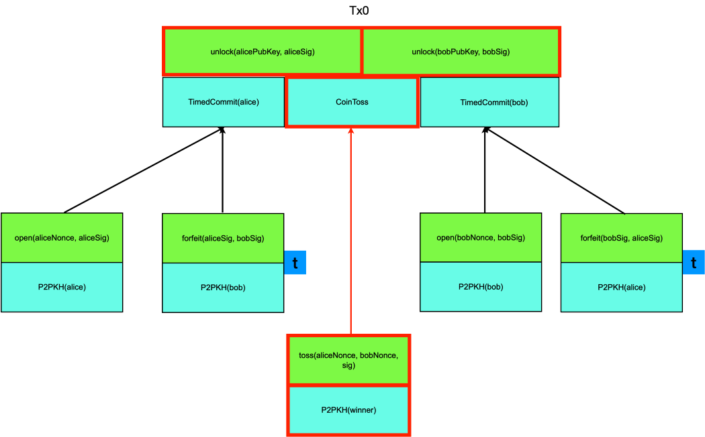
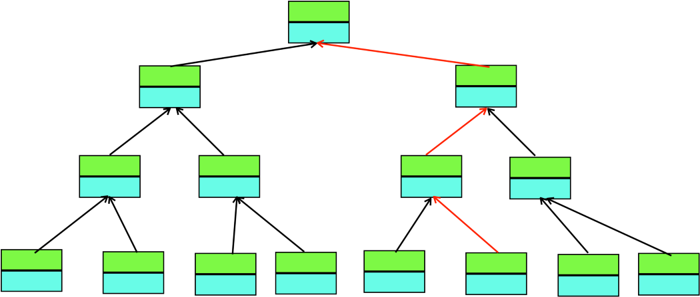

# 比特币智能合约 2.0

> *通过结合链上和链下交易进行无信任的签约*

我们将介绍了一种全新的方式来设计比特币上的智能合约。在我们以前的所有合约中，所有内容都嵌入在比特币脚本中并由矿工进行验证。在新方法中，我们将结合以前的合约，在链下验证交易。令人惊讶的是，它可以保持链上合同的不信任性质，同时大大提高效率和私有性。我们通过改进公平的抛硬币合约来举例说明总体的思路。

## 实用公平硬币抛

使用基于[哈希的承诺方案](https://blog.csdn.net/freedomhero/article/details/114257034)，我们引入了一种无需受信任的第三方即可实现公平抛硬币的合同。但是在实际应用之前，他有一个小问题：那就是，当其中一方知道了对方的秘密之后，他/她发现自己输掉了比赛，即使他/她不能拿回赌注，也可以简单地中途退出。

## 定时承诺方案

解决上述问题的一种方法是使用定时承诺方案 (TCS)<sup>1</sup>。基本思想是让一方存入一定的保证金，如果他诚实地遵守协议并在一定时间内公开承诺（即透露他的秘密），这笔钱将被退还。如果中止，他将被没收保证金。

### 1. 提交阶段

爱丽丝创建Tx<sub>0</sub>, 并将一些保证金锁定在名为 `TimedCommit` 的合同中。可以通过两种方式使用这笔资金：

1. 爱丽丝打开秘密并签名

1. 时间t之后，爱丽丝和鲍勃都签字。

她还用时间锁t签署了Tx<sub>2</sub>并将其提供给Bob。注意Bob会在本地/链下验证Alice的签名。

```javascript

contract TimedCommit {
  bytes aliceHash;
  PubKey alice;
  PubKey bob;

  public function open(bytes aliceNonce, Sig aliceSig) {
    require(sha256(aliceNonce) == this.aliceHash);
    require(checkSig(aliceSig, this.alice));
  }

  public function forfeit(Sig aliceSig, Sig bobSig) {
    require(checkSig(aliceSig, this.alice));
    require(checkSig(bobSig, this.bob));
  }
}

```

### 2. 打开阶段

在时间t之前，爱丽丝可以通过广播包含她的秘密和签名的Tx<sub>1</sub>赎回资金。否则，Bob可以通过在t之后广播Tx<sub>2</sub>来获得资金。




## 使用TCS抑制抛硬币中的中途退出

为了阻止任何一方中途退出掷硬币，各方必须在设置阶段的Tx<sub>0</sub>中支付一定的押金，押金必须大于下注金额才能生效。生成的交易图<sup>2</sup> 如下所示：



在原始交易Tx<sub>0</sub>的设置中，只有1个包含合约CoinToss的输出。引入TCS之后，还有两个额外的输出来抑制两个参与者的中途退出。

请注意，即使创建了6笔交易，由于比特币具有防止双花的功能，最多也将只有4笔交易最终上链。

## 概括

当多个不信任方希望在不依赖受信任第三方的情况下安全和公平地开展业务时，可以将上述方法推广到任意类型的合同。因此，智能合约成为我们之前介绍的智能合约的超集，它完全由矿工运行和验证的计算机代码（即Script / sCrypt）组成。它们还可以包含保持脱链的交易和链下验证的业务逻辑。这更类似于计算机网络领域中的协议设计（例如，TCP中的三向握手）和加密技术（例如，Diffie-Hellman密钥交换）。即使有人耍赖,也可以确保协议安全和公平地执行,并且是脱链验证的。

> 为保持链上智能合约（又名1.0）的不信任优势，以此方式设计的智能合约（又名2.0）享有显着优势。值得注意的是，比特币的UTXO模型适用于这种签约方式，而很难使用帐户模型来实现这一目标，甚至是不可能的。

## 效率

在以上示例中，我们节省了6笔交易中的2笔，链上交易减少了33%。我们期望在实际应用中节省大量交易费用，而实际应用中的交易图则更大。例如，如下图所示，当它退化为深度为n的二叉树时，只需在链上完成log n事务（红色箭头），而不是n！



## 隐私

由于只有一部分交易在链上进行结算，因此仅关注区块链的任何人都可能无法获得完整的信息来了解正在发生的事情。同时，合同涉及的各方可以保留所有交易，包括未出现在链上的交易。这增加了隐私，同时保留了必要时的追溯能力。

这只是众多2.0合同示例中的第一个。敬请关注。


...


[1] Andrychowicz, Marcin & Dziembowski, Stefan & Malinowski, Daniel & Mazurek, Łukasz. (2014). Fair Two-Party Computations via Bitcoin Deposits. 105–121. 10.1007/978–3–662–44774–1_8.

[2] Bitcoin Class: The Traveling Salesman Problem and the Transaction DAG https://youtu.be/hd2kn6NU19M