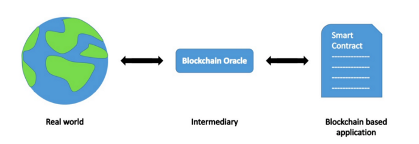

# 基于智能合约的预言机罚没

> 无需信任地惩罚作弊的预言机

预言机对于智能合约访问外部现实世界的数据是必不可少的。数据保真度对于这些智能合约的运行至关重要。提高数据保真度的一种方法是要求预言机针对他们提供的数据存入一些抵押品。如果预言机行为不端并提供欺诈性数据，抵押品将被没收（称为罚没）。如果抵押品由第三方托管，我们只是将信任问题从预言机转移到第三方，我们委托第三方对欺诈行为进行明智的监控和惩罚。



我们在本文中的创新是将抵押品直接锁定在智能合约中作为公共赏金，任何人只要能找到欺诈证据就可以收取，无需任何受信任的第三方。通过确保任何不诚实的行为都会被发现并受到经济处罚，来激励预言机诚实行事，从而使依赖于它们的智能合约更加安全。我们以 Sensible 预言机 为例进行说明。

## Sensible合约和预言机

[Sensible](https://sensiblecontract.org/) 合约是一种开发和组织比特币智能合约的方式。它允许合约回溯到其发行交易，并识别位于同一交易相邻输入对应的合约。它依赖于一种特定类型的预言机来验证链下数据的完整性，称为[签名服务](https://sensiblecontract.org/docs/sensible/1.-Whitepaper)。请注意， [Sensible预言机](https://github.com/sensible-contract/satotx) 签署了以下元组：

```
(txid, index, satoshis, scriptHash)
```

基本上，它代表 `txid` 交易中的第 `index` 个输出包含 `satoshis` 数量的比特币，并且输出的脚本哈希散列为 `scriptHash`。

## 预言机罚没

我们注意到元组中的所有信息都是公开的，每个人都可以独立检查。如果我们可以找到具有给定 `txid` 的交易，但在索引输出中包含不同的 `satoshi` 金额或脚本，那么我们已经找到了欺诈的证据，可以用来没收预言机的抵押品。为了实现这一点，需要预言机将抵押品锁定在以下合约中：

```javascript
import "rabin.scrypt";
import "txUtil.scrypt";

// signed data format
struct PayloadU4Data {
    // outpoint
    Sha256 txid;
    int index;    // 4 bytes

    // satoshis in the outpoint; 8 bytes
    int satoshis;
    // hash of the script of the outpoint
    Ripemd160 scriptHash;
}

// slash fraudulent Sensible oracles
contract SlashSensibleOracle {
    // oracle's public key
    RabinPubKey pubKey;

    public function slash(bytes fraudProofTx, bytes signedMsg, RabinSig sig) {
        // verify message is signed
        require(RabinSignature.checkSig(signedMsg, sig, this.pubKey));

        // deserialize into specified format
        PayloadU4Data payload = deserialize(signedMsg);

        // verify transaction is referenced in the signed message
        require(hash256(fraudProofTx) == payload.txid);

        // parse the output at the given index from the tx
        Output output = TxUtil.readOutput(fraudProofTx, payload.index);
        
        // fraud detected: either satoshi or script part of the output mismatches
        require(output.satoshis != payload.satoshis || hash160(output.script) != payload.scriptHash);
    }

    static function deserialize(bytes msg) : PayloadU4Data {
        return { Sha256(msg[: 32]), Utils.fromLEUnsigned(msg[32 : 36]), Utils.fromLEUnsigned(msg[36 : 44]), Ripemd160(msg[44 :]) };
    }
}
```

<center>SlashSensibleOracle</center>

第 `20` 行确保数据确实由 Sensible 预言机 签名。第 `23` 行将数据解析为所需的格式。第 `26` 行验证包含欺诈证明的交易与 `txid` 匹配。在第 `29` 行从交易中检索到指定的输出后，第 `35` 行通过验证预言机签署了错误的金额或脚本哈希来检查预言机是否作弊。

如果发现欺诈，任何人都可以调用合约并赎回预言机的抵押品。

## 延展
Sensible 预言机还签署另外一个元组：


```
(txid, index, satoshis, scriptHash, spendByTxID)
```

它不仅验证由对 (`txid`, `index`) 标识的输出具有指定的 `satoshi` 数量和脚本，而且还验证它是否被具有 `spendByTxID` 的交易所花费。为了检测这种欺诈行为，除了合约 `SlashSensibleOracle` 中所做的之外，我们还可以找到具有不同 `txid` 的交易。我们可以使用这种技术——[从没有预言机的比特币智能合约访问区块链数据](https://blog.csdn.net/freedomhero/article/details/121582456?spm=1001.2014.3001.5501)，来验证交易确实在链上。

## 总结
我们只展示了如何使用智能合约来罚没作弊的 Sensible 预言机。它适用于任何可以在智能合约中验证欺诈证据的预言机。

例如，预言机可以进行纯/无状态但复杂的计算并对结果进行签名。智能合约可以导入签名结果并获得结果，而无需重新运行昂贵的计算。同时，每当预言机作弊时，通过简单地计算出不同但正确的结果，就能罚没他锁定在合约中的抵押品。
