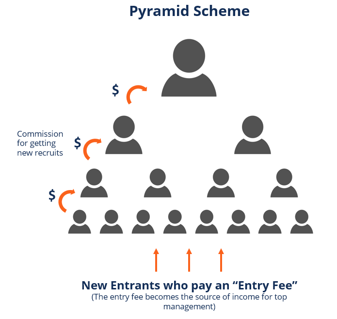
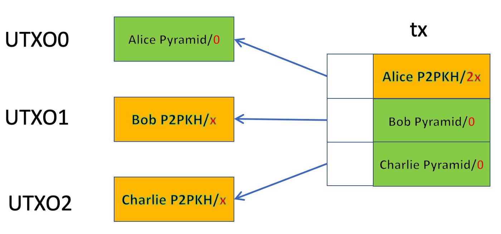

# 基于智能合约的比特币旁氏骗局

> 世界上最透明的旁氏骗局

根据维基百科：

旁氏骗局是一种商业模式，它通过承诺支付或服务来招募其他人加入计划，而不是提供投资或销售产品来招募成员。



我们开发了一个基于智能合约的旁氏骗局。要加入，每个参与者都必须支付费用才能与合约进行交互。合约保证新参与者获得 100% 的回报<sub>1</sub>，只要他可以再招募两名参与者。由于整个旁氏骗局是由智能合约自动执行的，因此是透明且无需信任的。




在上面的例子中，Alice 支付了 `x` 的入场费，这使她有权成为 UTXO<sub>0</sub> 的受益人。如果她说服 Bob 和 Charlie 加入，每人支付 `x`，合约就会保证她获得 `2x` 的报酬，这反过来又更新了该骗局，使 Bob 和 Charlie 成为新的受益人。只要能找到新的投资者，该骗局就会继续进行。

完整的代码如下所示：

```
// A transparent Pyramid scheme
contract Pyramid {
    @state
    PubKeyHash schemer;

    // satoshi amount required to enter the scheme
    int entryFee;

    // dust limit
    static const int DUST = 1;

    // recruite two members to get double payout
    public function recruit(PubKeyHash recruit0, PubKeyHash recruit1, SigHashPreimage txPreimage) {
        // use ANYONECANPAY so recruits can deposit
        SigHashType sigHashType = SigHash.ANYONECANPAY | SigHash.ALL | SigHash.FORKID;
        require(Tx.checkPreimageSigHashType(txPreimage, sigHashType));

        // commission payout: double the original entry fee
        bytes commissionScript = Utils.buildPublicKeyHashScript(this.schemer);
        bytes commissionOutput = Utils.buildOutput(commissionScript, 2 * this.entryFee);

        // keep the scheme going from recruit0
        this.schemer = recruit0;
        bytes recruitScript0 = this.getStateScript();
        bytes recruitOutput0 = Utils.buildOutput(recruitScript0, DUST);

        // keep the scheme going from recruit1
        this.schemer = recruit1;
        bytes recruitScript1 = this.getStateScript();
        bytes recruitOutput1 = Utils.buildOutput(recruitScript1, DUST);

        bytes output = commissionOutput + recruitOutput0 + recruitOutput1;
        require(hash256(output) == SigHash.hashOutputs(txPreimage));
    }
}
```

<center><a href="https://github.com/sCrypt-Inc/boilerplate/blob/master/contracts/pyramid.scrypt"> 旁氏骗局合约 </a></center>

第 `15` 行使用 ANYONECANPAY，因此 Bob 和 Charlie 可以独立添加他们的输入，每个都有 `x` satoshis<sub>2</sub>。

-------------------

[1] 这假设粉尘限制可以忽略不计。 第一个参与者的收益超过 100%，因为他只需支付交易费用即可部署合约。

[2] 我们忽略交易费用，这可以很容易地被另一个输入覆盖。