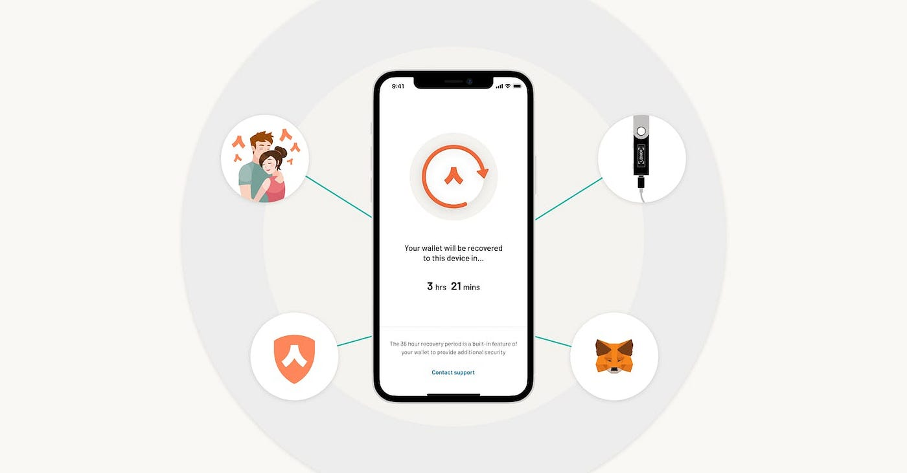
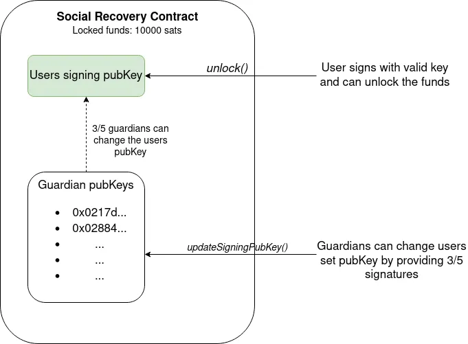

#  比特币社交恢复钱包

> 我如何不再担心丢失我的私钥

## 社交恢复简介

使比特币应用程序对用户友好的一个重大障碍是确保安全性以防止用户密钥丢失或被盗。 丢失和盗窃事件可能会造成严重后果，给无辜用户造成重大经济损失，有时甚至导致他们损失全部净资产的很大一部分。

社交恢复是指一种不需要[种子短语](https://wiki.bitcoinsv.io/index.php/Seed_phrase)的钱包恢复方法，同时还确保恢复过程保持完全非托管。 通常情况下，用户只需要一个私钥就可以转移资金，比多重签名钱包更方便。 如果密钥丢失，她可以重新获得对他们钱包的访问权限，而无需依赖种子短语，也无需第三方持有他们的资产。




<center>通过社交恢复的钱包</center>

## 如何实现社交恢复

我们可以使用智能合约实现社交恢复钱包。 用户将她的比特币锁定在一个智能合约中，如果她丢失了她的私钥，该合约允许她通过利用称为监护人的可信方的帮助来恢复对她钱包的访问。 典型的监护人可以是她的其他设备（例如，桌面和硬件钱包）、朋友、家人或企业。


通常，她使用她的签名密钥像普通钱包一样发送比特币。 如果她丢失了签名密钥，她可以与监护人签订合同。 如果他们中的 m-of-n 签名，她可以更改为她控制的新签名密钥并重新获得对她的资金的访问权限。 这可以为用户提供额外的安全层和安心，因为它降低了由于丢失或被盗密钥而无法访问其帐户的风险。

## 实现



在具体的 sCrypt 实现中，用户创建一个包含以下内容的智能合约：

- 用户签名公钥（也可以是地址）
- 监护人的公钥
- 两个公共方法：
1. `unlock` ：可以像普通交易一样通过用户私钥签名解锁。
2. `updateSigningPubKey`：接收监护人的签名和用户新的公钥。 如果达到某个阈值（即 3/5），旧用户公钥将更新为新用户公钥。 从此时起，合约只能通过使用新密钥派生的签名来解锁。


```ts
import {
    assert,
    hash256,
    method,
    prop,
    PubKey,
    ByteString,
    Sig,
    SmartContract,
    FixedArray,
    SigHash,
} from 'scrypt-ts'

export class SocialRecovery extends SmartContract {
    static readonly N_GUARDIANS = 5
    static readonly GUARDIAN_THRESHOLD = 3

    @prop(true)
    signingPubKey: PubKey

    @prop()
    guardianPubKeys: FixedArray<PubKey, typeof SocialRecovery.N_GUARDIANS>

    constructor(
        signingPubKey: PubKey,
        guardianPubKeys: FixedArray<PubKey, typeof SocialRecovery.N_GUARDIANS>
    ) {
        super(...arguments)
        this.signingPubKey = signingPubKey
        this.guardianPubKeys = guardianPubKeys
    }

    @method()
    public unlock(sig: Sig) {
        assert(
            this.checkSig(sig, this.signingPubKey),
            'Signature check failed.'
        )
    }

    // ANYONECANPAY_SINGLE is used here to ignore all inputs and outputs, other than the ones contains the state
    // see https://scrypt.io/scrypt-ts/getting-started/what-is-scriptcontext#sighash-type
    @method(SigHash.ANYONECANPAY_SINGLE)
    public updateSigningPubKey(
        newSigningPubKey: PubKey,
        guardianSigs: FixedArray<Sig, typeof SocialRecovery.GUARDIAN_THRESHOLD>
    ) {
        // Check guarding signatures.
        assert(
            this.checkMultiSig(guardianSigs, this.guardianPubKeys),
            'Guardian threshold not reached.'
        )

        // Update signing pubkey.
        this.signingPubKey = newSigningPubKey

        // Make sure balance in the contract does not change.
        const amount: bigint = this.ctx.utxo.value
        // Output containing the latest state.
        const output: ByteString = this.buildStateOutput(amount)
        // Verify current tx has this single output.
        assert(this.ctx.hashOutputs == hash256(output), 'hashOutputs mismatch')
    }
}
```

它是一个[有状态的合约](https://scrypt.io/docs/how-to-write-a-contract/stateful-contract)，其状态是可以更新的用户签名公钥。 GitHub 上提供了[完整代码](https://github.com/sCrypt-Inc/boilerplate/blob/master/src/contracts/socialRecovery.ts)和[测试](https://github.com/sCrypt-Inc/boilerplate/blob/master/tests/local/socialRecovery.test.ts)。

## 结论

总之，比特币上的社交恢复智能合约可以为其用户提供额外的安全层和安心。 通过利用可信赖的监护人的帮助，用户可以降低因丢失或被盗密钥而永久无法使用其资金的风险。 随着比特币生态系统的不断发展和成熟，我们可以预期社交恢复将成为一种越来越受欢迎并被广泛采用的保护和恢复资产的机制。