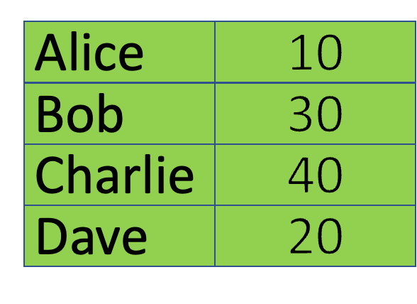
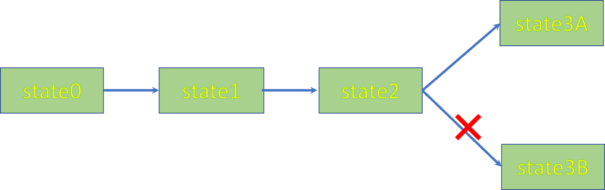
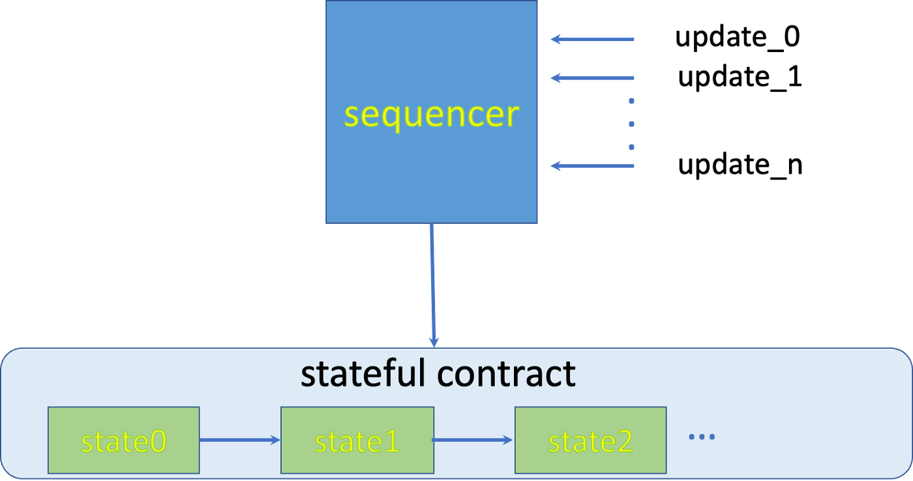

# 使用预授权签名加速比特币有状态合约更新

## 状态更新竞争


比特币智能合约将状态[存储](https://blog.csdn.net/freedomhero/article/details/107307306)在交易链的输出中。 当交易花费包含旧状态的输出并创建包含新状态的输出时，就会发生状态转换。 在任何给定时间，交易链末端的单个输出/UTXO 都具有最新状态。

当多个事务竞争同时更新共享状态时，就会出现问题。要了解原因，让我们考虑一个简单的类似 ERC-20 的代币智能合约，具有以下状态¹：



<center>图 1：可替代代币合约的状态</center>

状态记录每个用户拥有多少令牌。 假设 Alice 发送一笔交易将 `5` 个代币转移给 Charlie，将状态更新为 `state3A`，而 Bob 发送另一笔交易同时将 `10` 个代币转给 Dave，将其更新为 `state3B`。 其中一个交易将失败，因为它们双花包含 `state2` 的单个 UTXO。



<center>图 2：竞争</center>

假设 Bob 的交易失败。 他必须创建一个新的交易，花费新的 `state3A` 状态的UTXO  ，而不是 `state2` 状态的UTXO，然后重试。 不难看出，当有很多用户几乎同时尝试更新时，一个更新事务可能需要多次尝试才能成功，造成不可预知的延迟和降低用户体验。


为了避免争用，一种简单的方法是将所有更新交易发送给一个称为排序器的中间协调器，后者对它们进行排序并将它们广播到区块链。




不幸的是，这种方法不起作用，因为批量交易可以花费一个 UTXO，就像图 2 中 Alice 和 Bob 的交易一样。 当排序器将它们在链中按顺序重新排序以避免如图 3 所示的双重花费时，Bob 的原始交易， `state3B`， 中的签名变得无效。 如果排序器必须在每次交易重新排序时都要求用户重新签名，那么将再次出现不可预测的延迟，我们又回到了原点。

## 预授权签名

签名用于预授权对状态的更新。我们需要一种方法来签署每个交易，即使排序器通过更改其输入重新排序它也不会失效。但是没有一个 `SIGHASH` 标志允许我们这样做。

受我们[之前](https://medium.com/coinmonks/emulate-any-sighash-flag-without-a-fork-568fa624039f)模拟 SIGHASH_NOINPUT 工作方案的启发，该方案不包括从签名中花费的输入，我们只对包含有关授权操作的特定详细信息的消息进行签名。

在我们的代币合约中，我们只签署接收者和金额。例如，Alice 将签署授权将 `5` 个代币转移给 Charlie。

```
+ import "ec.scrypt";

// a basic ERC20-like fungible token
contract ERC20 {
    PubKey minter;

    @state
    HashedMap<PubKey, int> balances;
    
    // transfer tokens from sender to receiver
    public function transferFrom(PubKey sender, PubKey receiver, int amount, Sig senderSig, int senderBalance, int senderKeyIndex, int receiverBalance, int receiverKeyIndex, SigHashPreimage preimage) {
        // authenticate
-       require(checkSig(senderSig, sender));
        
+       bytes msg = receiver + pack(amount);
+       // check signature against the new message
+       require(EC.verifySig(msg, sig, sender));
```

<center>具有预授权签名的 <a href="https://github.com/sCrypt-Inc/boilerplate/blob/master/contracts/erc20.scrypt">ERC20 合约</a></center>


有了 Alice 的签名，包括排序器在内的任何人都可以创建一个交易，将 `5` 个代币从 Alice 转移到 Charlie。 攻击者无法通过将转账重定向给他或更改转账金额来窃取，这将使 Alice 的签名无效。


在这种方法中，排序器可以尽可能快地更新状态，因为他可以创建交易，使用商品硬件每秒可以[处理数百万笔交易](https://bitcoin.stackexchange.com/questions/51877/how-long-does-it-take-to-perform-a-single-sha256)。他不再因等待用户重新签署重新排序的交易而受阻。


此外，尽管创建交易是链下顺序的，这非常容易和快速，但由于比特币的 [UTXO 模型](https://xiaohuiliu.medium.com/bitcoin-vs-ethereum-smart-contracts-921e0a12b043)，矿工可以并行处理其中的智能合约。

## 重放攻击

请注意，只要提供有效的签名，令牌就可以转移。 Alice 的签名消息中没有任何内容可以防止重复使用相同的签名。

Bob（实际上是任何人）都可以重复使用相同的签名并向自己发送来自 Alice 的另外 5 个令牌。他甚至可以重复多次，直到爱丽丝的余额耗尽。

为了对抗重放攻击，我们可以使用应用程序级的随机数。 “Nonce”是密码学中“使用一次的数字”的简写。我们可以为每个签名使用一个 nonce，并将下一个 nonce 存储在合约中。


```

+ struct Value {
+   int balance;
+   int nonce;
+ }

// a basic ERC20-like fungible token
contract ERC20 {
    PubKey minter;

    @state
-   HashedMap<PubKey, int> balances;
+   HashedMap<PubKey, Value> balances;
    
    // transfer tokens from sender to receiver
    public function transferFrom(PubKey sender, PubKey receiver, int amount, Sig senderSig, int senderBalance, int senderNonce, int senderKeyIndex, int receiverBalance, int receiverKeyIndex, SigHashPreimage preimage) {
        // authenticate
-      bytes msg = receiver + pack(amount);
+      bytes msg = receiver + pack(amount) + pack(senderNonce);
       // check signature against the new message
       require(EC.verifySig(msg, sig, sender));

-       require(this.balances.canGet(sender, senderBalance, sendererKeyIndex));
+       require(this.balances.canGet(sender, {senderBalance, senderNonce}, sendererKeyIndex));
        require(senderBalance >= amount);
-       require(this.balances.set(sender, senderBalance - amount, senderKeyIndex));
+       require(this.balances.set(sender, {senderBalance - amount, ++senderNonce}, senderKeyIndex));
```

## 合约级别

如果两个合约使用相同的消息编码（例如，有另一个可替代的代币合约），一个合约使用的签名也可能对另一个有效，即使是 `nonce`。我们需要一些关于合约的识别信息来防止这种类型的重放攻击。

我们规定，在这样的有状态合约中使用的任何公钥/地址都不能在其他合约中重用。这与为每个新的比特币交易生成一个新地址的标准做法是一致的。

## 抗审查

如果排序器审查用户的交易，用户总是可以直接将其提交给链上的有状态合约。


给定的有状态合约也可以有多个排序器，如果一个人拒绝处理他的交易，用户可以提交给替代排序器。这些排序器可以在矿工网络之外的覆盖网络中进行协调。在访问最新状态时，可以采用标准调度技术（如[轮询](https://en.wikipedia.org/wiki/Round-robin_scheduling)）来解决它们之间的竞争。


--------------------

[1] 可以通过将每个表条目存储在 Merkle 树中来压缩状态，并且仅将树的根存储为智能合约中的状态。