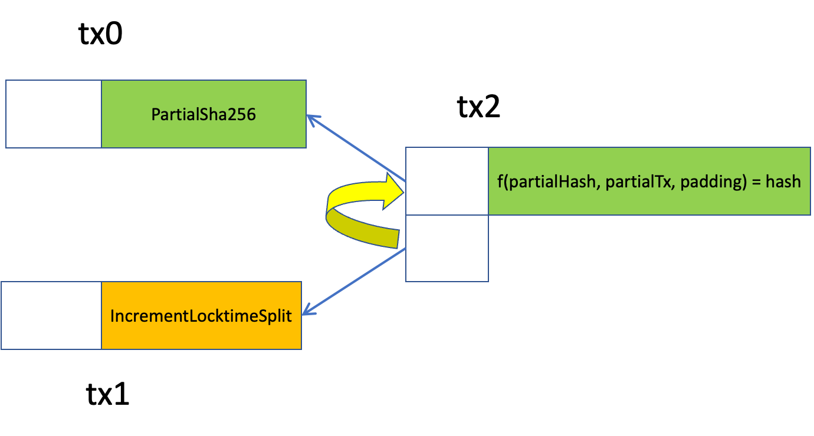
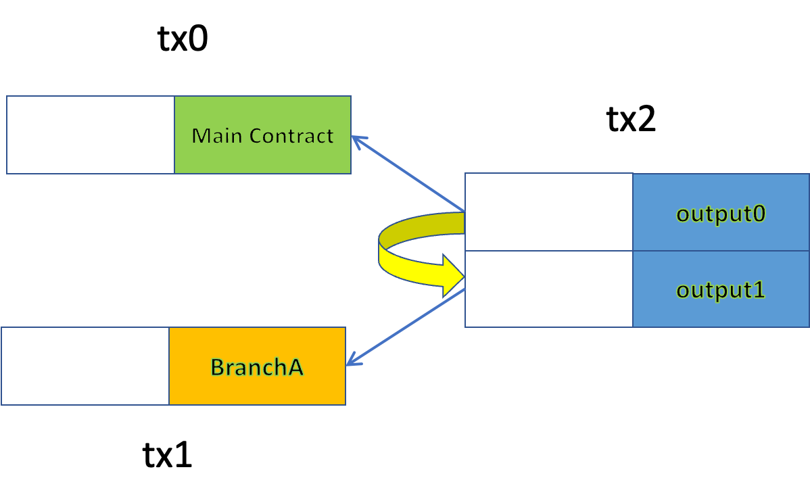

# 使用 P2CH 拆分合约
> 如何不再担心 sCrypt 中的大循环

我们提出了一种优化技术，可以将一个大合约拆分为多个较小的合约，从而在保持正确性的同时大幅减小其大小。我们将展示它如何在具有大循环和许多公共函数的合约中工作。

## 循环 (Loops)

[循环](https://scryptdoc.readthedocs.io/zh_CN/latest/loop.html)在 sCrypt 中采用以下格式：

```js
loop (maxLoopCount) {
    loopBody
}
```

因为循环是静态展开的，所以在编译时必须知道最大循环计数 `maxLoopCount`。如果设置得太小，可能会导致合约无法解锁成功，资金被永久烧毁。因此，它是为最坏的情况保守地设置的，并且当最常用的循环计数明显小于最坏的情况时，通常会导致脚本过度膨胀。


我们在[上一篇文章](https://medium.com/coinmonks/the-partial-preimage-technique-b60498c47ba)中针对最普遍的情况展示了如何使用 Pay to Contract Hash (P2CH) 来减少合约 `IncrementeLocktime` 中的循环计数，同时在需要确保在最大循环计数时保持合约正常工作。

如下图所示，我们将函数 `partialSha256()`（其循环占用大部分合约大小）移至单独的合约 `PartialSha256`。循环中的每次迭代都会处理 SHA256 原像中的一个块。我们使用 P2CH 从主合约的 `IncrementLocktimeSplit` 调用该函数。



```js
// same as contract IncrementLocktime, but splitting it
contract IncrementLocktimeSplit {
    //...

    static const int N = 3;
    // all possble hashes of the callee contract, i.e., all possible MAX_CHUNKS supported
    PubKeyHash[N] calleeContractHashes;

    public function main(int selector, bytes partialHash, bytes partialTx, bytes padding, bytes prevouts, 
        bytes calleeContractTx, bytes outputScript, int amount, SigHashPreimage txPreimage) {
        //...

        // validate partial tx without the full tx
        // P2CH: Pay to Contract Hash
        require(TxUtil.verifyContractByHash(
                    prevouts,
                    calleeContractInputIndex,
                    calleeContractTx,
                    this.calleeContractHashes[selector],    // which MAX_CHUNKS
                    txPreimage));
        // read function call arguments and return
        // remove leading OP_FALSE OP_RETURN
        bytes data = outputScript[2:];
        Reader r = new Reader(data);
        // arguments
        require(r.readBytes() == partialHash);
        require(r.readBytes() == partialTx);
        require(r.readBytes() == padding);
        // return value
        require(r.readBytes() == txid);
        // once we reach here, the following must be true
        //require(sha256(partialSha256(partialHash, partialTx, padding)) == txid);
        
        //...
    }
}
```

<center><a href="https://github.com/sCrypt-Inc/boilerplate/blob/master/contracts/incrementLocktimeSplit.scrypt">IncrementLocktimeSplit合约源码</a></center>


`IncrementLocktimeSplit` 与合约 `IncrementLocktime` 相同，只是从第 `15` 行到第 `30` 行删除了 `partialSha256()` 并使用 P2CH 间接调用。

数组 `calleeContractHashes` 中的每个元素都是合约 `PartialSha256` 的哈希，具有不同的 `MAX_CHUNKS`。因此，该数组包含主合约支持的所有 `MAX_CHUNKS`。

合约 `PartialSha256` 计算 `partialSha256()`（与原始合约 `IncrementLocktime` 相同的函数）并将函数调用参数和结果值存储在输出中，正如我们在[合约间调用](https://xiaohuiliu.medium.com/inter-contract-call-on-bitcoin-f51869c08be)中所做的那样，它可以被合约 `IncrementLocktimeSplit` 访问。

```js

contract PartialSha256 {
    // max number of chunks (512 bits) to be hashed
    static const int MAX_CHUNKS = 2;

    public function main(bytes partialHash, bytes partialPreimage, bytes padding, SigHashPreimage txPreimage) {
        //...
        bytes result = partialSha256(partialHash, partialPreimage, padding);

        // write arguments and return into the output
        bytes data = Writer.writeBytes(partialHash) + Writer.writeBytes(partialPreimage) + Writer.writeBytes(padding) + Writer.writeBytes(result);

        //...
    }
    
    // compute the sha256 from current hash (@partial_hash) and the remaining preimage (@partial_preimage)
    static function partialSha256(bytes partial_hash, bytes partial_preimage, bytes padding) : bytes {
        //...
        loop (MAX_CHUNKS) : i {
        }
        //...
    }
}
```

<center><a href="https://github.com/sCrypt-Inc/boilerplate/blob/master/contracts/partialSha256.scrypt">PartialSha256 合约源码</a></center>

与 `IncrementLocktime` 相比，`IncrementLocktimeSplit` 要小得多。它可以根据要散列的数据的长度，即 `MAX_CHUNKS` 动态调用 `partialSha256()`。在大多数情况下，我们只需要 `1` 的 MAX_CHUNKS。在锁定时间被分成最后两个块的极少数情况下，我们使用 `2` 的 MAX_CHUNKS。这带来了显着的节省，因为每个额外的块都会为最终脚本增加约 `60KB` 的大小。

## 多个公共函数

```js
contract ContractOfManyBranches {
    
    public function branchA() { }

    public function branchB() { }

    public function branchC() { }

    public function branchD() { }

    // ... more branches
}
```
<center> 原始合约</center>

我们可以将具有多个公共函数的合约分解为多个较小的合约，每个合约只包含一个公共函数。我们将原始合约替换为新的主合约，该主合约可以使用上一节中的相同技术调用任何较小的合约。

```js
contract Main {
    static const int N = 4;
    // all possble hashes of the callee contract, i.e., all possible branches
    PubKeyHash[N] calleeContractHashes; 
    
    // ...
}
```

<center> 拆分后的合约</center>



<center>主合约调用分支A</center>

当每个公共函数都很大并且有很多时，这种拆分带来显著的优化。

除了减小大小之外，这种优化还允许同一合约的其他输入中的合约识别当前主合约中调用了哪个公共函数。通常这是未知的，因为无法访问 OP_PUSH_TX 中的解锁脚本。这可以通过注入较小的合约交易来访问，例如 tx1。

## 讨论

我们已经说明了如何通过将大合约拆分为多个较小的合约来减少大合约的规模。示例合约是一次性且无状态的。对于连续调用并累积节省的有状态合约，减少将更为显着。

优化使用许多公共函数的合约的另一种方法是使用[Merklized 抽象语法树压缩智能合约](https://blog.csdn.net/freedomhero/article/details/119301247)。

## 致谢

这个想法源于 [Sensible Contract](https://sensiblecontract.org)，它在生产中广泛使用它。

