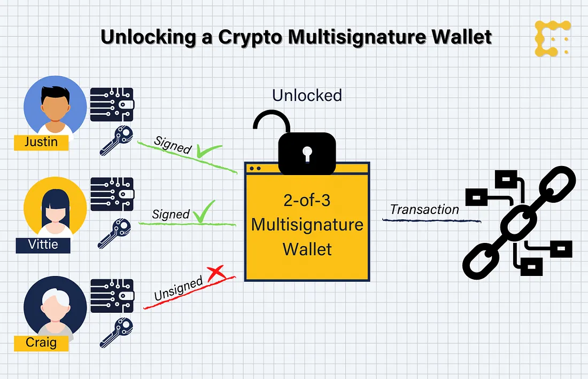

# 比特币上的有状态多重签名

> 无需链下通信

## 介绍

随着区块链和加密货币空间的发展，越来越需要增强安全措施来保护数字资产。 应对这一挑战的突出解决方案之一是多重签名（多重签名）钱包。 这些钱包在执行交易之前需要多方签名，从而提供额外的安全层来防止未经授权的访问和欺诈。



图片来源[CoinDesk](https://www.coindesk.com/tech/2020/11/10/multisignature-wallets-can-keep-your-coins-safer-if-you-use-them-right/)

传统的多重签名钱包需要各方进行带外（链下）通信以收集所有签名。 我们引入了一种智能合约，可以直接在区块链上收集签名。 智能合约会跟踪这些签名，一旦达到设定的阈值，就可以解锁资金。 例如，当多重签名组中的各方彼此不认识时，这可能很有用。

## 传统多重签名钱包

多重签名钱包通常需要 `M-of-N` 签名（来自一组 `N` 个参与者的 `M` 个签名）来授权交易。 这些钱包在管理数字资产方面越来越受欢迎，特别是在以下场景中：


1. 联名账户，需要多个家庭成员或商业伙伴批准交易。
2. 托管服务，中立的第三方持有资金直到满足预定条件。
3. 安全存储，一个用户持有多个密钥以防止未经授权的访问。


传统的多重签名钱包需要在各方之间交换部分签名的交易，然后才能将它们提交到链上。

## 链上签名收集

在接下来的步骤中，我们已经开发了一个允许链上签名收集的多重签名智能合约。

1. 智能合约部署在区块链上，指定最小签名数 `M` 和授权签名者列表 `N`。 它有一个状态：到目前为止收集的签名列表，初始化为零。
2. 每当使用新签名调用合约时，如果它是有效的和新的，它就会被添加到状态中。
3. 一旦达到阈值 `M`，智能合约就会支付到预定义的目标地址。


下面是用 sCrypt 编写的完整代码。

```ts
export type Owner = {
    pubKey: PubKey
    validated: boolean
}

export class StatefulMultiSig extends SmartContract {
    // N of M signatures required.
    static readonly N = 2
    static readonly M = 3

    // Payment destination once signature threshold is reached.
    @prop()
    dest: PubKeyHash

    // Public keys of the owners along with boolean flags, that
    // indicate if their sig was already validated.
    @prop(true)
    owners: FixedArray<Owner, typeof StatefulMultiSig.M>

    constructor(
        dest: PubKeyHash,
        owners: FixedArray<Owner, typeof StatefulMultiSig.M>
    ) {
        super(...arguments)
        this.dest = dest
        this.owners = owners
    }

    @method(SigHash.ANYONECANPAY_SINGLE)
    public pay() {
        // Check if threshold was reached.
        let nValid = 0n
        for (let i = 0; i < StatefulMultiSig.M; i++) {
            if (this.owners[i].validated) {
                nValid += 1n
            }
        }
        assert(
            nValid >= BigInt(StatefulMultiSig.N),
            'Not enough valid signatures.'
        )

        // Make sure balance in the contract does not change.
        const amount: bigint = this.ctx.utxo.value
        // Pay destination address
        const output: ByteString = Utils.buildPublicKeyHashOutput(
            this.dest,
            amount
        )
        // Verify unlocking tx has this output.
        assert(this.ctx.hashOutputs == hash256(output), 'hashOutputs mismatch')
    }

    @method(SigHash.ANYONECANPAY_SINGLE)
    public add(sig: Sig, pubKeyIdx: bigint) {
        let added = false

        for (let i = 0; i < StatefulMultiSig.M; i++) {
            if (BigInt(i) == pubKeyIdx) {
                const owner = this.owners[i]
                const valid = this.checkSig(sig, owner.pubKey)
                if (valid && !owner.validated) {
                    // Toggle flag.
                    this.owners[i].validated = true
                    added = true
                }
            }
        }

        // Make sure at least one new valid sig was added.
        assert(added, 'No new valid signature was provided.')

        // Make sure balance in the contract does not change.
        const amount: bigint = this.ctx.utxo.value
        // Output containing the latest state.
        const output: ByteString = this.buildStateOutput(amount)
        // Verify unlocking tx has this single output.
        assert(this.ctx.hashOutputs == hash256(output), 'hashOutputs mismatch')
    }
}
```

[合约源代码](https://gist.github.com/xhliu/4b9c7bf4a3f9ace51538e6bb9ca412e7#file-statefulmultisig-ts)


该合约有两个公共方法：


它有两个公共方法：

- `add` ——此方法将有效签名及其所属公钥的索引作为输入。 它首先检查此签名的有效性，如果有效则设置一个标志。
- `pay` — 此方法检查是否已达到签名阈值，例如 在此特定示例中，阈值是三分之二。 如果是这样，它确保下一个输出将锁定资金支付到存储在 `dest` 变量中的地址。


完整的代码和[测试](https://github.com/sCrypt-Inc/boilerplate/blob/master/tests/local/statefulMultiSig.test.ts)可以在我们的样[板存库](https://github.com/sCrypt-Inc/boilerplate/blob/master/src/contracts/statefulMultiSig.ts)中找到。


-----------------------------

## 引用

扩展 UTXO 模型中的原生自定义令牌：https://iohk.io/en/research/library/papers/native-custom-tokens-in-the-extended-utxo-model/


