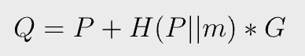
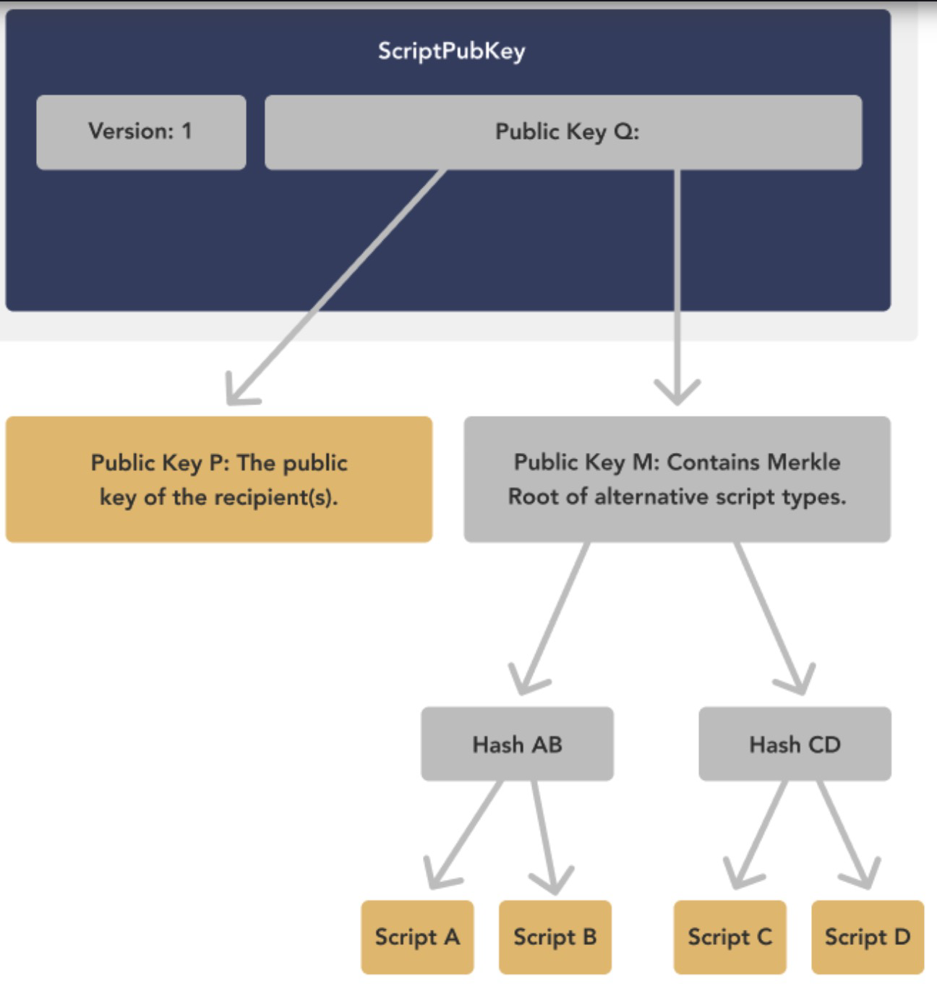
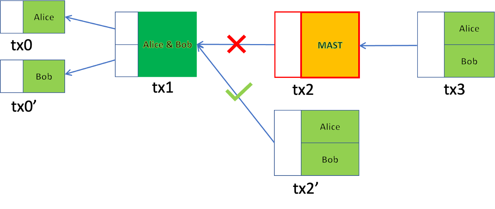

# 比特币的Taproot

> 无合约的合约 + MAST

我们展示了如何通过结合[无合约的合约](https://blog.csdn.net/freedomhero/article/details/124047689) 和 [Merklized 抽象语法树](https://blog.csdn.net/freedomhero/article/details/119301247) (MAST) 使用原始比特币协议来实现 [Taproot](https://en.bitcoin.it/wiki/BIP_0341)。

## BTC 中的Taproot

Taproot 是自 2017 年以来最大的BTC升级，旨在改进其功能。在 Taproot 中，我们调整公钥 P 以获得新的公钥 Q，如下所示：

`H()` 是一个哈希函数，`G` 是生成点。当我们[将数据链接到签名](https://xiaohuiliu.medium.com/zero-overhead-private-timestamping-in-bitcoin-f3cfa7a62ee4)时，这与等式 4 中的公式相同。在这种情况下，`Q` 中提交的数据只是 `m`，即 MAST 的根。`P` 是各方的聚合公钥。

<a href="https://river.com/learn/what-is-taproot/">支付到taproot</a>

`Q` 锁定资金有两种使用方式：

1. **合作案例** ：又名默认密钥支出路径

当各方对以 MAST 为代表的合约输出达成一致时，他们就可以共同签名释放资金1。只需要常规支付交易，隐藏实际的合约/MAST。

2. **不合作案例** ：又名替代脚本支出路径

如果任何一方未签名，则可以使用 MAST 分支解锁资金。与常规 [MAST 合约](https://blog.csdn.net/freedomhero/article/details/119301247)一样，需要叶脚本、Merkle 证明和解锁脚本。

## 原始比特币中的 Taproot

我们可以使用原始比特币协议实现 Taproot 所做的事情，而无需任何更改。

使用无合约合约的Taproot

我们简单地使用无合约合约技术，其中合约是具有 Merkle 根 m 的 MAST 合约。与一般无合约合约一样：

1. **合作案例**：各方在常规支付交易tx2'中签署并释放资金。

2. **不合作案例**：如果一方不签署，我们在 tx2 执行 MAST 合约。

## 比较

Taproot 升级从[开始](https://lists.linuxfoundation.org/pipermail/bitcoin-dev/2018-January/015614.html)到[激活](https://www.coindesk.com/tech/2021/11/13/taproot-bitcoins-long-anticipated-upgrade-activates-this-weekend/)用了将近四年的时间。它需要在协议级别进行根本性和巨大的更改，包括 [BIP114](https://github.com/bitcoin/bips/blob/master/bip-0114.mediawiki)（默克尔抽象语法树）、[BIP 340](https://github.com/bitcoin/bips/blob/master/bip-0340.mediawiki)（Schnorr 签名）、[BIP 341](https://github.com/bitcoin/bips/blob/master/bip-0341.mediawiki)（Taproot）和 [BIP 342](https://github.com/bitcoin/bips/blob/master/bip-0342.mediawiki)（Tapscript）。

原始比特币上的 Taproot 不需要协议更改，并且只需要 `20` 行代码。整个事情可以在 `20` 分钟内完成编码。

-------------------------

[1] 直观地说，私钥 `q = p + H(P||m)`。私钥 `p` 为各方共同“知晓”。 `P` 和 `m` 都是公开的，因此各方可以针对 `q` 的公钥 `Q` 共同签名。