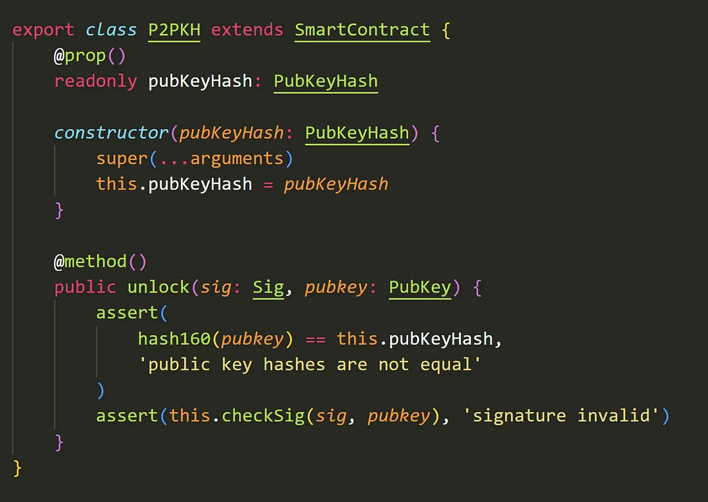
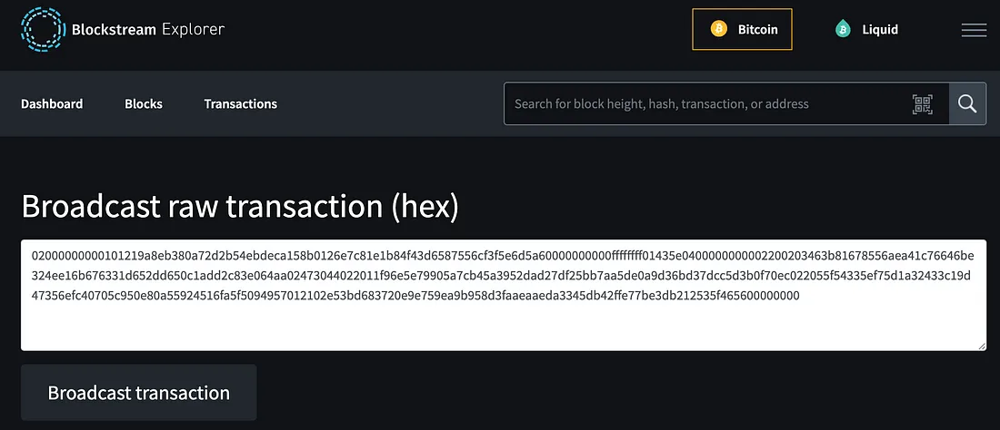
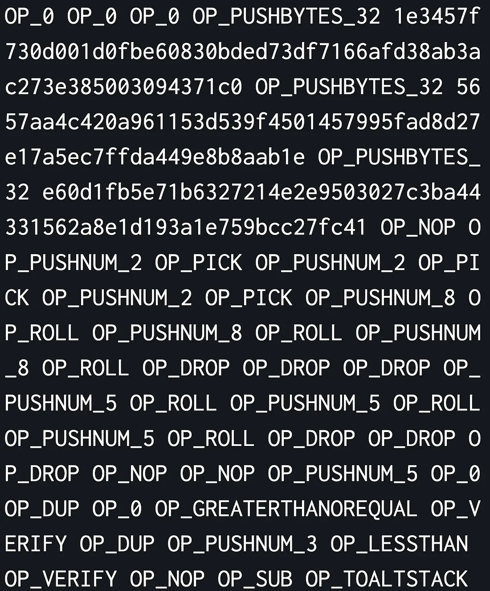
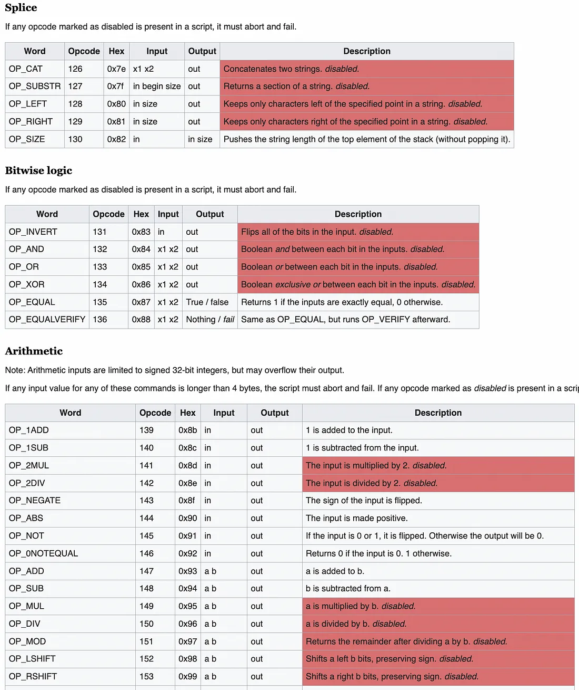

# BTC 上第一个高级语言智能合约

> 在 BTC 上运行 sCrypt 智能合约

我们很高兴地宣布在BTC 网络上部署了用高级编程语言编写的第一个成功的智能合约。


该合约涉及两笔交易，可以使用区块浏览器查看：

1. 部署交易 id: [f7b0d5c2a1b70a3ce13afe06f867a9f3c60fd73c9756bb4f37a343e9a8f9d4c1](https://blockstream.info/tx/f7b0d5c2a1b70a3ce13afe06f867a9f3c60fd73c9756bb4f37a343e9a8f9d4c1)
2. 花费交易 id: [cf48d9d242bd19a70042609d1602f39ca4191830b656e6d1d9660ba9fa529a8e](https://blockstream.info/tx/cf48d9d242bd19a70042609d1602f39ca4191830b656e6d1d9660ba9fa529a8e)

了解整个智能合约逻辑以比特币脚本的形式在第 1 层执行是至关重要的，它嵌入在见证数据中。

我们提供了有关如何在 BTC 上部署 sCrypt 智能合约的分步指南，从编译到部署，最后调用它。 我们还将阐明 BTC 链当前的局限性以及它们如何阻碍发展。

## 什么是sCrypt？

sCrypt 是一个用于在比特币上编写智能合约的 TypeScript 框架。 它允许开发人员[直接使用 TypeScript<sup>1</sup>](https://xiaohuiliu.medium.com/introducing-scryptts-write-bitcoin-smart-contracts-in-typescript-e59845213fbc) 编写智能合约。TypeScript 是全球数百万开发人员都知道的最流行的高级编程语言之一。 sCrypt 智能合约编译成比特币的原生脚本语言 Script，然后将其包含在交易中以执行任意支出条件。 它提供了一种对开发人员更友好的抽象脚本。

sCrypt 最初主要是为比特币 SV 设计的，但它编译的脚本也可以应用于其他比特币分叉链和衍生链，例如 BTC、BCH、LiteCoin 或 DogeCoin，因为它们使用兼容的比特币脚本。

以下是当今比特币上最流行的智能合约，即[Pay to Public Key Hash](https://wiki.bitcoinsv.io/index.php/Bitcoin_Transactions#Pay_to_Public_Key_Hash_.28P2PKH.29)，是如何在sCrypt中编码的。



## P2WSH

Pay to Witness Script Hash ([P2WSH](https://en.bitcoin.it/wiki/BIP_0142#Specification)) 是 BTC 中的一种锁定脚本，在隔离见证 (SegWit) 升级中引入。 它类似于 Pay to Script Hash ([P2SH](https://river.com/learn/terms/p/p2sh/))，只是它使用 SegWit。


<center>P2SH, 图片取自 <a href="https://learnmeabitcoin.com/technical/p2sh">learnmeabitcoin</a></center>


以下是 P2WSH 工作原理的简要概述：

创建：P2WSH UTXO（未花费的交易输出）是通过将比特币发送到见证或赎回脚本的哈希来创建的，就像在 P2SH 中一样。 在我们的例子中，这个赎回脚本是编译后的 sCrypt 智能合约。
花费：为了花费这些比特币，花费者出示原始兑换脚本和任何所需的见证（即 sCrypt 智能合约公共方法参数）。 比特币网络验证提供的赎回脚本是否与先前输出中的哈希匹配，以及脚本是否在给定的见证下成功执行。

## 多方哈希谜题

在散列拼图合约中，花费者必须提供原像 `x`，该原像 `x` 散列为预定义值 `y` 以解锁 UTXO。 它可以扩展到多方，因此必须提供多个原像，使得 `y1 = H(x1), y2 = H(x2), …, yN = H(xN)`。

这可以很容易地在 sCrypt 中编码。

```ts
import { assert, FixedArray, ByteString, method, prop, Sha256, SmartContract, sha256 } from 'scrypt-ts'

type HashArray = FixedArray<Sha256, typeof MultiPartyHashPuzzle.N>
type PreimageArray = FixedArray<ByteString, typeof MultiPartyHashPuzzle.N>

export class MultiPartyHashPuzzle extends SmartContract {
    static readonly N = 3

    @prop()
    readonly hashes: HashArray

    constructor(hashes: HashArray) {
        super(...arguments)
        this.hashes = hashes
    }

    @method()
    public unlock(preimages: PreimageArray) {
        for (let i = 0; i < MultiPartyHashPuzzle.N; i++) {
            assert(sha256(preimages[i]) == this.hashes[i], 'hash mismatch')
        }
    }
}
```

## 部署和调用
出于演示目的，我们将部署一个多方哈希谜题合约。

我们首先编译合约并创建一个实例，即用随机生成的值初始化它：

```ts

await MultiPartyHashPuzzle.compile()

const _hashes = []
for (let i = 0; i < MultiPartyHashPuzzle.N; i++) {
    const preimage = generateRandomHex(32)
    _hashes.push(sha256(preimage))
}
hashes = _hashes as FixedArray<Sha256, typeof MultiPartyHashPuzzle.N>
instance = new MultiPartyHashPuzzle(hashes)
```

现在我们可以提取我们的赎回脚本：

```ts
console.log(instance.lockingScript.toHex())
```

这将打印序列化脚本：

```
0000018257615179547a75537a537a537a0079537a75527a527a7575615279008763537952795279615179517993517a75517a75619c77777777675279518763537952795279949c7777777767006868
```


现在，让我们广播包含此脚本哈希的 P2WSH 交易。 为此，我们使用 Python 库 [bitcoin-utils](https://pypi.org/project/bitcoin-utils/)：


```py
from bitcoinutils.setup import setup
from bitcoinutils.utils import to_satoshis
from bitcoinutils.transactions import Transaction, TxInput, TxOutput
from bitcoinutils.keys import PrivateKey, P2wshAddress, P2wpkhAddress
from bitcoinutils.script import Script


def main():
    # always remember to setup the network
    setup('mainnet')

    priv0 = PrivateKey("")

    pub = priv0.get_public_key()
    fromAddress = pub.get_segwit_address()

    # P2SH Script:
    p2sh_redeem_script = Script.from_raw('000000201e3457f730d001d0fbe60830bded73df7166afd38ab3ac273e385003094371c0205657aa4c420a961153d539f4501457995fad8d27e17a5ec7ffda449e8b8aab1e20e60d1fb5e71b6327214e2e9503027c3ba44331562a8e1d193a1e759bcc27fc4161527952795279587a587a587a757575557a557a557a757575616155007600a26976539f6961946b6c766b796c75a853795379537953007600a26976539f6994618c6b6c766b796c756b7575756c87696155517600a26976539f6961946b6c766b796c75a853795379537953517600a26976539f6994618c6b6c766b796c756b7575756c87696155527600a26976539f6961946b6c766b796c75a853795379537953527600a26976539f6994618c6b6c766b796c756b7575756c876951777777777777')


    toAddress = P2wshAddress.from_script(p2sh_redeem_script)

    # set values
    txid = 'a6d5e6f5f36c5587653df4841b1ec8e726018b15cadeeb542b2da780b38e9a21'
    vout = 0
    amount = 0.00296275
    fee = 0.00010000

    # create transaction input from tx id of UTXO
    txin = TxInput(txid, vout)
    redeem_script1 = Script(
        ['OP_DUP', 'OP_HASH160', priv0.get_public_key().to_hash160(), 'OP_EQUALVERIFY', 'OP_CHECKSIG'])

    # create transaction output
    txOut = TxOutput(to_satoshis(amount - fee), toAddress.to_script_pub_key())

    # create transaction
    tx = Transaction([txin], [txOut], has_segwit=True)

    print("\nRaw transaction:\n" + tx.serialize())

    sig1 = priv0.sign_segwit_input(tx, 0, redeem_script1, to_satoshis(amount))
    tx.witnesses.append(Script([sig1, pub.to_hex()]))

    # print raw signed transaction ready to be broadcasted
    print("\nRaw signed transaction:\n" + tx.serialize())
    print("\nTxId:", tx.get_txid())


if __name__ == "__main__":
    main()
```


这将打印序列化和签名的 P2WSH 交易，如下所示：

```
02000000000101219a8eb380a72d2b54ebdeca158b0126e7c81e1b84f43d6587556cf3f5e6d5a60000000000ffffffff01435e0400000000002200203463b81678556aea41c76646be324ee16b676331d652dd650c1add2c83e064aa02473044022011f96e5e79905a7cb45a3952dad27df25bb7aa5de0a9d36bd37dcc5d3b0f70ec022055f54335ef75d1a32433c19d47356efc40705c950e80a55924516fa5f5094957012102e53bd683720e9e759ea9b958d3faaeaaeda3345db42ffe77be3db212535f465600000000
```

我们只需将其复制粘贴到以下网站，点击“广播交易”即可进行广播。




一旦广播，我们就可以构建将花费我们的 P2WSH 输出的赎回交易。 同样，我们使用 Python 脚本：

```py
def main():
    # always remember to setup the network
    setup('mainnet')

    p2wsh_witness_script = Script.from_raw('000000201e3457f730d001d0fbe60830bded73df7166afd38ab3ac273e385003094371c0205657aa4c420a961153d539f4501457995fad8d27e17a5ec7ffda449e8b8aab1e20e60d1fb5e71b6327214e2e9503027c3ba44331562a8e1d193a1e759bcc27fc4161527952795279587a587a587a757575557a557a557a757575616155007600a26976539f6961946b6c766b796c75a853795379537953007600a26976539f6994618c6b6c766b796c756b7575756c87696155517600a26976539f6961946b6c766b796c75a853795379537953517600a26976539f6994618c6b6c766b796c756b7575756c87696155527600a26976539f6961946b6c766b796c75a853795379537953527600a26976539f6994618c6b6c766b796c756b7575756c876951777777777777')

    fromAddress = P2wshAddress.from_script(p2wsh_witness_script)

    toAddress = P2wpkhAddress.from_address("bc1q99dsng0pq93r6t97llcdy3s7xz96qer03f55wz")

    # set values
    txid = 'f7b0d5c2a1b70a3ce13afe06f867a9f3c60fd73c9756bb4f37a343e9a8f9d4c1'
    vout = 0
    amount = 0.00286275
    fee = 0.00010000

    # create transaction input from tx id of UTXO
    txin = TxInput(txid, vout)

    txOut1 = TxOutput(to_satoshis(amount - fee), toAddress.to_script_pub_key())

    tx = Transaction([txin], [txOut1], has_segwit=True)

    tx.witnesses.append(Script([
        'abc57d70dc5e56ac73e2970077adaf94accfb36dac2b40d34f807cdedad0807b',
        'fe4f237f4e51053fa4cebc55ee15ffd9dd654c2e3b928d4a6243d1f1bcb57ca7',
        '5776ddb41c760c1965401fc4521531c3db68cf1023ce5a294a201ccfc887bc85',
        p2wsh_witness_script.to_hex()]))
    
    # print raw signed transaction ready to be broadcasted
    print("\nRaw signed transaction:\n" + tx.serialize())
    print("\nTxId:", tx.get_txid())


if __name__ == "__main__":
    main()
```

上面脚本最重要的部分是我们设置见证数据，它在第 `25-27` 行包含正确的原像。

运行脚本后，我们得到这样的原始交易：

```
02000000000101c1d4f9a8e943a3374fbb56973cd70fc6f3a967f806fe3ae13c0ab7a1c2d5b0f70000000000ffffffff013337040000000000160014295b09a1e101623d2cbefff0d2461e308ba0646f0420abc57d70dc5e56ac73e2970077adaf94accfb36dac2b40d34f807cdedad0807b20fe4f237f4e51053fa4cebc55ee15ffd9dd654c2e3b928d4a6243d1f1bcb57ca7205776ddb41c760c1965401fc4521531c3db68cf1023ce5a294a201ccfc887bc85fd2901000000201e3457f730d001d0fbe60830bded73df7166afd38ab3ac273e385003094371c0205657aa4c420a961153d539f4501457995fad8d27e17a5ec7ffda449e8b8aab1e20e60d1fb5e71b6327214e2e9503027c3ba44331562a8e1d193a1e759bcc27fc4161527952795279587a587a587a757575557a557a557a757575616155007600a26976539f6961946b6c766b796c75a853795379537953007600a26976539f6994618c6b6c766b796c756b7575756c87696155517600a26976539f6961946b6c766b796c75a853795379537953517600a26976539f6994618c6b6c766b796c756b7575756c87696155527600a26976539f6961946b6c766b796c75a853795379537953527600a26976539f6994618c6b6c766b796c756b7575756c87695177777777777700000000
```

同样，我们可以简单地使用与以前[相同的链接](https://blockstream.info/tx/push)进行广播。

瞧！ 我们已经在 BTC 区块链上成功[部署](https://blockstream.info/testnet/tx/b435b180c936564cc902ce3d7011643836a74d671159d494f59536e70d977cd2?expand)并[调用](https://blockstream.info/testnet/tx/5e5c4ebde652c06adde980687926a0f91aa261bdeed3e1e18fd045dd1e766e22?expand)了 sCrypt 智能合约。



## BTC 的严重局限性
BTC 在开发复杂的智能合约时存在几个严重的缺点，主要是因为它有许多[禁用的操作码](https://en.bitcoin.it/wiki/Script)以及人为地对[交易和脚本大小施加限制](https://bitcoin.stackexchange.com/a/117595/142084)。




相比之下，BSV 通过恢复所有操作码并消除所有人为限制，释放了比特币智能合约的全部不受约束的力量。 智能合约出现了寒武纪大爆发，例如[零知识证明](https://xiaohuiliu.medium.com/zk-snarks-on-bitcoin-239d96d182bd)、[图灵机](https://xiaohuiliu.medium.com/zk-snarks-on-bitcoin-239d96d182bd)、[ZK-Rollup](https://medium.com/xiaohuiliu/zk-rollups-on-bitcoin-ce35869b940d) 和[深度神经网络](https://xiaohuiliu.medium.com/running-deep-neural-networks-on-bitcoin-b8f48eddce8e)。 这在 BTC 和其他比特币兼容链上是不可能的。


作为一个具体的例子，上述多方哈希难题可以通过使用连接操作码 OP_CAT 来优化，它在 BSV 上重新启用但在 BTC 上仍然禁用。 以前，所有 `N` 个哈希值都必须包含在锁定脚本中，当 `N` 很大时会使事务膨胀。 相反，我们可以将所有 `y` 组合成一个 y。 例如，当 `N` 为 `3` 时，我们令 `y = H(H(H(y1) || y2) || y3)` ，其中 || 是连接。 新的优化合约如下：


```ts
import { assert, FixedArray, ByteString, method, prop, Sha256, SmartContract, sha256, toByteString } from 'scrypt-ts'

type PreimageArray = FixedArray<ByteString, typeof MultiPartyHashPuzzle.N>

export class MultiPartyHashPuzzleOpt extends SmartContract {
    static readonly N = 10

    @prop()
    readonly combinedHash: Sha256

    constructor(combinedHash: Sha256) {
        super(...arguments)
        this.combinedHash = combinedHash
    }

    @method()
    public unlock(preimages: PreimageArray) {
        let combinedHash: ByteString = toByteString('')
        for (let i = 0; i < MultiPartyHashPuzzle.N; i++) {
            combinedHash = sha256(combinedHash + preimages[i])
        }
        assert(combinedHash == this.combinedHash, 'hash mismatch')
    }
}
```

在第 `20` 行中，使用了连接（+），这在 BTC 上不起作用。

## 结论

我们已经演示了 sCrypt 智能合约如何在 BTC 上运行。 同样，它可以运行任何脚本兼容的链，如 BCH、LiteCoin 和 DogeCoin。 由于其严重的限制，它的运行速度远不如 BSV，而 BSV 是唯一实现 sCrypt 全部潜力的无限且可扩展的链。

完整代码在[这里](https://github.com/sCrypt-Inc/smartcontract-btc)。

[1] 更准确地说，它是一种嵌入在 TypeScript 中的特定领域语言 (DSL)。