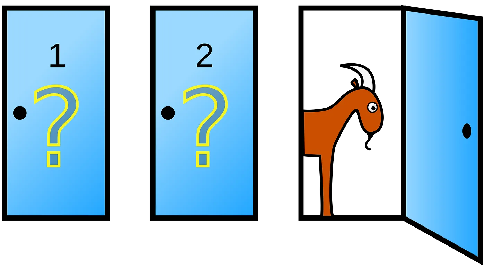
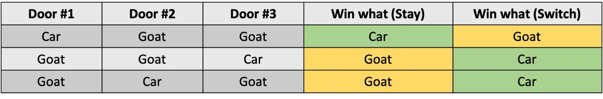

# 比特币的蒙提霍尔问题
> 把钱放在嘴边

我们在比特币上建立了蒙提霍尔问题模拟。 如果您知道概率谜题的正确答案，不仅炫耀您的数学技能，还会获得金钱奖励。 它完全无需信任地在链上运行。

## 蒙提霍尔问题

蒙提霍尔问题（三门问题）是一个以蒙提霍尔命名的概率谜题，蒙提霍尔是电视节目《让我们做个交易》的原主持人。 这是一个著名的反直觉统计难题，其解决方案非常荒谬，即使被证明是真的，大多数人也拒绝相信。 它的工作原理如下：

*假设你在参加一个游戏节目，你可以选择三扇门：一扇门后面是一辆汽车； 在其他人之后，山羊。 你选择一扇门，比如 1 号，知道门后面是什么的主持人打开另一扇门，比如 3 号，里面有一只山羊。 然后他对你说，“你想选择 2 号门吗？” 改变你的选择对你有利吗？*



令人惊讶的是，赔率不是 50–50。 如果你换门，你会赢概率是 2/3 ！ 有许多解释数学的文章/视频，我们不在这里深入探讨。 下面列出了一些很好的例子。

- [Monty Hall Problem - Numberphile](https://youtu.be/4Lb-6rxZxx0)
- [使用 Python 模拟蒙提霍尔问题](https://medium.com/swlh/simulate-the-monty-hall-problem-using-python-7b76b943640e)


<center>展示位置的可能性</center>



<center>Stay vs. Switch 的可能场景</center>

## 密码学的门

为了在比特币中模拟 Monty Hall，我们需要一种方法来隐藏汽车/山羊，这样:

1. 玩家看不到每扇门后面的东西；
2. 比赛开始后，主持人不能移动汽车/山羊。 

[承诺方案](https://en.wikipedia.org/wiki/Commitment_scheme)是实现这两者的标准方法。 我们使用单个位 `1` 表示汽车，位 `0` 表示山羊。 像往常一样，我们还在位前添加一个随机数，以防止暴力攻击。

## 实现

我们使用 [scryptTS](https://scrypt.io/scrypt-ts/)（一种 TypeScript DSL）在比特币智能合约中实施了蒙提霍尔问题。 在游戏开始之前，玩家和主机都将等量的比特币锁定到以下合约中。 部署合约后，游戏将按以下步骤进行：

1. 玩家选择一扇门，比如 0 号门，当然希望有车
2. 主持人打开一扇门，另外两扇门里有一只山羊
3. 玩家决定是坚持使用 0 号门（最初的猜测）还是切换到剩余的未打开的门
4. 主持人揭晓结果：如果玩家选中有车的门，他拿走合约中的所有比特币； 否则主持人拿走。


```ts
// this contract simulates the Monty Hall problem
class MontyHall extends SmartContract {
    @prop()
    player: PubKey

    @prop()
    host: PubKey

    @prop(true)
    step: bigint

    // player's choice
    @prop(true)
    choice: bigint

    // door opened by host
    @prop(true)
    openedDoor: bigint

    // number of doors
    static readonly N: number = 3

    // what's behind each door
    @prop()
    doorHashes: FixedArray<Sha256, 3>


    constructor(
        player: PubKey,
        host: PubKey,
        doorHashes: FixedArray<Sha256, 3>
    ) {
        super(...arguments)
        this.player = player
        this.host = host
        this.step = 0n
        this.choice = -1n
        this.openedDoor = -1n
        this.doorHashes = doorHashes
    }


    // step 1: the player chooses initially a random door that s/he believes has the prize
    @method()
    public choose(choice: bigint, sig: Sig) {
        assert(++this.step == 1n, 'step number unexpected')

        this.choice = choice

        // game goes on
        assert(this.ctx.hashOutputs == hash256(this.buildStateOutput(this.ctx.utxo.value)), 'hashOutputs check failed')
    }

    // step 2: host opens a goat door
    @method()
    public open(goatDoorNum: bigint, behindDoor: ByteString, sig: Sig) {
        assert(++this.step == 2n, 'step number unexpected')

        this.openedDoor = goatDoorNum
        const goatDoorHash = this.doorHashes[Number(goatDoorNum)]
        assert(sha256(behindDoor) == goatDoorHash)
        assert(!this.isCar(behindDoor), "expect goat, but got car")

        assert(this.ctx.hashOutputs == hash256(this.buildStateOutput(this.ctx.utxo.value)), 'hashOutputs check failed')
    }

    // step 3: player stays or switches
    @method()
    public stay(stay: boolean, sig: Sig) {
        assert(++this.step == 3n, 'step number unexpected')

        if (!stay) {
            // switch
            this.choice = this.findUnopenedDoor()
        }

        assert(this.ctx.hashOutputs == hash256(this.buildStateOutput(this.ctx.utxo.value)), 'hashOutputs check failed')
    }

    // step 4: reveal
    @method()
    public reveal(behindDoor: ByteString) {
        assert(++this.step == 4n, 'step number unexpected')

        const doorHash = this.doorHashes[Number(this.choice)]
        assert(sha256(behindDoor) == doorHash)

        // does the play choose a door, behind which is a car
        const won = this.isCar(behindDoor)
        const winner = won ? this.player : this.host

        // pay full amount to winner
        const winnerScript: ByteString = Utils.buildPublicKeyHashScript(winner)
        const payoutOutput: ByteString = Utils.buildOutput(winnerScript, this.ctx.utxo.value)
        assert(this.ctx.hashOutputs == hash256(payoutOutput))
    }

    // if last bit is set, it is a car; otherwise, a goat
    @method()
    isCar(behindDoor: ByteString): boolean {
        return unpack(behindDoor) % 2n == 1n
    }

    // find the remaining unopened door
    @method()
    findUnopenedDoor(): bigint {
        let result: bigint = -1n
        for (let i = 0n; i < MontyHall.N; i++) {
            if (i != this.choice && i != this.openedDoor)
                result = i
        }
        return result
    }
}
```

<center><a href="https://github.com/sCrypt-Inc/scryptTS-examples/blob/master/src/contracts/montyhall.ts">Montyhall 合约</a></center>

在第 `25` 行，主持人提交汽车的位置。 他通过打开 SHA256 承诺“打开”了一扇门。 在每个公共方法的开始，我们确保按顺序执行正确的步骤。 第 `51` 行使用[有状态合约](https://scrypt.io/scrypt-ts/how-to-write-a-contract/stateful-contract)技术。

如果游戏重复多次，一个玩家选择一直留下会赢大约 `1/3` 的时间，而如果他总是切换，他的获胜几率可以提高到 `2/3`。

### 主持人作弊怎么办？


主持人作弊有两种可能的方式：

1. 如果玩家在步骤 `4` 中正确选择了汽车，他拒绝开门；

2. 他把三只山羊放在门后，但没有车。


为防止（1），我们可以使用定时承诺方案，如果主持人在截止日期前未打开承诺，则没收主持人的押金。

(2) 同样可以预防。 主持人最终必须打开所有三扇门，如果它们都是山羊，他将失去押金。 或者他可以使用[零知识证明](https://blog.csdn.net/freedomhero/article/details/125598868)让玩家相信门后确实有一辆车，但没有透露它在哪扇门后面。

---------------------------------


[1] 为了便于说明，我们忽略了交易费用，这可以很容易地在合同中说明，例如，通过使用 [ANYONECANPAY](https://scrypt.io/scrypt-ts/how-to-write-a-contract/scriptcontext#sighash-type)。
