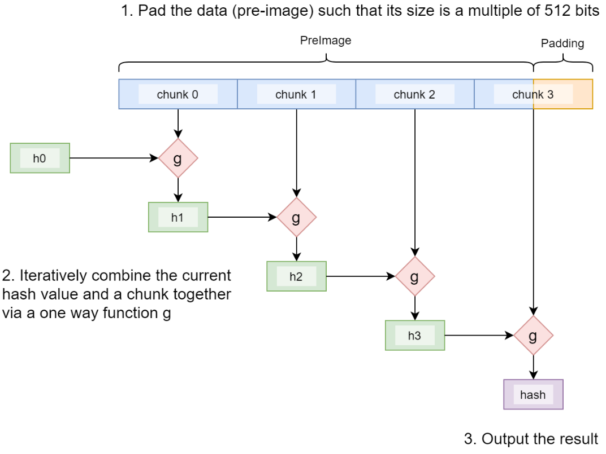
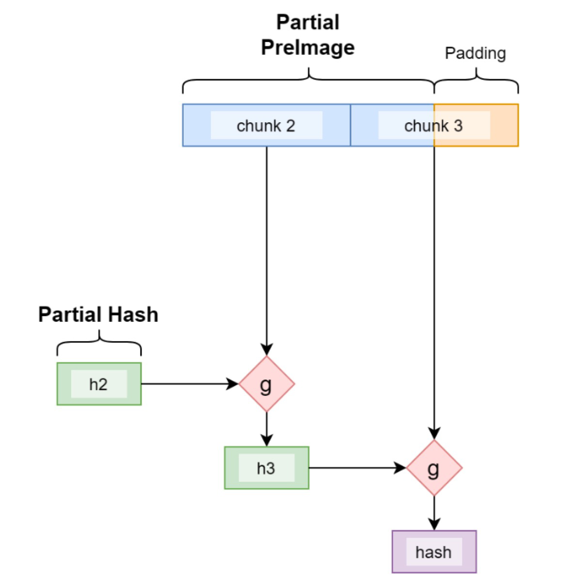

# 部分原像技术
> 如何利用长度扩展攻击

通常，要计算输入（称为原像）的散列，需要其整体。我们展示了一种新技术，可以仅使用原像的一部分来计算散列，适用于各种散列算法。

## SHA256 的工作原理

让我们以 SHA256 为例。在内部，它的工作原理如下：

1. 原像被分成 `512` 位的块。如有必要，将附加填充。
2. 每个块与内部状态（当前哈希 h0-h3）一起迭代地输入函数 g，其输出用作下一次迭代的输入。
3. 最后一个状态是最终的哈希。




这个过程称为 [Merkle-Damgård](https://en.wikipedia.org/wiki/Merkle%E2%80%93Damg%C3%A5rd_construction) 构造。`g` 是一个压缩函数，它接受两个固定长度的输入并产生一个固定长度的输出。

## 部分原像技术

由于构造的迭代性质，如果我们从任何中间迭代开始，只要我们有当前的内部状态/哈希和剩余的原像，我们就可以获得相同的哈希。



<center>从中间状态计算哈希</center>

## 长度扩展攻击 (Length Extension Attack)

SHA256 的迭代和有状态特性使其容易受到所谓的[长度扩展攻击](https://en.wikipedia.org/wiki/Length_extension_attack)。攻击者可以使用 SHA256(message1) 和 message1 的长度来计算攻击者控制的 message2 的 SHA256(message1 ‖ padding ‖ message2)<sub>1</sub>，而无需知道 message1 的内容。

我们将攻击面翻转过来，使其成为我们的优势。

## 示例用法：在没有完整 Tx 的情况下获取父 Tx 的 nLocktime

我们使用一个玩具示例来演示如何利用上述技术。合约要求解锁它的支出交易必须在 [nlocktime](https://learnmeabitcoin.com/technical/locktime) 上增加一个指定的延迟。这通常需要注入完整的父事务并对其进行解析以获取锁定时间。多亏了这项技术，我们可以通过仅包含最后一个块<sub>2</sub>来实现它。

```js
import "util.scrypt";

// ensure a spending tx's locktime is larger than that of the tx being spent, by a specified amount
// without pushing the entire tx being spent
contract IncrementLocktime {
    int delay;

    static const bytes[64] k = [
        b'428a2f98', b'71374491', b'b5c0fbcf', b'e9b5dba5', b'3956c25b', b'59f111f1', b'923f82a4', b'ab1c5ed5',
        b'd807aa98', b'12835b01', b'243185be', b'550c7dc3', b'72be5d74', b'80deb1fe', b'9bdc06a7', b'c19bf174',
        b'e49b69c1', b'efbe4786', b'0fc19dc6', b'240ca1cc', b'2de92c6f', b'4a7484aa', b'5cb0a9dc', b'76f988da',
        b'983e5152', b'a831c66d', b'b00327c8', b'bf597fc7', b'c6e00bf3', b'd5a79147', b'06ca6351', b'14292967',
        b'27b70a85', b'2e1b2138', b'4d2c6dfc', b'53380d13', b'650a7354', b'766a0abb', b'81c2c92e', b'92722c85',
        b'a2bfe8a1', b'a81a664b', b'c24b8b70', b'c76c51a3', b'd192e819', b'd6990624', b'f40e3585', b'106aa070',
        b'19a4c116', b'1e376c08', b'2748774c', b'34b0bcb5', b'391c0cb3', b'4ed8aa4a', b'5b9cca4f', b'682e6ff3',
        b'748f82ee', b'78a5636f', b'84c87814', b'8cc70208', b'90befffa', b'a4506ceb', b'bef9a3f7', b'c67178f2'
    ];

    static const int MAX_CHUNKS = 2;
    static const int MAX_VOUT = 2;

    public function main(bytes partialHash, bytes partialTx, bytes padding, SigHashPreimage txPreimage) {
        // get parent tx's id
        bytes txid = SigHash.outpoint(txPreimage)[:32];
        // validate partial tx without the full tx
        require(sha256(partialSha256(partialHash, partialTx, padding)) == txid);
        // get parent tx's nlocktime as the last 4 bytes
        int nLocktimeParent = Utils.fromLEUnsigned(partialTx[len(partialTx) - 4 :]);
        // ensure timelock is incremented as expected
        require(SigHash.nLocktime(txPreimage) - nLocktimeParent == this.delay);
    }

    // compute the sha256 from current hash (@partial_hash) and the remaining preimage (@partial_preimage)
    static function partialSha256(bytes partial_hash, bytes partial_preimage, bytes padding) : bytes {
        bytes padded_msg = partial_preimage + padding;

        require(len(partial_hash) == 32);
        require(len(padded_msg) % 64 == 0);
        require(len(padded_msg) <= MAX_CHUNKS * 64);

        int n_chunks = len(padded_msg) / 64;

        bytes h0 = partial_hash[0:4];
        bytes h1 = partial_hash[4:8];
        bytes h2 = partial_hash[8:12];
        bytes h3 = partial_hash[12:16];
        bytes h4 = partial_hash[16:20];
        bytes h5 = partial_hash[20:24];
        bytes h6 = partial_hash[24:28];
        bytes h7 = partial_hash[28:32];
        loop (MAX_CHUNKS) : i {
            if (i < n_chunks) {
                bytes chunk = padded_msg[i * 64 : (i + 1) * 64];
                bytes w00 = chunk[0 : 4];
                bytes w01 = chunk[4 : 8];
                bytes w02 = chunk[8 : 12];
                bytes w03 = chunk[12 : 16];
                bytes w04 = chunk[16 : 20];
                bytes w05 = chunk[20 : 24];
                bytes w06 = chunk[24 : 28];
                bytes w07 = chunk[28 : 32];
                bytes w08 = chunk[32 : 36];
                bytes w09 = chunk[36 : 40];
                bytes w10 = chunk[40 : 44];
                bytes w11 = chunk[44 : 48];
                bytes w12 = chunk[48 : 52];
                bytes w13 = chunk[52 : 56];
                bytes w14 = chunk[56 : 60];
                bytes w15 = chunk[60 : 64];
                bytes w16 = mod_add_4(w00, s0(w01), w09, s1(w14));
                bytes w17 = mod_add_4(w01, s0(w02), w10, s1(w15));
                bytes w18 = mod_add_4(w02, s0(w03), w11, s1(w16));
                bytes w19 = mod_add_4(w03, s0(w04), w12, s1(w17));
                bytes w20 = mod_add_4(w04, s0(w05), w13, s1(w18));
                bytes w21 = mod_add_4(w05, s0(w06), w14, s1(w19));
                bytes w22 = mod_add_4(w06, s0(w07), w15, s1(w20));
                bytes w23 = mod_add_4(w07, s0(w08), w16, s1(w21));
                bytes w24 = mod_add_4(w08, s0(w09), w17, s1(w22));
                bytes w25 = mod_add_4(w09, s0(w10), w18, s1(w23));
                bytes w26 = mod_add_4(w10, s0(w11), w19, s1(w24));
                bytes w27 = mod_add_4(w11, s0(w12), w20, s1(w25));
                bytes w28 = mod_add_4(w12, s0(w13), w21, s1(w26));
                bytes w29 = mod_add_4(w13, s0(w14), w22, s1(w27));
                bytes w30 = mod_add_4(w14, s0(w15), w23, s1(w28));
                bytes w31 = mod_add_4(w15, s0(w16), w24, s1(w29));
                bytes w32 = mod_add_4(w16, s0(w17), w25, s1(w30));
                bytes w33 = mod_add_4(w17, s0(w18), w26, s1(w31));
                bytes w34 = mod_add_4(w18, s0(w19), w27, s1(w32));
                bytes w35 = mod_add_4(w19, s0(w20), w28, s1(w33));
                bytes w36 = mod_add_4(w20, s0(w21), w29, s1(w34));
                bytes w37 = mod_add_4(w21, s0(w22), w30, s1(w35));
                bytes w38 = mod_add_4(w22, s0(w23), w31, s1(w36));
                bytes w39 = mod_add_4(w23, s0(w24), w32, s1(w37));
                bytes w40 = mod_add_4(w24, s0(w25), w33, s1(w38));
                bytes w41 = mod_add_4(w25, s0(w26), w34, s1(w39));
                bytes w42 = mod_add_4(w26, s0(w27), w35, s1(w40));
                bytes w43 = mod_add_4(w27, s0(w28), w36, s1(w41));
                bytes w44 = mod_add_4(w28, s0(w29), w37, s1(w42));
                bytes w45 = mod_add_4(w29, s0(w30), w38, s1(w43));
                bytes w46 = mod_add_4(w30, s0(w31), w39, s1(w44));
                bytes w47 = mod_add_4(w31, s0(w32), w40, s1(w45));
                bytes w48 = mod_add_4(w32, s0(w33), w41, s1(w46));
                bytes w49 = mod_add_4(w33, s0(w34), w42, s1(w47));
                bytes w50 = mod_add_4(w34, s0(w35), w43, s1(w48));
                bytes w51 = mod_add_4(w35, s0(w36), w44, s1(w49));
                bytes w52 = mod_add_4(w36, s0(w37), w45, s1(w50));
                bytes w53 = mod_add_4(w37, s0(w38), w46, s1(w51));
                bytes w54 = mod_add_4(w38, s0(w39), w47, s1(w52));
                bytes w55 = mod_add_4(w39, s0(w40), w48, s1(w53));
                bytes w56 = mod_add_4(w40, s0(w41), w49, s1(w54));
                bytes w57 = mod_add_4(w41, s0(w42), w50, s1(w55));
                bytes w58 = mod_add_4(w42, s0(w43), w51, s1(w56));
                bytes w59 = mod_add_4(w43, s0(w44), w52, s1(w57));
                bytes w60 = mod_add_4(w44, s0(w45), w53, s1(w58));
                bytes w61 = mod_add_4(w45, s0(w46), w54, s1(w59));
                bytes w62 = mod_add_4(w46, s0(w47), w55, s1(w60));
                bytes w63 = mod_add_4(w47, s0(w48), w56, s1(w61));
                bytes[64] w = [
                    w00, w01, w02, w03, w04, w05, w06, w07,
                    w08, w09, w10, w11, w12, w13, w14, w15,
                    w16, w17, w18, w19, w20, w21, w22, w23,
                    w24, w25, w26, w27, w28, w29, w30, w31,
                    w32, w33, w34, w35, w36, w37, w38, w39,
                    w40, w41, w42, w43, w44, w45, w46, w47, 
                    w48, w49, w50, w51, w52, w53, w54, w55, 
                    w56, w57, w58, w59, w60, w61, w62, w63
                ];

                bytes a = h0;
                bytes b = h1;
                bytes c = h2;
                bytes d = h3;
                bytes e = h4;
                bytes f = h5;
                bytes g = h6;
                bytes h = h7;

                loop(64): j {
                    bytes temp1 = mod_add_5(h, S1(e), ch(e, f, g), k[j], w[j]);
                    bytes temp2 = mod_add_2(S0(a), maj(a, b, c));
                    h = g;
                    g = f;
                    f = e;
                    e = mod_add_2(d, temp1);
                    d = c;
                    c = b;
                    b = a;
                    a = mod_add_2(temp1, temp2);
                }

                h0 = mod_add_2(h0, a);
                h1 = mod_add_2(h1, b);
                h2 = mod_add_2(h2, c);
                h3 = mod_add_2(h3, d);
                h4 = mod_add_2(h4, e);
                h5 = mod_add_2(h5, f);
                h6 = mod_add_2(h6, g);
                h7 = mod_add_2(h7, h);
            }
        }

        return h0 + h1 + h2 + h3 + h4 + h5 + h6 + h7;
    }
}
```

<center><a href="https://github.com/sCrypt-Inc/boilerplate/blob/master/contracts/incrementLocktime.scrypt">IncrementLocktime合约代码</a></center>

函数 partialSha256() 实现了 SHA256 算法，从交易的尾随部分和所有前面部分 (h0-h7) 的当前哈希计算交易的 sha256 哈希。  第 `53`-`158` 行对应于将函数 g 应用于一个块。

## 讨论

将部分原像技术应用于上述合约可能没有意义，因为实现 SHA256 的开销超过了仅注入部分事务带来的节省。但是，当事务很大时，收益可能会超过开销，随着脚本和事务大小的不断增长，这种情况变得越来越频繁。除了 SHA256，该技术还适用于哈希算法 MD5、RIPEMD-160、SHA-1、SHA-2，以及其他同样基于 Merkle-Damgård 构造的哈希散列算法。鉴于这些散列算法在比特币中的流行，该技术可以得到广泛使用。

## 致谢

这个想法源于史蒂夫·沙德斯。部分原像的白皮书和代码归 Ying Chan 所有，他以前在 nChain 工作，现在在 Cambridge Cryptographic 工作。

-------------------
[1] ‖ 是串联。

[2] 假设 `4` 字节的 nlocktime 在最后一个块中，而不是在最后 `2` 个块中拆分。