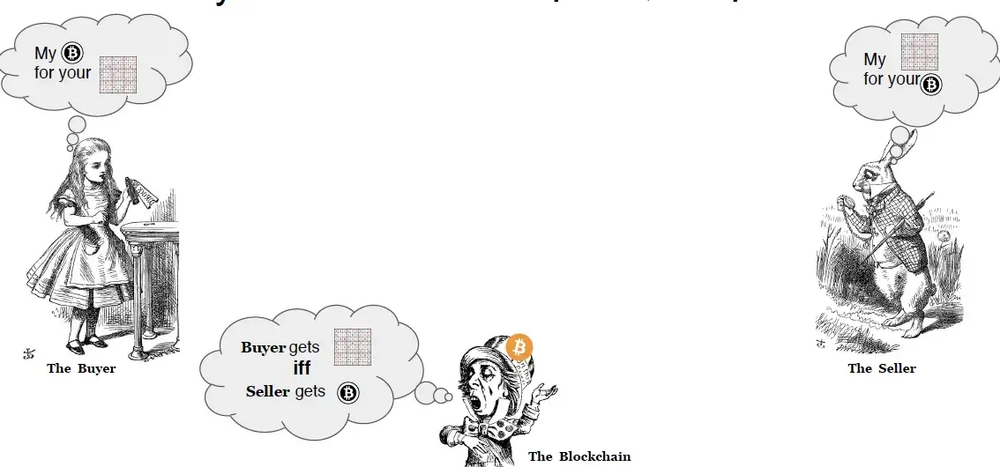
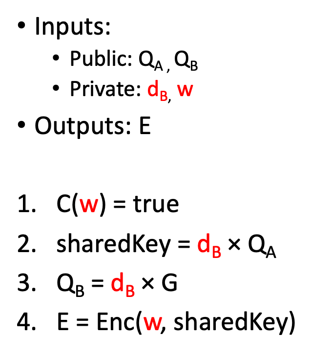

# 比特币上第一个成功的零知识付费数独赏金

我们很高兴地宣布比特币网络上的第一个成功的零知识赏金。我们已应用[零知识赏金](https://xiaohuiliu.medium.com/private-non-interactive-bounties-for-general-computation-on-bitcoin-6bc05fc3c752)解决 9x9 数独谜题。


与使用零知识或有付款 (ZKCP) 的[支付到数独](https://bitcoincore.org/en/2016/02/26/zero-knowledge-contingent-payments-announcement/)相比，卖家无需与买家互动，买家只需发布一次赏金交易。更关键的是，买方不能在卖方花费资源解决难题并证明解决方案有效后中止，从而通过拒绝发布赏金交易来剥夺卖方的付款。



<center>支付到数独</center>

## 电路


<center>ZK赏金电路</center>

该电路是通用 ZK 赏金电路的实例。在第 1 步中，子电路 C 验证数独解法。在步骤 4 中，使用 ZKP 友好的 [Poseidon](https://dusk.network/uploads/Encryption-with-Poseidon.pdf) 加密。

```ts
// Circuit for proving the knowledge of the solution to a sudoku puzzle.
template Main(N, sqrtN, lCyphertext) {

    // Private inputs:
    signal input w[N][N];           // Solition to the specified puzzle.
    signal input db[4];             // Seller (Bob) private key.
    signal input Qs[2][4];          // Shared (symmetric) key. Used to encrypt w.
    
    // "Public" inputs that are still passed as private to reduce verifier size on chain:
    signal input Qa[2][4];          // Buyer (Alice) public key.
                                    // TODO: Could also be hardcoded into the circuit like the unsolved puzzle.
    signal input Qb[2][4];          // Seller (Bob) public key.
    signal input nonce;             // Needed to encrypt/decrypt xy.
    signal input ew[lCyphertext];   // Encrypted solution to puzzle.

    // Public inputs:
    signal input Hpub[2];            // Hash of inputs that are supposed to be public.
                                     // As we use SHA256 in this example, we need two field elements
                                     // to acommodate all possible hash values.

    // Unsolved sudoku board. This could also be passed as a public input.
    var unsolved[N][N] = [
        [0, 0, 0, 0, 0, 6, 0, 0, 0],
        [0, 0, 7, 2, 0, 0, 8, 0, 0],
        [9, 0, 6, 8, 0, 0, 0, 1, 0],
        [3, 0, 0, 7, 0, 0, 0, 2, 9],
        [0, 0, 0, 0, 0, 0, 0, 0, 0],
        [4, 0, 0, 5, 0, 0, 0, 7, 0],
        [6, 5, 0, 1, 0, 0, 0, 0, 0],
        [8, 0, 1, 0, 5, 0, 3, 0, 0],
        [7, 9, 2, 0, 0, 0, 0, 0, 4]
    ];
    
    // step 1
    
    //// Assert w is a valid solution. //////////////////////////////////////////////
    component sudokuVerify = Sudoku(sqrtN, N);
    for (var i = 0; i < N; i++) {
        for (var j = 0; j < N; j++) {
            sudokuVerify.unsolved[i][j] <== unsolved[i][j];
            sudokuVerify.solved[i][j] <== w[i][j];
        }
    }


    // step 2
    
    //// Assert that (db * Qa) = Qs ////////////////////////////////////////////////
    // This will ensure that Bob actually derived Qs using Alices public key Qa.
    // This uses Circom code to emulate operations on secp256k1 by 0xPARC:
    // https://github.com/0xPARC/circom-ecdsa
    component privToPub0 = Secp256k1ScalarMult(64, 4);
    for (var i = 0; i < 4; i++) {
        privToPub0.scalar[i] <== db[i];
    }
    for (var i = 0; i < 4; i++) {
        privToPub0.point[0][i] <== Qa[0][i];
        privToPub0.point[1][i] <== Qa[1][i];
    }

    signal Qs_x_diff[4];
    signal Qs_y_diff[4];
    for (var i = 0; i < 4; i++) {
        Qs_x_diff[i] <-- privToPub0.out[0][i] - Qs[0][i];
        Qs_x_diff[i] === 0;
        Qs_y_diff[i] <-- privToPub0.out[1][i] - Qs[1][i];
        Qs_y_diff[i] === 0;
    }

    // step 3
    
    //// Assert that (db * G) = Qb /////////////////////////////////////////////////
    // This makes sure that Qb is really the public key corresponding to db.
    component privToPub1 = ECDSAPrivToPub(64, 4);
    for (var i = 0; i < 4; i++) {
        privToPub1.privkey[i] <== db[i];
    }

    signal Qb_x_diff[4];
    signal Qb_y_diff[4];
    for (var i = 0; i < 4; i++) {
        Qb_x_diff[i] <-- privToPub1.pubkey[0][i] - Qb[0][i];
        Qb_x_diff[i] === 0;
        Qb_y_diff[i] <-- privToPub1.pubkey[1][i] - Qb[1][i];
        Qb_y_diff[i] === 0;
    }


    // step 4
    
    //// Assert that encrypting w with Qs produces ew. /////////////////////////////
    component p = PoseidonEncryptCheck(N*N);

    for (var i = 0; i < lCyphertext; i++) {
        p.ciphertext[i] <== ew[i];
    }

    for (var i = 0; i < N; i++) {
        for (var j = 0; j < N; j++) {
            p.message[i*N + j] <== w[i][j];
        }
    }
    
    component sharedKey = FromatSharedKey();
    sharedKey.pointX[0] <== Qs[0][0];
    sharedKey.pointX[1] <== Qs[0][1];
    sharedKey.pointX[2] <== Qs[0][2];
    sharedKey.pointX[3] <== Qs[0][3];

    p.nonce <== nonce;
    p.key[0] <== sharedKey.ks[0];
    p.key[1] <== sharedKey.ks[1];
    p.out === 1;
    
}
```

<center><a href="https://gist.github.com/xhliu/bbda4fc47b10fe4ef605d6181d57fd0e#file-sudoku_circom-js">sudoku_circom.js</a></center>

## 智能合约

赏金合约仅在第 `20` 行[验证 ZK 证明](https://blog.csdn.net/freedomhero/article/details/126096767)。如果有效，它使用 [OP_PUSH_TX](https://blog.csdn.net/freedomhero/article/details/107306604) 从第 `25` 行到第 `30` 行将赏金奖励发送给买方。

```ts
contract SudokuBounty {

    ECPoint Qa;         // Buyer's (Alice) public key.
    VerifyingKey vk;    // Verifying key from the circuits setup.

    int satsReward;         // Amount of satoshis to be handed as a reward for the solution.
    int expirationBlockN;   // nLocktime of deadline when Alice can reclaim the reward.

    public function unlock(
                        ECPoint Qb,    // Bobs public key.
                        int[82] ew,    // Solution of puzzle, encrypted with shared key Qs.
                        Sha256 Hpub,   // Hash of public inputs.
                        int nonce,     // Nonce for encryption with shared key. Can be timestamp.
                        Proof pi,      // Proof of solution for the whole circuit C.
                        SigHashPreimage preimage
                    ) {
        // ...  
         
        //// Verify the proof. ////////////////////////////////////////////////////////////////////////////
        bool proofCorrect = ZKSNARK.verifyOptimized(pubInputs, pi, this.vk);
        require(proofCorrect);

        
        //// Ensure next output will pay Qb. //////////////////////////////////////////////////////////////
        require(Tx.checkPreimage(preimage));
        Ripemd160 pkh = hash160(point2PubKey(Qb));
        bytes outputScript = Utils.buildPublicKeyHashScript(pkh);
        bytes output = Utils.buildOutput(outputScript, this.satsReward);
        
        require(hash256(output) == SigHash.hashOutputs(preimage));
    }

    public function refund(Sig aliceSig, SigHashPreimage preimage) {
      // ...
    }
}
```

<center><a href="https://github.com/sCrypt-Inc/sudoku-bounty/blob/master/contracts/bounty.scrypt">数独赏金合约</a></center>

如果在第 `33` 行的截止日期之前没有人领取赏金，Alice 可以收回赏金。

## 一个可用的示例

与一般的 ZK 赏金一样，分为三个步骤：

1. 爱丽丝在电路的第 `22-32` 行中为数独谜题放置了赏金交易[T<sub>m</sub>](https://whatsonchain.com/tx/8e524b7de2f42cf45daf2851e00161ee6984780c464e484b88b34bb6c629911f)

2. Bob 解决了这个难题，并使用共享的 ECDH 密钥对解决方案进行了加密。他生成一个ZK证明并提交一个交易 [T<sub>c</sub>](https://whatsonchain.com/tx/32b3b9906d4cdfe2aa5fe6aeec31d39d7b3040bf3d8548296cd7ad04f288fab1) 来领取赏金，其中包含证明和加密的解决方案。

3. 使用 T<sub>c</sub>，Alice 在 T<sub>c</sub> 的输出中使用她自己的私钥和 Bob 的公钥导出相同的共享密钥，解密 T<sub>c</sub> 输入中的加密解决方案以获得最终解决方案。


请注意，Alice 和 Bob 之间没有来回交互，也没有涉及受信任的中间人。也没有其他观看这两个交易的人知道解决方案，因为它是加密的。

完整的代码可以在这个 [repo](https://github.com/sCrypt-Inc/sudoku-bounty) 中找到，带有端到端的测试和部署。

## 优化：减少公共输入的数量

链上 ZKP 验证者对电路的每个公共输入进行椭圆曲线标量乘法，这是相当昂贵的。我们将这些输入作为私有参数传递给电路，并且仅将它们的散列用作公共输入。电路和智能合约都断言对这些输入进行哈希处理实际上会产生指定的哈希值。这种方法将公共输入从 `100`（数独板的每个字段需要其自己的输入）减少到仅 `2`。